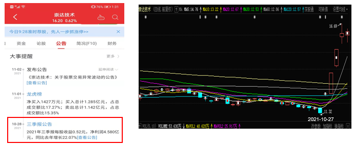

### 一、有效市场假说的前世今生

首先，我们来介绍有效市场假说，聊聊他的前世今生。有效市场假说的奠基人是Eugene F. Fama，2013年Fama因为提出了有效市场理论而获得诺贝尔经济学奖，被誉为现代金融的奠基者。

早在20世纪50年代，计算机在经济学中的早期运用是分析时间序列数据，研究经济周期的学者发现，跟踪某些经济变量的发展，可以预测经济在繁荣与衰退期发展的特质，所以，股票市场价格自然成为其分析的对象。假定股票价格反映了公司的前景，经济表现的峰谷交替将在股票价格中表现出来。
莫里斯。肯德尔在1953年对这一命题进行了研究，惊奇地发现股票价格不存在任何可以预测的模式，股票价格似乎是随机的，这意味着股票市场由无规律的心理或“动物精神”所主导，没有任何逻辑可循。这一些结论让经济学家感到困惑。

随着研究的深入，这个问题很快就明朗起来，股票价格的这种随机变化暗示着市场的理性运行是有效的。

假设肯德尔发现股票价格是可预测的，对投资者来说无疑是一个金矿，他们按照肯德尔方程预测的股票价格进行投资就可以获得无穷无尽的利润。稍加思索，我们就知道这种情况不会持久。如果该模型能够准确预测股票价格，投资者获得信息后，将蜂拥而至，瞬间将股票价格拉到合理位置。因此，任何用于预测股票业绩的信息都已经反映在股票价格中。

然而，在给定所有已知信息后，如果股票价格立马回复到正常水平，那股票价格必定只会对新信息做出上涨或下跌的反应。这就是股票价格变化是随机不可预测的本质，股票价格随机波动绝非是市场非理性的表现，而是聪明的投资者比市场上的其他投资者更早地发现了信息，并买入或卖出股票的必然结果。

Fama在1970年的文章中深入地讨论了这一问题，提出了有效市场假说，认为，在一个有效的市场中，有大量的追求利益最大化的投资者，这些理性的投资者他们相互竞争，都试图预测单只股票未来的市场价格，每个投资者都在试图预测一个股票价格的未来走势，但由于信息对每个参与者来说都是一样的，可以免费获得的，投资者之间的竞争就会导致单只股票价格已经反应了已经发生和尚未发生但市场有预期将要发生的事情，由于信息的获取对每个人来说都是均等的，投资者也就不可能获得超额利益。
 

以崇达技术为例，2021-10-28日前，持续下跌，2021-10-28日，发布三季度盈余公告，开盘直接封死涨停，连续三个板，这就是股票价格无法预测的最好例子。

### 二、有效市场的形式

**弱有效市场假说**：股价已经反应了全部能从市场交易数据中获得的信息，这些信息包括历史股价、交易量等。该假说认为市场的价格趋势分析是徒劳，过去交易的价格资料几乎是公开的，如果这样的数据传递了未来可靠的业绩信号，所有投资者早已学会利用这些信号获取收益，随着信号广为人知，就失去了他的价值。但是，投资者可以挖掘未来上市公司价值的相关信息来获得超额利润。

**半强势有效市场假说**：股价已经反应了全部能从市场交易数据中获得的信息，除过包括历史股价、交易量外，还包括生产线、会计信息等。半强势意味着投资者可以通过私有内幕消息获取超额收益，基本面分析已经失去了意义。

**强有效市场假说**：股价已经反应了全部与市场相关的信息，甚至包括公司内部人的私有信息。
以上三种形式的有效市场形式是在有效市场假说不断受到挑战中完善的。

### 三、市场有效性来源于竞争

    市场有效性来源于投资者对信息需求的竞争。从上图可知，从市场上获取收益有两种方式：一种是承担风险，获得风险补偿，另一种是通过挖掘信息获得超额收益。

     理性的投资者都想通过挖掘信息获得超额收益，这种挖掘信息的竞争性行为导致股价充分地反映了市场上的所有信息，从而提高了市场有效性。
四、有效市场假说的理论价值

> “有效市场假说”的提出奠定了资产定价的基础。

从股价反映信息的角度来说，股价是对公司价值进行定价，股价准确及时地反映了上市公司价值的相关信息，增加了配置经济资源的效率。
从风险收益的角度来讲，投资者获取得收益是对风险的定价，承担了更大的风险将获取更高的超额收益。资本市场上没有免费的午餐。

### 五、有效市场假说对投资实践的指导意义

有效市场的支持者相信，在信息充分反映的市场中，股票误定家的机会很少，主动挖掘市场信息无法再获得超额收益。
此时，投资者只有通过承担风险来获取风险补偿收益，积极主动投资策略是白费力气。

如果市场是有效的，证券价格是公平定价，是否可以通过抛硬币的方式随机选择股票进行投资呢？

当然不是，即便在完全有效的市场中，进行投资也要讲究策略。虽然所有股票都是公平定价，每只股票都面临者公司层面的风险，分散化就显得尤为重要。通过投资组合进行分散化投资可以有效对冲公司层面的风险，从而实现正常的风险补偿收益。
