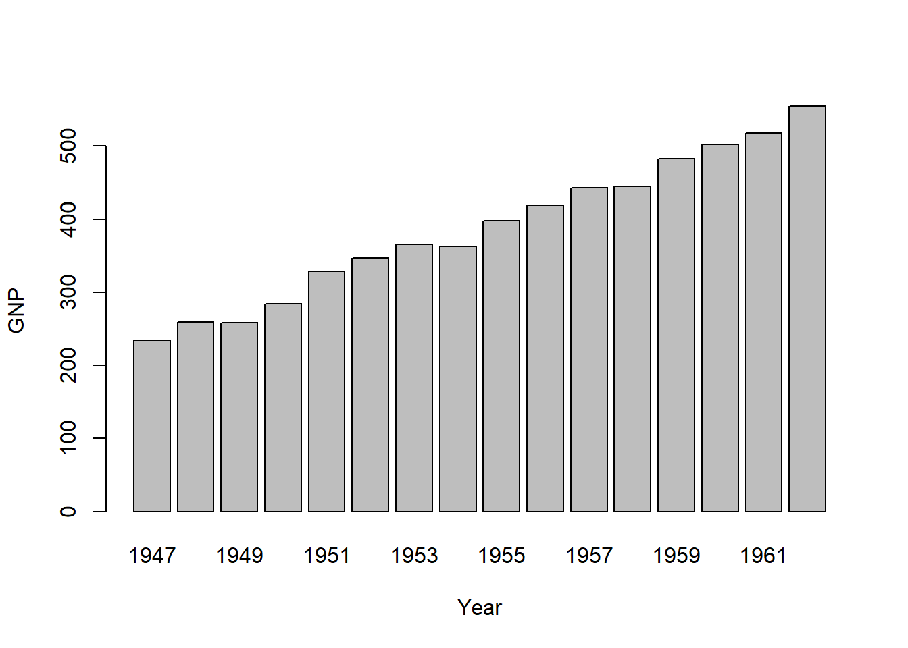

一篇科学论文是文字、图表、参考文献有机统一的格式化产品，有效快速地将这些元素有机统一并格式化可以提高科研人员的研究效率。谢益辉等大佬在重复化报告邻域做出了巨大贡献，从研究报告、期刊论文、学位论文到书籍，都提供了模板化的格式，让我们可以傻乎乎地直接在Rstudio中编辑Rmarkdown文件，通过Knit就可以输出我们想要格式的报告、论文或书籍。markdown的使用可以参考：[R Markdown Cookbook](https://bookdown.org/yihui/rmarkdown-cookbook/)

Rstudio最大的好处就是为科研工作者提供了一站式服务，既可以撰写文字，又可以分析数据，输出图表，不仅能管理文献，还能输出个性化格式的论文或研究报告。之所使用Rstudio撰写论文非常方便，主要由于存在大量可以利用的个性化模板，例如，article包提供了各大国际期刊的[投稿模板](https://bookdown.org/yihui/rmarkdown/rticles-templates.html),[bookdownplus](https://bookdown.org/baydap/bookdownplus/)也提供了许多期刊、学位论文、书籍等[模板](https://bookdownplus.netlify.app/portfolio/), 如果这些模板不够，你可以为自己量身定做一个属于自己的模板。虽然模板生态也比较成熟，但由于markdown转化word文件时公式和表格不能很好显示，这些模板是基于latex打造的pdf模板，对国内大家习惯于word环境的学者来说，在阅读修改上可能不太方便，下面我们就基于word格式来介绍如何利用Rtudio写作论文。


### Markdown yaml设置

文档格式设定是markdown最重要的部分，关系到页面布局、表格格式、图形大小、参考文献等在word中的呈现方式。需要强调的是许多包都提供了markdown输出word文件的功能，比如markdown包提供的word_document可实现基本文档的编辑功能;bookdown提供的word_document2可以实现交叉引用，但这两者对个性化的格式、公式和表格都支持的不是很好，officedown提供的rdocx_document，可谓为大家定制个性化的word文档提供了福音，在这个环境中，可以通过officer包集成的函数对word的元素进行修改，以达到自己想要的效果。如果大家想通过Rmarkdown输出word格式文件，我极力推荐rdox_document环境，下面给出rdox_document环境下的yaml：

    ---
    title: "ETF持股增加了定价效率吗？"
    subtitle: "——基于中国A股市场的实证"
    output: 
      officedown::rdocx_document:
        pandoc_args: ["-Fpandoc-crossref"]  #用于公式编号
        reference_docx: template.docx       #参考文档设置
        tables:                             #表格格式设置
          style: Table
          layout: autofit
          width: 1.0
          topcaption: true
          tab.lp: 'tab:'
          caption:
            style: Table Caption
            pre: '表 '
            sep: ': '
            tnd: 0
            tns: '-'
            fp_text: !expr officer::fp_text_lite(bold = TRUE)
          conditional:
            first_row: false
            first_column: false
            last_row: false
            last_column: false
            no_hband: false
            no_vband: false
        plots:                         ##图形格式设置
          style: Normal
          align: center
          fig.lp: 'fig:'
          topcaption: false
          caption:
            style: Image Caption
            pre: '图 '
            sep: ': '
            tnd: 0
            tns: '-'
            fp_text: !expr officer::fp_text_lite(bold = TRUE)
        page_margins:                 ##页边距设置
            bottom: 1
            top: 1
            right: 1.25
            left: 1.25
            header: 0
            footer: 0
            gutter: 0
            
    bibliography: reference.bib      #参考文献应用
    csl: china-national-standard-gb-t-7714-2015-author-date.csl     #参考文献格式                             
    ---

### 页面设置

word 文档的页面设置由top、bottom、left、right、header、footer、gutter六个参数控制，top、bottom、left、right、分别对应上、下、左、右页边距，header、footer分别为页眉和页脚的高度，gutter左右两页中间的空白距离。

### word模板制作

由于Markdown只有标题字号大小不同，正文的字体大小、行距、段前段后间距等格式均没有设置，为了使生成的word在这些功能上自由设置，yaml中设置了参数reference_docx，让你添加一个word模板，在模板中设置好不同文字内容对应的字体、字号、行距等格式，然后将模板的文件名添加到reference_docx后面，markdown生成的文档字体、字号、行距等格式与模板完全相同。**需要提醒的是，设置模板最好的办法就是用markdown先生成一个word文档，在该文档的基础上调整相应格式后，将其作为模板添加到yaml中。**

模板制作的教程可以参考阅读[网页教程](https://rmarkdown.rstudio.com/articles_docx.html)或观看[视频教程](https://vimeo.com/110804387)，要是打不开，可能要翻墙去看噢。

### 图表格式

图表格式参数我挑几个比较重要的来说一下，其他的可以通过查看R帮助文档去了解详情。rdocx_document环境默认的是英文语言下的图表名称，比如图1显示出来就成figure1,表1就成Table1,而我们想把它改成中文环境下的显示，只需要将yaml中的参数'pre: figure'改为'pre: 图'，表格的修改阐述也一样，这样就可以实现图表自动编号。 图表标题是显示在图表上方还是下方有yaml参数'topcaption'控制，大家可以根据需要进行修改。

文档图形可以直接通过插入的R代码块输出，比如：

```{r echo=TRUE, message=FALSE, warning=FALSE, fig.align='center'}
barplot(GNP ~ Year, data = longley)
```


插入以上代码就可以生成带标题的图形。但是对于来自其他软件的图片也要通过代码块载入才能自动编号，比如通过插入图片的方式就不能自动编号，具体如下：

```

```


而应该使用如下代码才能自动编号，具体如下：

```{r,fig.cap="中国GNP",echo=TRUE , message=FALSE, warning=FALSE,fig.align='center'}
knitr::include_graphics("D:/Rblogdown/content/cn/2022-09-04-how-to-write-paper-by-rstudio/index_files/figure-html/new.png")
```

表格可以通过R代码读入表格数据，然后使用flextable包对表格格式格式化后可以输出到word，flextab可以很好地支持word表格的各种格式。表格样式学习参考：[flextable 模板](https://ardata.fr/en/flextable-gallery/)，或看Youtube视频教程(可能要翻墙)。
```{=html}
<p> 如何使用Flextable :</p>

<iframe width="100%" height="400"
  src="https://www.youtube.com/embed/-EuPFZCTnHE"
  frameborder="0" allow="autoplay; encrypted-media"
  allowfullscreen></iframe>
```


具体flextable函数介绍看网站：[flextable函数大全](https://rdrr.io/cran/flextable/)。参考样例如下：

```{r echo=TRUE,tab.cap="变量定义", tab.id = "mytab", tab.cap.style = "Table Caption"}
pacman::p_load(startowd,flextable)
sumarydat<-data.frame(vname=c("交易成本","融券比率","分析师覆盖","公司规模",
                              "账面市值比","换手率","波动率","资产收益率",
                              "机构持股比例","动量"),
                    symbosv=c("Illiqudity","Shortratio","Anlysiscover","Size",
                                "BM","Turnover","Volatility","ROE",
                              "Instituhold","Mon"),
                    vdefin=c("Amihud(2006)非流动性指标",
                             "股票融券余额与总市值之比",
                             "当月跟踪股票i的分析师数量与分析师总数量之比",
                             "上市公司市值",
                             "净资产比公司市值",
                             "交易量与流通股之比",
                             "股票收益的方差",
                             "净利润比净资产",
                             "机构持股市值占总市值之比",
                             "股票过去20个月的收益率"))


names(sumarydat)=c("变量名称","变量符号","变量定义")
ft<-fatdat(sumarydat,ftname="宋体")
ft
```

这个三线表就是本人基于flextable格式化的一个表格，也是科研论文中常用的表格格式。对于模型结果输出，stargazer包做了大量工作，可以汇总大多数模型的结果并形成漂亮的表格，但其输出格式只支持latex和html文件，word使用者只能通过复制html表格后，粘贴到word，这种手动方式肯定不适合可重复性报告，为了解决这个问题，我开发了[startowd包](https://github.com/yingjiexue/startowd),可以通过读入stargazer包输出的html文件，并利用flextable包将其格式化，实现了从手动到自动的过程。样例如下：

```{r echo=TRUE, message=FALSE, warning=FALSE,tab.cap="回归结果"}
fname<-system.file("extdata","table.html",package = "startowd",mustWork = TRUE)
library(flextable)
library(stringi)
library(stringr)
library(officer)
table<-gettable(fname)[c(2:20),]
ft<-fmmodel(table)
ft
```

关于stargazer包如何使用参考： [stargazer 使用指南](https://www.jakeruss.com/cheatsheets/stargazer/)。

### 文档个性化格式

要输出个性化的word文档，就需要利用officer包的函数进行特殊化处理，其使用方法参考：
[R Markdown 输出优雅office文档教程](https://ardata-fr.github.io/officeverse/index.html)。例如要添加作者、作者单位，并以脚注的形式添加基金信息和作者简介，可以利用officer包通过以下代码实现：

> 代码


```
library(officer)

##设置作者姓名
author="薛英杰     汪 勇     尹玉刚 "
fpar_1 <- fpar(author,  fp_p = fp_par(text.align = "center") )
fpar_1

##设置作者单位
atthinstiution<-"（西南财经大学 证券与期货学院，四川 成都 611130）"

##设置基金及作者简介
ftcontent<- "基金项目：国家自然科学基金面上项目“对国有企业高杠杆的控制权网络解析”（71874145）；国家自然科学基金青年项目“上市公司产品竞争与股票市场定价：机制与实证研究”（71903154）。"
authorintr<-"作者简介：薛英杰（通讯作者），西南财经大学博士研究生，主要从事金融市场、资产定价研究，联系方式yingjiexuesuwfe@163.com；汪勇，西南财经大学副教授，博士，主要从事公司金融、资产定价研究；尹玉刚，西南财经大学副教授，博士，主要从事公司金融、实证资产定价研究。"
fp_refnote <- fp_text_lite(vertical.align = 'superscript')
ftsyle<-fp_text(font.size = 8)
ftnot<-block_list(fpar(ftext(ftcontent,prop=ftsyle),fp_p = fp_par(text.align =  'justify',line_spacing=1),fp_t=fp_refnote),
                  fpar(ftext(authorintr,prop=ftsyle),fp_p = fp_par(text.align =  'justify',line_spacing=1),fp_t=fp_refnote))
fpar_2 <- fpar(atthinstiution,
               fp_p = fp_par(text.align = "center",line_spacing=2) ,
               run_footnote(x =ftnot,prop = fp_refnote))
fpar_2

```


> 显示格式


```{r,echo=FALSE , message=FALSE, warning=FALSE,fig.align='center'}
knitr::include_graphics("D:/Rblogdown/content/cn/2022-09-04-how-to-write-paper-by-rstudio/index_files/figure-html/1663227779349.png")
```


[Markdown 中的公式命令](https://rpruim.github.io/s341/S19/from-class/MathinRmd.html)

