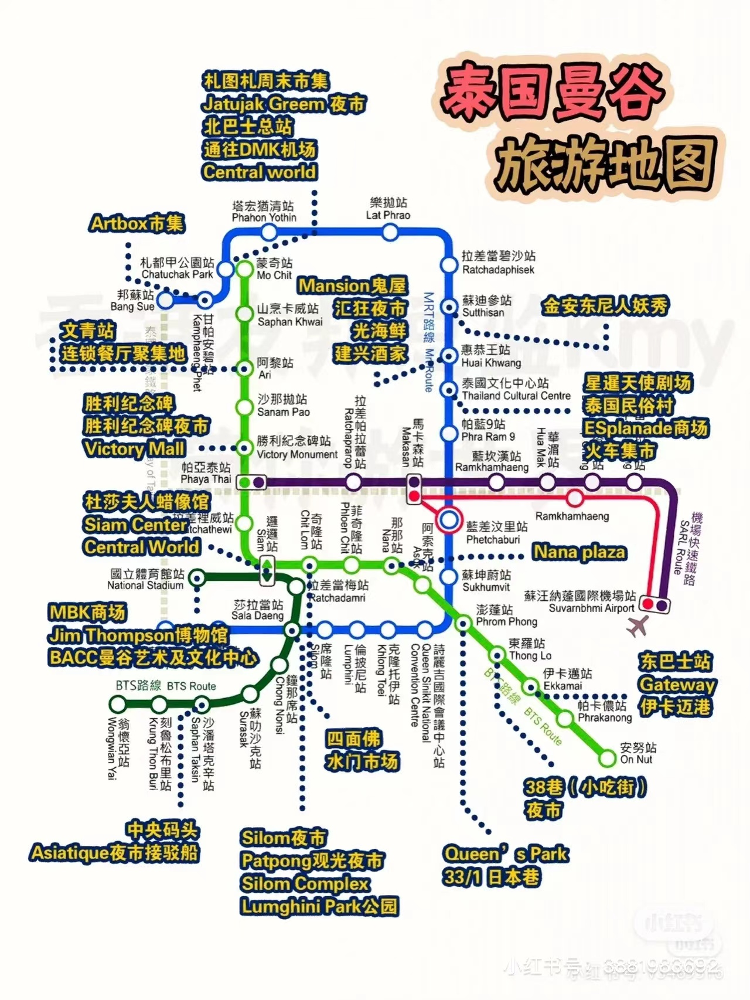
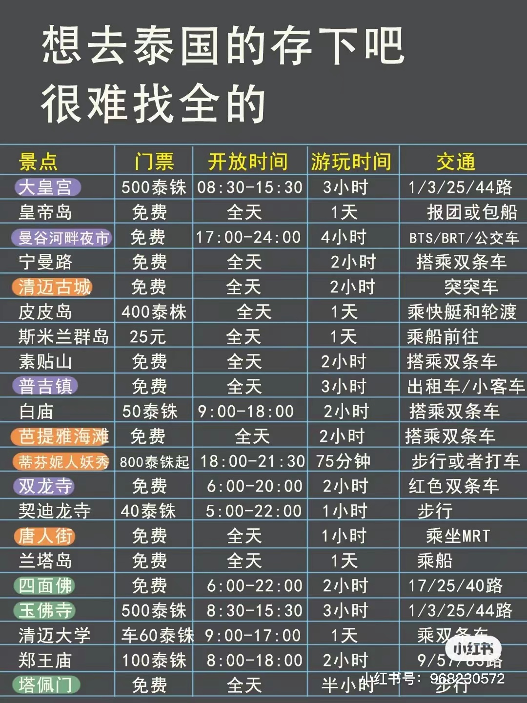

原本计划过年去澳洲陪老婆过年，但签证至今还未下签，经与他沟通，提出了前往泰国的一起见面的Plan B。如果我的澳洲签证在2月6号前下不来，我们将于2月11号分别从北京和墨尔本飞往曼谷，在泰国旅行一周，她上班一周，于2月25日分别返回工作地。

机票预算：13000元（北京-曼谷：2500；清迈-北京：1800；墨尔本-曼谷：1980；曼谷-墨尔本：5700）

往返行程：

北京-曼谷：2500； 清迈-上海-北京：1800

墨尔本-曼谷：1980；清迈-曼谷-墨尔本：5700（包括购买行李）

酒店预算：8000元（每天600元（普吉岛温德姆））

+------------+-----------------------------------------------------------------------------------------------------------+-----------+----------------------------------------------------------------------------------------------------------------------------------------------------------+
| 日期       | 行程                                                                                                      | 预算      | 备注                                                                                                                                                     |
+:==========:+:=========================================================================================================:+:=========:+:========================================================================================================================================================:+
| 2023-02-11 | 机场➡️酒店（水门寺或文化艺术中心附近）                                                                    | 50        | 使劲砍价，打车工具Grab                                                                                                                                   |
+------------+-----------------------------------------------------------------------------------------------------------+-----------+----------------------------------------------------------------------------------------------------------------------------------------------------------+
| 2023-02-12 | 曼谷文化艺术中心（在siam商圈附近吃饭）➡️水门寺（下午） ➡️吃海鲜自助（Mungkorn Seafood性价比较高）+马杀鸡  | 400       | 吃海鲜自助（Mungkorn Seafood）499铢/人；曼谷文化艺术中心免费；马杀鸡100-300铢/人                                                                         |
+------------+-----------------------------------------------------------------------------------------------------------+-----------+----------------------------------------------------------------------------------------------------------------------------------------------------------+
| 2023-02-13 | 玉佛寺（午饭）➡️大皇宫➡️郑王庙➡️湄南河看日落（可以做摩天轮）➡️火车头夜市（吃饭）                          | 800       | 大皇宫和玉佛寺门票共500铢/人（游览时间需要3个小时，不能穿无袖，露胳膊的衣服，裙子要过膝，门口的裙子大概100铢）、郑王庙100泰铢/人；坐船浏览湄南河600铢/人 |
+------------+-----------------------------------------------------------------------------------------------------------+-----------+----------------------------------------------------------------------------------------------------------------------------------------------------------+
| 2023-02-14 | 暹罗古城➡️三象神博物馆市➡️水上美食街（Iconsiam）                                                          | 500       | 星落古城离市区较远（近一个小时车程），可以租高尔夫球车游览（携程或肥猪或Klook买票便宜，暹罗古城+三象神博物馆一共400铢；租车两座100泰铢/小时）            |
+------------+-----------------------------------------------------------------------------------------------------------+-----------+----------------------------------------------------------------------------------------------------------------------------------------------------------+
| 2023-02-15 | 皮皮岛（浮潜、坐游船、玛雅湾（看风景）、蛋岛看落日）                                                      | 1000      | 500/人（本地订更便宜）                                                                                                                                   |
+------------+-----------------------------------------------------------------------------------------------------------+-----------+----------------------------------------------------------------------------------------------------------------------------------------------------------+
| 2023-02-16 | 休息，作马杀鸡，去芭东夜市                                                                                | 500       | 逛夜市、找美食吃                                                                                                                                         |
+------------+-----------------------------------------------------------------------------------------------------------+-----------+----------------------------------------------------------------------------------------------------------------------------------------------------------+
| 2023-02-17 | 皇帝岛（深潜水）                                                                                          | 3000      | 1500/1对1；2000（情侣）/1对2，                                                                                                                           |
+------------+-----------------------------------------------------------------------------------------------------------+-----------+----------------------------------------------------------------------------------------------------------------------------------------------------------+
|            |                                                                                                           |           |                                                                                                                                                          |
+------------+-----------------------------------------------------------------------------------------------------------+-----------+----------------------------------------------------------------------------------------------------------------------------------------------------------+
|            |                                                                                                           |           |                                                                                                                                                          |
+------------+-----------------------------------------------------------------------------------------------------------+-----------+----------------------------------------------------------------------------------------------------------------------------------------------------------+
|            |                                                                                                           |           |                                                                                                                                                          |
+------------+-----------------------------------------------------------------------------------------------------------+-----------+----------------------------------------------------------------------------------------------------------------------------------------------------------+
|            |                                                                                                           |           |                                                                                                                                                          |
+------------+-----------------------------------------------------------------------------------------------------------+-----------+----------------------------------------------------------------------------------------------------------------------------------------------------------+
|            |                                                                                                           |           |                                                                                                                                                          |
+------------+-----------------------------------------------------------------------------------------------------------+-----------+----------------------------------------------------------------------------------------------------------------------------------------------------------+

景点门票

