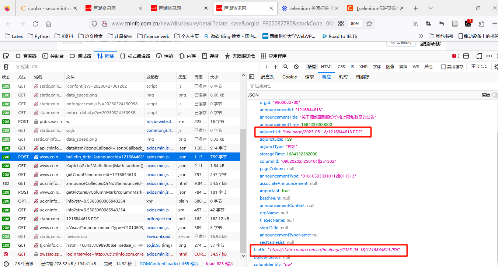

随着互联网的发展，网络数据越来越多，从网站上搜集数据成为科学研究中必不可少的环节。 而且，网络数据量之巨大已经超出了人工手动收集数据的能力，随之而来网络爬虫技术在收集 网络数据中广泛应用。今天，我们通过从巨潮网爬取上市公司年报来探讨如何使用python获取 网上的数据。

### 网络爬虫流程及需要的技术

```{r echo=FALSE, warning=FALSE}
library(mindr)
from<-c("# 确定目标数据",
        "## 文本",
        "## 表格",
        "## 文件",
        "## 链接",
        "# 分析网站结构",
        "## 动态or静态",
        "### HTML",
        "### CSS",
        "### Javascript",
        "## 数据同步加载or异步加载",
        "## 有无反爬机制",
        "### 表单验证",
        "### 二维码",
        "# 爬虫框架选择",
        "## Scrapy",
        "## Request",
        "### Get请求",
        "### POST 请求",
        "## Selenium",
        "### Xpath",
        "### click",
        "### Key",
        "# 数据爬取与存储",
        "## 数据格式化",
        "### 正则表达式",
        "### Pandas",
        "## 数据存储",
        "### SQL",
        "### Mongo",
        "### Oracle"
        
        )
markmap(from,root="网络爬虫",widget_options = markmapOption(nodeHeight = 30, nodeWidth = 100,linkShape = "diagonal",spacingHorizontal = 60,
  renderer = "basic"))
```

### 确定爬取目标

我们想获得的数据为每年每个上市公司的年报，因此，巨潮网的公告数据就是我们爬取的目标数据。 比如一下公告：

```{r, echo=FALSE}
knitr::include_url("http://www.cninfo.com.cn/new/disclosure/detail?stockCode=001979&announcementId=1216844159&orgId=GD014107&announcementTime=2023-05-18")
```

下载公告的关键在于获取公告pdf文件的下载链接，在获取链接后下载文档即可。

### 获取链接

 
 
 上图呈现了网页内部包含下载pdf文件的链接，因此，我需要获取所有上市公司每年年报链接。具体步骤如下：
 
 1. 获取上市公司年报网页信息
 
```
# -*- coding: utf-8 -*-
import urllib.parse
import urllib.request
import json
import pandas as pd
import math

##获取股票基本信息
def getbasic(marktname):
        url='http://www.cninfo.com.cn/new/data/'+marktname+'_stock.json'
        reqdat=urllib.request.Request(url, method='GET')
        response = urllib.request.urlopen(reqdat)
        for i in response:
                weblink = i
        dats = json.loads(weblink)
        return (dats)

def outputdata(market):
        import pymongo
        client = pymongo.MongoClient()
        db = client.juchaowang
        table1 = db.stockbasic
        basic=getbasic(market)['stockList']
        for i in range(len(basic)):
            basic[i]["_id"] = basic[i]["code"] + basic[i]["orgId"]
            celld={'_id':basic[i]['_id'],'code': basic[i]['code'], 'pinyin': basic[i]['pinyin'], 'category': basic[i]['category'], 'orgId': basic[i]['orgId'], 'zwjc': basic[i]['zwjc']}
            print(celld)
            try:
                    table1.insert_one(celld)
            except:
                    continue

if __name__ == '__main__':
    outputdata("bj")
    outputdata("szse")
    # stockbasicszse=pd.DataFrame(getbasic('szse')['stockList'])
    # stockbasicbj=pd.DataFrame(getbasic('bj')['stockList'])
    # stockbasic=pd.concat([stockbasicszse,stockbasicbj],axis=0)
    # stockbasic.to_csv("F:\project\juchaowang\stockbasic.csv",index=True)

```
 
 2. 获取上市公司所有年报链接
 
 ```
 # -*- coding: utf-8 -*-
import time
import urllib.parse
import urllib.request
import json
import pandas as pd
import math

def getdata(code,ptcode,page):
        url = 'http://www.cninfo.com.cn/new/hisAnnouncement/query'
        data = {"pageNum": page,
                "pageSize": "30",
                "column": "szse",
                "tabName": "fulltext",
                "plate": "sz,sh,bj",
                "stock": code+","+ptcode,
                "searchkey": "",
                "secid": "",
                "category": "category_ndbg_szsh",
                "trade": "",
                "seDate": '2000-01-01~2023-05-31',
                "sortName": "",
                "sortType": "",
                "isHLtitle": "true"
                }
        encoded_data = urllib.parse.urlencode(data).encode('utf-8')
        req = urllib.request.Request(url, data=encoded_data, method='POST')
        req.add_header('Content-Type', 'application/x-www-form-urlencoded')
        response = urllib.request.urlopen(req)
        for i in response:
            weblink=i
        dats=json.loads(weblink)
        return(dats)

def getlink(code,ptcode):
        import pymongo
        client = pymongo.MongoClient()
        db = client.juchaowang
        table2 = db.anualreportlink
        fpage=getdata(code,ptcode,1)
        totalpage=math.ceil(fpage['totalAnnouncement']/30)
        print(code)
        for page in range(1,totalpage):
               time.sleep(2)
               otherpage=getdata(code, ptcode, page)['announcements']
               for i in range(len(otherpage)):
                       otherpage[i]["_id"] = otherpage[i]["secCode"] + otherpage[i]["orgId"]+otherpage[i]['announcementTitle']
                       celld = {'_id': otherpage[i]['_id'], 'secCode': otherpage[i]['secCode'], 'secName': otherpage[i]['secName'],
                                'orgId': otherpage[i]['orgId'], 'announcementId': otherpage[i]['announcementId'], 'announcementTitle': otherpage[i]['announcementTitle'],
                                'announcementTime': otherpage[i]['announcementTime'], 'adjunctUrl': otherpage[i]['adjunctUrl'], 'adjunctSize': otherpage[i]['adjunctSize'],
                                'adjunctType': otherpage[i]['adjunctType'], 'columnId': otherpage[i]['columnId'],
                                'pageColumn': otherpage[i]['pageColumn'], 'announcementType': otherpage[i]['announcementType'], 'tileSecName': otherpage[i]['tileSecName'],
                                'shortTitle': otherpage[i]['shortTitle']}
                       print(celld)
                       try:
                               table2.insert_one(celld)
                       except:
                               continue


if __name__ == '__main__':
    import pymongo
    client = pymongo.MongoClient()
    db = client.juchaowang
    table1 = db.stockbasic
    stockid=table1.find({},{'_id':0,'code':1,'orgId':1})
    stockbase=[]
    for data in stockid:
        time.sleep(2)
        getlink(data['code'],data['orgId'])
        table1.delete_one({'code':data['code']})


 ```
 
 ### 下载年报
 
```
# -*- coding: utf-8 -*-
import io
import requests
import time
def download_pdf(save_path,pdf_name,pdf_url):
    send_headers = {
        "User-Agent": "Mozilla/5.0 (Windows NT 10.0; Win64; x64) AppleWebKit/537.36 (KHTML, like Gecko) Chrome/61.0.3163.100 Safari/537.36",
        "Connection": "keep-alive",
        "Accept": "text/html,application/xhtml+xml,application/xml;q=0.9,image/webp,image/apng,*/*;q=0.8",
        "Accept-Language": "zh-CN,zh;q=0.8"}
    response = requests.get(pdf_url, headers=send_headers)
    bytes_io = io.BytesIO(response.content)
    with open(save_path + "%s.PDF" % pdf_name, mode='wb') as f:
        f.write(bytes_io.getvalue())
        print('%s.PDF,下载成功！' % (pdf_name))
if __name__ == '__main__':
    save_path = 'F:/project/juchaowang/report/'
    import pymongo
    client = pymongo.MongoClient()
    db = client.juchaowang
    table1 = db.anualreportlink
    stockid = table1.find({}, {'_id': 0, 'adjunctUrl': 1, 'secCode': 1,'announcementTitle': 1})
    for data in stockid:
        time.sleep(2)
        pdf_name=data['announcementTitle'].replace("*","")+data['secCode']
        pdf_url='http://static.cninfo.com.cn/'+data['adjunctUrl']
        download_pdf(save_path, pdf_name, pdf_url)
        table1.delete_one({'announcementTitle': data['announcementTitle']})
```