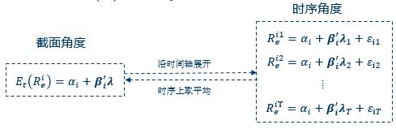
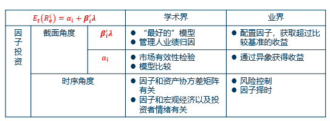

### 资产定价研究的问题

> 资产定价是对未来现金流不确定资产的定价。资产定价理论尝试着理解不确定的现金流的价值和价格，资产价格越高，意味着收益率越低。因此，资产定价理论也被用来解释不同资产收益率存在的差异。

> 过去50年，美国市场的股票平均收益率为9%，而债券的平均收益率仅有2%。过去10年，中国A股市场股票平均收益率为11%，而债券平均收益为5%。之所以股票与债券收益之间存在显著的差，核心原因在于他们的现金流不确定性的差异。

### 资产定价的理论基础

> 资产定价理论来自于一个非常简单的概念：资产价格等于期望现金流折现。即：

$$
𝑝_𝑡=𝐸_𝑡  (𝑚_{𝑡+1} 𝑥_{𝑡+1}) 
$$

> 其中，$𝑝_𝑡$是资产在t期的价格，$𝑥_(𝑡+1)$是资产在t+1期的现金流，$𝑚_(𝑡+1)$是资产现金流对应的随机折现因子。

> 之所以资产的价格可以表现为未来现金流的折现，来源于消费者对消费和投资的选择，以最大化其效用。每一个家庭或投资者都必须决定自己的收入多少用来消费，多少用来投资以及持有什么资产组合，以实现终生效用最大化。该问题可以表示为：

$$
\max_{\xi}{\hspace{1cm}⁡𝑈= 𝑢(𝑐_𝑡 )+𝐸_𝑡 [𝛽𝑢(c_{t+1})}\\
s.t : c_t=e_t-p_t\xi\\
\hspace{2.2cm}c_{t+1}=e_{t+1}+x_{t+1}\xi
$$

> 其中， $𝑢$ 是投资者的效用函数， $𝑐$ 是投资者的消费， $𝑝$ 是投资者购买资产的价格，$𝜉$ 是投资购买资产的数量， $𝑥$ 是投资卖出资产获得的现金流。

> 效用最大化的一阶条件：
>
> $$
> \begin{equation}
> \begin{aligned}
> \frac{\partial{U}}{\partial{\xi}}&=\frac{\partial{u(c_t)}}{\partial{c_t}}\frac{\partial{c_t}}{\partial{\xi}}+E_t[\beta\frac{\partial{u(c_{t+1})}}{\partial{c_{t+1}}}\frac{\partial{c_{t+1}}}{\partial{\xi}}]\\
> &=-p_tu^{\prime}(c_t)+E_t[x_{t+1}\beta u^{\prime}(c_{t+1})]\\
> &=0
> \end{aligned}
> \end{equation}
> $$

> 解得：

> $$
> p_t=E_t(\beta\frac{u^{\prime}(c_{t+1})}{u^{\prime}(c_{t})}x_{t+1})
> $$

> 让$m_{t+1}=\beta\frac{u^{\prime}(c_{t+1})}{u^{\prime}(c_{t})}$,就可得到定价公式：

> $$
> 𝑝_𝑡=𝐸_𝑡  (𝑚_{𝑡+1} 𝑥_{𝑡+1}) 
> $$

### 资产定价模型的经济含义

> 1.无风险资产

> 对于无风险资产来说，投资收益确定的，与风险无关，无风险资产的价格可以表示为期望折现因子与现金流的乘积：

> $$
> \begin{equation}
> \begin{aligned}
> p_t&=E_t(m_{t+1}x_{t+1})\\
>    &=E_t(m_{t+1})x_{t+1}
> \end{aligned}
> \end{equation}
> $$

> 即：

> $$
> R^f=\frac{x_{t+1}}{p_t}=\frac{1}{E_t(m_{t+1})}
> $$

> 也就是说无风险收益率等于1元使用期望折现因子进行折现。

> 2.风险资产

> 对于风险资产来说，投资者获得的现金流与随机贴现因子相关，根据$Cov(x,y)=E(xy)-E(x)E(y)$，风险资产价格可表示如下：

> $$
> \begin{equation}
> \begin{aligned}
> p_t&=E_t(m_{t+1}x_{t+1})\\
>    &=E_t(m_{t+1})E_t(x_{t+1})+Cov(m_{t+1},x_{t+1})\\
>    &=\frac{E_t(x_{t+1})}{R^f}+Cov(m_{t+1},x_{t+1})
> \end{aligned}
> \end{equation}
> $$

> 即：

> $$
> \begin{equation}
> \begin{aligned}
> E_t(R_i)&=R^f+(\frac{Cov(m_{t+1,R_i})}{Var(m_{t+1})})(\frac{Var(m_{t+1})}{E_t(m_{t+1})})\\
>    &=R^f++\beta_{im}\lambda_m
> \end{aligned}
> \end{equation}
> $$

> 风险资产期望收益等于无风险资产收益加风险调整收益，$\lambda$表示风险价格，$\beta$表示风险数量，风险数量越高，资产期望收益越高。

### 资产定价的实证分析

> 相比资产现金流的时间价值来说，学者和业界人士更加关注资产的风险溢价，因此，他们分别从横截面和时间序列两个维度来研究不同资产收益率的差异。

> 令$R_i^e=R_i-R^f$，则资产定价模型可以表示为：$E_t(R_i^e)=(\frac{Cov(m_{t+1,R_i})}{Var(m_{t+1})})(\frac{Var(m_{t+1})}{E_t(m_{t+1})})$，其计量模型为：

> $$
> E_t(R_i^e)=\alpha+(\frac{Cov(m_{t+1,R_i})}{Var(m_{t+1})})(\frac{Var(m_{t+1})}{E_t(m_{t+1})})
> $$
>
> # {style="margin:0 auto"}

> 关于资产定价的实证分别从横截面和时间序列两个维度讨论，横截面分析不同风险的资产获得的风险价格$\lambda$是否为0，而时间序列则关注的是给定风险价格，检验风险数量是不是为0.

### 资产定价对学术界和业界的指导意义

# 
