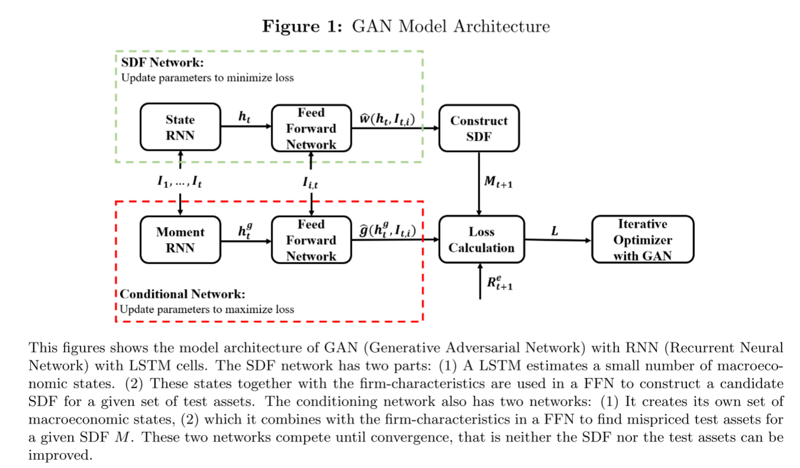

## Machine learning in the Chinese stock market

### 研究背景

> 截至2020年，中国股票市场的价值已经创历史新高，达到100亿美元。国家经济从疫情中加速恢复已经超过了2015年股票泡沫期间的高点，使中国成为第二大资本市场。然而，不仅仅是规模，中国市场的特殊性使这个市场对学术研究更有吸引力，并使我能够探索理解新型市场的问题，补充我们对其他金融体系的了解。
>
> As of October 2020, the total value of China's stock market **has climbed a record high**[^1] of more than USD 10 trillions. As county's accelerating economic recovery from COVID-19 pandemic has surpassed previous high reached during the equity bubble in 2015, making it the second-largest in the word. However, it not only size, but equally important, the specificity of the Chinese stock market that makes this market particularly attractive for academic researcher and allows us to explore question that contribute to understanding of emerging market and complement our knowledge of financial system in other institutional settings.

[^1]: has climbed a record high：创历史新高

### 中国市场的主要特征

> -   发达的市场主要有机构投资者主导，而中国资本市场主要由散户主导。散户的投机和短期交易动机导致换手率增加。
>
>     The developed markets that are dominated by institutional investors, the Chinese stock market is dominated by retail investors. The speculative and short-term trading motives of many retail investors lead to increased turnover.
>
> -   从制度的角度来看，中国金融体系的核心特征是由中央控制、银行主导的独一无二的关系驱动。另外，当股票价格低于基本面价值时，上市公司（特别是国有企业）的被阻止回购。这样，自发的市场纠正机制受政府导向限制的影响。所以，国有企业的突出作用应该因其重要性和独一性而被特殊对待。他们不仅经常因为缺乏信息透明度而遭批评，还因为其政治目标偏离价值最大化损害了企业业绩。
>
>     The key characteristic of China's financial system from an institutional perspective is centrally controlled, bank-dominated and uniquely relationship driven. On the other hand, listed companies, especially state-owned enterprise, are prevent share buy-back when the stock price fall below the fundamental value. listed companies. Therefore, the automatic market correction mechanisms are affected by government-oriented restrictions. The SOEs' prominent role in China's capital markets deserve a different treatment for their importance and uniqueness. Not only are the criticized for the lack of information transparency, But the departure of SOEs' political objectives from value maximization may harm their cooperate performance.
>
> -   中国市场的卖空历史有限，许多学者认为卖空有助于价格发现，进而使得市场更加有效。而美国和欧洲市场的因子投资研究依赖于多空策略，这样的策略在中国市场无法实现。
>
>     The Chinese market has a limited history of short-selling, many academics agree that short-selling help price discovery, rendering market more efficiency. Most of studies on factor investing on US and Europe markets relies on long-short strategies, such a strategy is not realized in Chinese market.

### 研究目的

> 当前，中国市场没有大型因子数据可以利用，本文想构建大量因子数据，并期望通过机器学习的方法来检验那些因子在中国资本市场定价中发挥主要作用。

### 研究结论

> 本文研究了几个机器学习方法对中国股票市场的预测能力，发现最重要的因子是与流动性相关的交易信号。让人惊讶的是基于价格动量的信号之发挥了一小部分作用。基本面因子是第二重要的因子，短期交易的投资者产生很大的可预测性，特别是小盘股。国有企业在长期的预测性会增加。而且，神经网络模型在预测中是表现最稳定的，即使在2015年市场大幅下跌时也没有明显回撤。

## [Anomalies and the expected Market Return](https://doi.org/10.1111/jofi.13099)

### 摘要

> 我们首次系统地证明了多空异象投资组合收益（横截面文献的基石）与总市场超额收益的时间序列可预测性之间的联系。使用文献中的100个典型异象，我们使用了各种降维技术(包括机器学习、预测组合和降维)来有效地提取高维环境中的预测信号。我们发现，多空异象投资组合收益对市场超额收益具有显著的样本外预测能力。异象投资组合收益的预测能力似乎源于套利的不对称限制和过高定价的修正持久性。

### 研究背景与问题

> 股票收益预测是金融中的一个基本话题，而关于该话题的研究主要由两种路线。一是检验上市公司特征是否可以预测股票横截面收益的变化，并发现了多种异象；二是基于宏观经济变量研究市场超额收益在时间序列上的可预测性，例如，利率，通货膨胀率以及估值率，他们强调这些变量对股权风险溢价的影响。那么，这两条主线是否存在联系？也就是说，来自于上市公司特征的异象投资组合是否对市场收益有预测性。

### 研究内容

> -   本文将研究的重点放在横截面多空异象收益预测的关键文献上，由于这些研究将异象收益视为错误定价的证据。

> -   本文应用了样本外检验方法，这种检验提供了最严格和最相关的股票收益可预测的证据。

> -   检验了以横截面研究文献为代表的多空异象投资组合收益的预测能力，同时汇总了这些异象收益的信息。

> -   探讨了多空异常投资组合收益能够预测市场收益的经济学原理，从而用经济分析补充了我们的统计结果。

### 文献观点

> -   套利限制源于多种多样的摩擦[@gromb2010]。
> -   在 @gârleanu2013 、 @gârleanu2016 和 @dong2020fast 建立的模型中，风险承受能力有限和交易成本等摩擦导致套利者纠正错误定价的速度很慢。
> -   在实证研究中，套利限制的主要变量有总流动性[@pástor2003]、特质风险[@ang2006; @pontiff2006]、交易噪声[@hu2013]、经济不确定性[@jurado2015]、风险厌恶指数[@bekaert2022a]、卖空成本[@asness2018]。

### 研究结论

> 在实证上，我们发现，如果我们依赖防止数据过度拟合的策略，100个多空异常投资组合收益组中的信息对于预测非样本基础上的月度市场超额收益确实是有用的。在经济意义上，多空异象组合收益对市场收益的预测力可以被非对称错误定价修正持续性解释，这种错误定价修正的非对称性源于套利限制非对称。

> 本文的实证结果显示，多头和空头收益与未来市场收益正相关，而样本外预测能力较弱意味着错误定价修正更强，导致多空异象收益对未来收益有负向预测作用。

## [Deep Learning in Asset Pricing](https://doi.org/10.1287/mnsc.2023.4695)

### 摘要

> 我们通过深度学习模型利用大量条件信息的优势来估计个股收益的资产定价模型，该模型同时可以保持灵活的形式，并考虑时变特征。本文的关键创新在于，使用了基本面无套利条件作为评价函数，从许多宏观经济时间序列中提取了经济状态，用对抗性方法构造了最有信息含量的测试资产。我们的资产定价模型样本外的夏普比率超过了所有基准方法，解释了定价误差，并识别了关键资产定价的因素。

### 研究问题

> 资产定价的基本问题是解释资产平均收益的差异，无套利定价理论为该问题提出了明确的答案，认为不同资产收益不同是由于这些资产在随机贴现因子或定价核上的暴露不同。过去40年来，资产定价的实证的探索一直是估计一个可以解释所有资产预期收益的随机贴现因子。迄今为止，学者们在一个统一的框架中努力克服了四个主要挑战：

> (1)构造的随机贴现因子（SDF）依赖于所有可用的信息，这意味着SDF是一个可能非常大的变量集的函数。

> (2)随机贴现因子（SDF）的函数形式是未知的，可能很复杂。

> (3)随机贴现因子（SDF）具有复杂的动态结构，单个资产的风险敞口可能随着时间的推移而变化，这取决于经济状况和资产特定属性的变化。

> (4)个股的风险溢价具有较低的信噪比，这使得解释所有股票预期收益的随机贴现因子（SDF）的估计变得复杂。

> 为了应付这些挑战，本文使用深度学习模型基于大量宏观经济和公司特征信息来估计一个广义的非线性资产定价模型。主要回答了三个问题：

> （1）基于信息集的随机贴现因子（SDF）的函数形式是什么?(**FF五因子模型认为随机贴现因子（SDF）是少数几个公司特征的线性组合，但线性模型似乎被错误设定，因子动物园意味着有更多的特征包含定价信息。**)

> （2）什么是正确的检验资产？（**传统的方法是在少量预先指定的检验资产上校准和评估资产定价模型，例如Fama和French(1992)的25个规模和账面对市场的双重分类投资组合。然而，可以很好地解释这25个投资组合的资产定价模型不需要捕获其他特征分类投资组合或单个股票收益的定价信息。我们的方法以数据驱动的方式构建了最具信息量的测试资产，这些资产是最难解释和识别SDF参数的**）

>  （3） 经济状态是什么？（**考虑到数百个具有复杂动态的宏观经济时间序列，这是一组非常粗糙的信息。我们的模型提取了少量的状态过程，这些过程基于大量宏观经济时间序列的完整动态，并且与资产定价最相关。**）

### 研究思路

> 机器学习工具是为了在高信噪比环境中很好地完成预测任务。由于有效市场中的资产回报似乎由不可预测的消息主导，用现成的方法很难预测它们的风险溢价。本文在无套利条件矩约束下，估计了随机贴现因子，用其来解释所有股票收益。具体来讲，使用深度神经网络等机器学习技术来处理高维和复杂的函数依赖关系，通过长短期记忆模型（LSTM）考虑经济结构来估计随机贴现因子，通过生成式对抗网络通过识别具有最无法解释的定价信息的投资组合和状态来构建测试资产，进而改善风险溢价信号，解释个股收益。

### 文献观点

> (1) @gu2020empirical 比较了在预测美股收益中的机器学习方法，说明了灵活函数模型的好处。

> (2) @freyberger2020dissecting 使用Lasso方法作为公司特征的非线性函数来估计股票的风险溢价。

> (3) @feng2024deep 利用一组预先设定的线性资产定价因子施加无套利约束，并利用深度神经网络估计风险载荷。

> (4) @rossi2018predicting 基于市场投资组合和无风险资产，利用增强回归树形成条件均值方差有效投资组合。

> (5) @lettau2020factors 扩展主成分分析(PCA)来解释无套利。他们表明，无套利惩罚项可以克服金融数据中的低信噪比问题，并找到与定价核相关的信息。

### 核心技术路线——如何估计

> **(1)损失函数与模型构建**

> 我们模型的实证的损失函数使加权样本矩最小化，加权样本矩可以解释为加权样本平均定价误差:

$$
L(w|\hat{g},I_t,I_{ti})=\frac{1}{N}\sum_{i=1}^{N}\frac{T_i}{T}\|\frac{1}{T_i}\sum_{t\in T_i}{M_{t+1}R_{t+1,i}^{e}\hat{g}(I_t,I{ti})}\|^2
$$

> 我们处理一个不平衡面板，其中每个资产的时间序列观测数$T_i$变化。由于矩在适当条件下的收敛率为$\sqrt{1/T_i}$，我们对每个横截面矩条件进行$\sqrt{Ti/T}$加权，这为更精确估计的矩分配了更高的权重，并降低了仅在短时间内观察到的资产的矩的权重。

> 对于给定的条件函数$g(.)$和信息集的选择随机贴现因子（SDF）的组合权重，该权重由前馈网络估计，使定价误差损失最小化：

$$
\hat{w}=\min_{w}L(w|\hat{g},I_t,I_{ti})
$$

> 我们通过一个具有类似神经网络结构的条件网络构造条件函数$\hat{g}$。条件网络作为对手，与估计随机贴现因子（SDF）的网络竞争，以确定最难解释的资产和投资组合策略。宏观经济信息动态由具有长短期记忆单元的递归神经网络(RNN)得到的宏观经济状态变量$h_t$来概括。模型体系结构在图1中进行了总结，并且在下一小节中将详细描述每个不同的组件。

> (2) 模型训练的步骤

> 条件函数g是第二个前馈网络的输出。受生成对抗网络(GAN)的启发，我们通过让两个网络相互竞争来选择导致最大定价差异的时刻条件。一个网络创建随机贴现因子（SDF） Mt+1，另一个网络创建条件作用函数g。我们用三步来训练模型。我们最初的第一步是训练随机贴现因子（SDF）使无条件损失最小化。其次，给定这个随机贴现因子（SDF），我们通过优化条件网络中的参数来最大化损失。最后，给定条件网络，我们更新随机贴现因子（SDF）网络以最小化条件损失。

### 研究结论

> 本文提出了一种新的方法来估计个股收益的资产定价模型，该模型可以利用大量的条件信息，同时保持完全灵活的形式并考虑时间变化。为此，我们以一种新颖的方式组合了三种不同的深度神经网络结构:一个前馈网络用于捕获非线性，一个循环(LSTM)网络用于寻找一小组经济状态过程，一个生成对抗网络用于识别具有最无法解释的定价信息的投资组合策略。我们的关键创新是使用无套利条件作为神经网络算法的一部分。我们从无套利隐含的条件矩约束中估计解释所有股票收益的随机折现因子。我们的SDF是所有交易资产的投资组合，具有时变的投资组合权重，这些权重是可观察到的公司特定变量和宏观经济变量的一般函数。我们的模型使我们能够理解驱动资产价格的关键因素，识别股票的错误定价，并生成条件均值方差有效投资组合。

> 我们的主要结论有四个方面。首先，我们展示了机器学习方法在资产定价中的潜力。我们能够确定驱动资产价格的关键因素，以及这种关系的功能形式，其普遍性和准确性是传统计量经济学方法无法做到的。其次，我们展示并量化了在机器学习资产定价模型的估计中包含无套利条件的重要性。深度学习的“厨房水槽”预测方法并不优于无套利约束的线性模型。这说明，在金融领域成功使用机器学习方法既需要特定学科的领域知识，也需要最先进的技术实现。第三，财务数据具有时间维度，因此必须考虑到时间维度。即使是最灵活的模型也无法弥补这样一个问题:如果只把最后的增量作为输入，宏观经济数据似乎无法为资产定价提供信息。我们表明宏观经济条件对资产定价很重要，并且可以通过少数经济状态变量来总结，这些变量依赖于所有时间序列的完整动态。第四，资产定价实际上是惊人的“线性”。只要我们孤立地考虑异常，线性因子模型就提供了一个很好的近似。然而，资产定价的多维挑战不能用线性模型来解决，需要一套不同的工具。

### 参考文献
