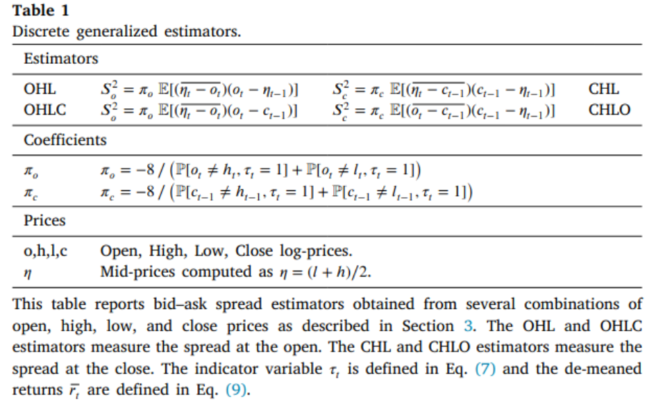

## Efficient estimation of bid–ask spreads from open, high, low, and close prices

### 摘要

> 当交易不频繁时，常见的买卖价差估计量被低估。然而，这些估计量只考虑了开盘价、最高价、最低价以及收盘价，忽略了潜在有用的信息来改善有效买卖价差估计量。在这篇文章中，我们通过考虑离散观察价格推导出了有效买卖价差的渐近无偏估计量。为了最小化估计量的方差，我们综合了他们的优势，通过理论分析、数值模拟和实证评估，证明了我们的有效估计量优于其他估计量，在实证金融中有广阔的应用前景。

### 研究问题

> 有效的买卖价差度量了可观测价格和不可观测价格之间的距离，他是对金融市场中交易成本的重要度量。关于买卖价差度量的文献主要沿着高频和低频两个方向发展。高频文献为了获得基本面价格的代理变量而依赖交易和报价数据，而低频文献则对基本面价格做出了假设，并不要求任何关于报价的信息。

> 虽然从交易和报价中得出的测量结果通常更为准确，但由于获取国际市场报价数据、历史数据样本和股票以外资产类别的困难和成本，低频估算结果更容易获得，而且越来越受欢迎。然而，**估计量的发展很大程度上依赖价格被连续观测的假设，但在真实的市场中，任何时间区间内交易的数量是有限的，价格在离散的时间点上被观测。我们证明了当每个观测期的交易数量较小时，估计偏差会下移。这是由于现有估计量只考虑了开盘价、最高价、最低价以及收盘价，忽略了潜在有用的信息来改善买卖价差估计，进而降低估计方差。**

## 文献观点

> 1.为了获得明确的基本面价格的代理变量，并计算他与交易价格的距离，关注高频数据的文献都依赖交易和报价数据[@holden2014liquidity; @stoikov2018micro; @HAGSTROMER2021314]。

> 2.为了只从交易价格中推到估计量，不考虑其他任何报价信息，关注低频数据的文献引入了基本面价格的假设[@roll1984simple; @hasbrouck2009trading; @corwin2012simple; @hhx084]。

> 3.  @jahan2023low 证明了当买卖价差相对波动率较小时，一个大的估计误差将导致一个向上的偏差，这是由于在小样本中这种方法的使用会确保买卖估计的非负性。

## 有效买卖价差的计算

> 给定交易，相对有效买卖价差$S$被定义如下：

$$
S=\frac{2D(P-\tilde{P})}{\tilde{P}}
$$

> 其中，$P$是观测到的交易价格，$\tilde{P}$为观测不到的基本面价格，$D$是交易指标的方向，交易由买方发起时，$D$取1，由买方发起时，$D$取-1。

> **由于基本面价格**$\tilde{P}$不可观测，不同买卖价差的估计量取决于不同的基本面代理变量$\tilde{P}$，现有文献分别用高频数据和低频数据来估计基本面价格。

### 高频数据度量

> **1. 中间报价**

> 最简单的方法是用中间报价作为基本面价格[@HAGSTROMER2021314]，它是标价和询价的平均，具体如下：

$$
P_M=\frac{P_A+P_B}{2}
$$

> 其中，$P_A$和$P_B$分别未询价和标价。

> **2. 加权中间报价**

> @HAGSTROMER2021314 研究表明中间报价会导致夸大有效买卖价差，为了克服这个问题，提出了加权中间报价。

$$
P_M=\frac{P_AQ_B+P_BQ_A}{Q_A+Q_B}
$$ 其中，$Q_A$和$Q_B$标价和询价的报价深度。

**3. 相关中间报价**

> @stoikov2018micro 抨击中间报价和加权中间报价作为基本面价格的代理，由于该报价产生于自相关收益，并提出了一个新的代理变量。

### 低频数据度量

> 在低频数据的度量中，这些方法对数据产生的过程做出了合理的假设，不再要求明确的基本面价格代理。这类估计量通过模型假设测度了交易价格和基本面之间的距离。

> 一些学者[@roll1984simple; @hasbrouck2009trading; @corwin2012simple; @hhx084]利用对数价格$p=log(P)$变化提出了有效价差的估计量，具体如下：

$$
p=\tilde{p}+Z
$$

> 其中 $Z=S/2D$是竞价跳跃。基本假设如下：

> **假设1：基本面收益序列无序列相关。**

> **假设2：基本面收益与竞价跳跃无关。**

> **假设3：竞价跳跃是零均值，无自相关序列。**

> 假设1至3的目的是通过与竞价跳跃无关的收益序列来测度交易价格与基本面价格之间的距离，这类估计是本篇论文关注的核心。

**1. 利用收盘价测度**

> @roll1984simple 通过计算可观测收益序列的协方差来估计有效价差，具体如下：

$$
S^2=-4Cov[\Delta c_t,\Delta c_{t-1}]
$$

> 其中，$c_t$是t期的对数收盘价。

> **该方法的缺点在于由较大的估计方差，使用一年日度收盘价计算时，估计偏差高点50%。**为了提高估计精度，@hasbrouck2009trading 提出了该模型的GIBBS估计，但该方法要求有一个迭代过程，需要大量观测值才能收敛。

**2. 利用最高价和最低价测度**

> @corwin2012simple 了基于最高价和最低价提出另一个估计量，该估计量的方差比 @roll1984simple 的估计量小。基本的思想是**最高（低）价几乎一直是买（卖）方交易，所以，最高价与最低价之比包含了基本面价格的波动和买卖价差。由于波动随着收益区间而增加，但买卖价差不会变动，所以基于不同时间间隔就可以从高低价格比率中分离出买卖价差。**

> 这个估计只有在观测价格连续的情况下成立，由于交易者在任何时间内都可能交易，则在实践中采用该估计量是有偏的。

**3. 利用收盘价、最高价和最低价测度**

> @abdi2017simple 提出使用收盘价、最高价、最低价来联合估计，这种方法得到的估计量方差和偏差都较小。具体如下：

$$
S^2=4E[c_{t-1}-\eta_{t-1},c_{t-1}-\eta_{t}]
$$

> 其中，$\eta=(h_t+l_t)/2$。但这个方法要求基本面价格服从几何布朗运动。然而，该方法没有利用开盘价、收盘价、最低价和收盘价的全部信息来估计买卖价差。

### 本文的估计方法

> 本文放松了价格被连续观测和假设1-3，考虑了交易的离散型，利用开盘价、收盘价、最低价和收盘价的全部信息降低了估计偏差。

> 首先，我们引入虚拟变量测度交易者的行为，具体如下：

## 

> 经过一系列推到，可以得到均方价差如下：

$$
S_a^2=E[S_{a_t}^2]=\frac{-8E[(\overline{\eta_t-o_t})(o_t-c_{t-1})]}{P[o_t\neq h_t,\tau_t=1]+P[o_t\neq l_t,\tau_t=1]}
$$

> 其中，$\eta=(h_t+l_t)/2$。

> **买卖价差的有效估计**

> 我们利用开盘价与收盘价比以及以及开盘价与中盘收益推到了一个买卖价差估计量，采用同样的方法，也可以从其他综合价格推导出不同的估计量。总之，我么推导出了四个估计量实现了不同条件下最小方差的目的。具体统计量如表1所示。

> 然后，我们综合了四种最小方差的估计，提出了不受任何条件约束的估计量，称其为离散广义估计量（DGEs）。为了最小化估计方差，我们广义矩估计法综合了DGEs估计量，具体来讲，每一个DGE都可以写作一个矩条件，由于OHL 和 OHLC 测量的是开盘时的价差，而 CHL 和 CHLO 测量的是收盘时的价差。因此，我们将 OHL 与 CHL 和 OHLC 与 CHLO 结合起来，得到两个时刻条件，分别测量开盘和收盘时的平均价差：

$$
E[2S^2-\pi_o(\overline{\eta_t-o_t})(o_t-\eta_{t-1})-\pi_c(\overline{\eta_t-c_{t-1}})(c_{t-1}-\eta_{t-1})]=0\\
E[2S^2-\pi_o(\overline{\eta_t-c_t})(o_t-\eta_{t-1})-\pi_c(\overline{o_t-c_{t-1}})(c_{t-1}-\eta_{t-1})]=0
$$

> 其中，$S^2=(S_a^2+S_c^2)/2$

> 进一步，矩条件可以被写为:

$$
E[S^2-x_{i,t}]=0
$$

> 通过GMM，有效估计量如下：

$$
S_{GMM}^2=arg min\sum_{ij}(S^2-\mu_i)W_{ij}(S^2-\mu_j)
$$

> 由一阶条件可得：

$$
S_{GMM}^2=\sum_{i}w_i\mu_i
$$

$$
w_i=\frac{\sum_jW_{ij}}{\sum_{i,j}W_{ij}}
$$

### 主要结论

> 1.开盘价比收盘价等于最高价比最低价的概率在25%至75%之间持续了1个世纪，近20年来逐渐降低。

> 2.本文通过最小化估计方差获得了渐近无偏的有效估计量。这样在小样本中降低了向上偏差。
