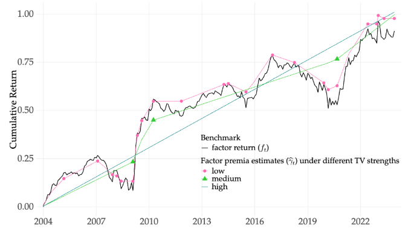
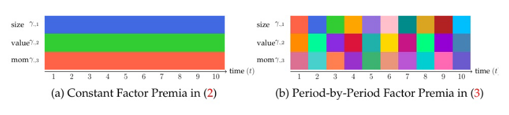
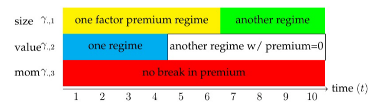
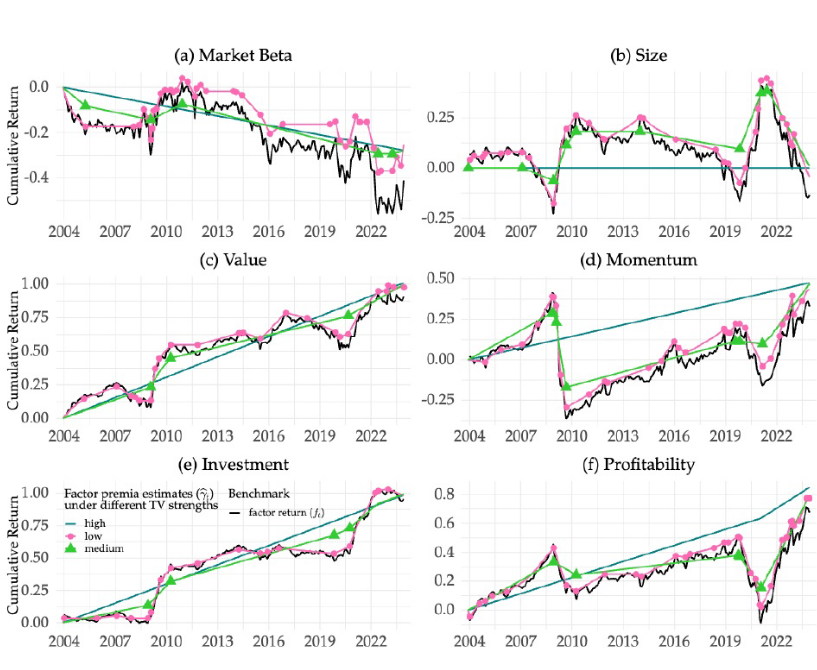
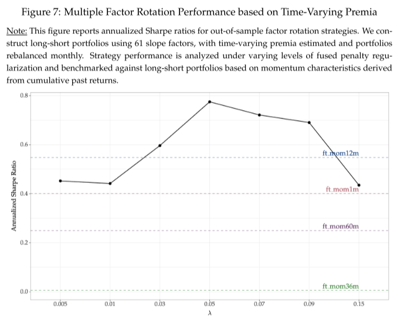
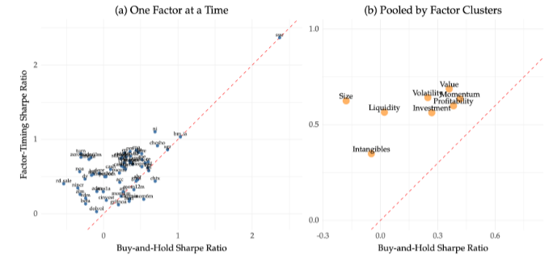
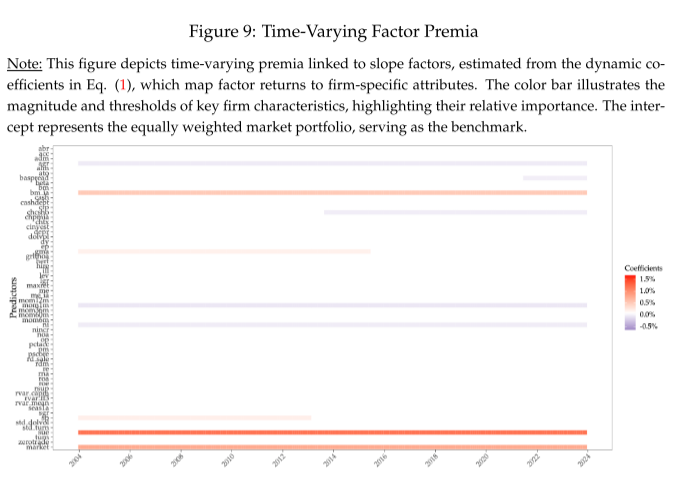
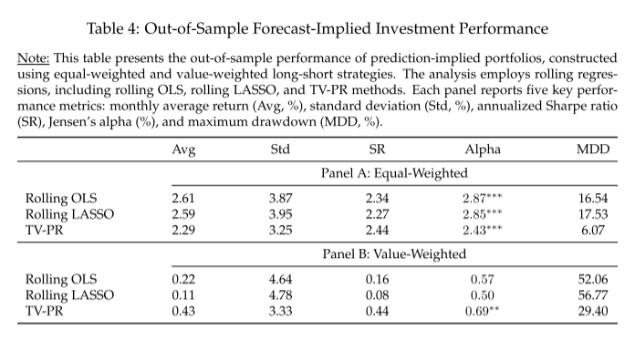

### 摘要

> 本文提出了一个横截面资产定价模型，该模型结合了因子溢价中的结构性中断和
> 制度依赖的动量趋势。为了估计时变斜率因子模型，我们采用了全变差正则化
> (TV)，它允许灵活的股票收益预测。这种方法在不同频率下产生分段线性趋势线，
> 根据TV惩罚捕获长期或细粒度的因素动量趋势，并使用机器学习框架进行校准。
> 该方法展示了大样本理论性质，包括一致性和渐近正态性。样本外趋势跟随因子
> 择时策略优于传统的买入并持有或固定窗口动量策略。此外，与时不变模型相比，
> 动态因子选择和时变溢价估计导致资产定价因子模型规范得到改善。该框架为捕
> 获动态市场条件提供了强大的工具，并在预测准确性和投资组合绩效方面提供了
> 显着优势。

### 研究问题

> 股票收益的风险收益建模主要依靠因子模型。虽然在使用公司特征
> 估计动态因子负荷方面取得了很大进展，但由于时间序列信息的限制，
> 动态因子溢价估计仍然具有挑战性。识别因子溢价的结构性中断和趋势对
> 于构建SDF和基于因子的投资至关重要。

> 从经济学的角度来看，因子溢价发生变化的原因有很多。因子溢价可能在因子构建发布
> 后衰减或消失，与因子层面的交易流量密切相关，并且可能由于潜在经
> 济条件的结构性变化而发生突变，例如全球金融危机和COVID-19大流
> 行各种各样的潜在原因表明，突变和趋势可能以复杂的方式出现，单独
> 对这些经济机制进行建模可能不足以捕捉全貌。完整的图景很可能是短
> 期和长期(或高频和低频)变化的混合。

> 因此，数据驱动的方法可以非常适合从股票回报数据中梳理出突变和趋势，我们提出
> 了一种实现这些目标的新方法，并证明了其在资产定价和投资应用中的普遍实用性。

### 研究方法

> 本文提出了一个全变异面板回归(TV-PR)模型，该模型由两部分组成，首先利用股票
> 收益和横截面特征数据来改进因子溢价的估计。然后通过总变化(TV)正则化的机器学习
> 技术来捕捉因子溢价的趋势和中断，即通过对时间上相邻的每对因子溢价系数之间
> 的变化进行正则化$|\gamma_t-\gamma_{t-1}|$。
>
> 如图1所示，通过绘制因子收益和因子溢价的累积总和来估计中断或趋势。该框架允许灵活地捕获不同频率的中断，或者换句话说，不同平滑度的趋势，高正则化强度产生更平滑的趋势(如图1中的蓝色趋势线所示)。在极低的正则化条件下，模型简化为逐周期的横截面回归，$\gamma_t$
> 估计接近斜率因子本身(图1中红色锯齿状趋势线)。因此，TV
> 正则化参数打开了频率/平滑度变化的断裂和趋势谱。以机器学习的方式调整参数，识别出最适合特定用例的频谱中的"最佳点"。
>
> 
>
> 本文提出了一个专为具有时变系数的高维预测因子设计的面板回归框架，该框架专为具有时变系数的高维预测因子设计。为了实现这一
> 点，我们引入了一个双重惩罚程序，该程序识别驱动时间特定变化的关键变量。时变系数面板回归模型如下：
>
> $$
> r_{i,t+1}=z_{i,t}^\prime f_{t+1}+\epsilon_{i,t}, i=1,\dots N,
> t=1,\dots T
> $$

> 其中， $r_{i,t+1}$ 是股票 $i$ 在 $t$ 时期的收益， $z_{i,t}$
> 是一个外生的回归变量， $f_{t+1}=\gamma_t+v_{t+1}$
> 代表不可观测的风险因子， $\gamma_t=E(f_{t+1})$ 表示因子溢价。
>
> 一种是因子溢价为常数的情形，即
> $\gamma_t=\gamma$，此时，面板回归模型为：

> $$
>  r_{i,t+1}=z_{i,t}^ \prime \gamma+\epsilon_{i,t}
> $$

> 另一种是因子溢价随时间变动，即：

> $$
>  r_{i,t+1}=z_{i,t}^ \prime \gamma_t+\epsilon_{i,t}
> $$

> 

> 在实践中，虽然可能会有中断，但在不同时期的时变预测系数值$\gamma_t$存在相似之处。我们建议从以下双罚面板预测回归过程中获得$\gamma_t$，具体如下：

> $$
>    \min_{\gamma_{i,t}}\frac{1}{NT}\sum_{i,t}(r_{i,t+1}-z_{i,t}^\prime\gamma_t)^2+\lambda\sum_{j=1}^p\sum_{t=2}^T|\gamma_{t,j}-\gamma_{t-1,j}|+\eta\sum_{j=1}^p\sum_{t=1}^T|\gamma_{t,j}|
>  $$

> 其中， $\sum_{j=1}^p\sum_{t=2}^T|\gamma_{t,j}-\gamma_{t-1,j}|$
> 采样期间结构断裂的总数，促进了稀疏区的识别，第二成惩罚项用于消除影响为零的因子。
>
> 
>
> 图3和(4)中描述的TV-PR过程产生的估计反映了在不同因子之间观察到的不同频率的中断和异质趋。势。

### 研究贡献

> 1.  从计量经济学的角度来看，现有的时变模型通常依赖于两个限制性假设:(1)所有预测因子之间的结构同时变化，(2)全局稀疏数据生成过程。第一个假设忽略了个别预测因子中不同结构断裂的
>     可能性，未能捕捉到实践中观察到的异质动态。第二个假设将系数建模为状态变量或缩放时间的函数，但往往忽略了局部时变稀疏性。
> 2.  无论是在总市场层面还是在横截面上预测股票收益，都面临着一个根
>     本性的挑战:预测关系的不稳定性。无论是在总市场层面还是在横截面上预测股票收益，都面临着一个根
>     本性的挑战:预测关系的不稳定性。
> 3.  TV-PR的主要贡献是解决了预测器选择和异质性不稳定性的双重挑战。
>     它采用了一种为资产定价应用量身定制的新型双重惩罚策略。

### 实证结果

#### 时变因子斜率的估计

> 我们通过基于特征的因素分析了2004年至2023年美国股
> 票市场中的61家公司特征及其相关风险溢价。我们的研究结果通过各种
> 实证练习证实了重大结构性转变的存在，并强调了将这些突破和趋势纳
> 入因素模型和投资决策的重要性。时变风险溢价捕捉了斜率因子回报的
> 结构性断裂和长期趋势。
>
> 
>
> 本文分析考察了经验资产定价中六个被广泛认可的因素，以探索风险溢价的动态及其对资产定价模型的影响。这些因素包括市场(以CAPM
> beta衡量)、
> 规模(以市场股本为代表)、价值(通过账面市值比获取)、动量(以12个月为期限评
> 估)、投资(定义为资产增长率)和盈利能力(以经营盈利能力为代表)。通过识别相关风险溢价的结构性突破，我们的目标是增强对这些因素如何影响资产定价框架的理解。
>
> 估计系数的平滑度取决于正则化水平，更大的调整参数产生更平滑的估计，更小的值提供更大的灵活性来跟
> 踪斜率因子回报。中等正则化估计的因子溢价有效地捕捉了制度变化。

#### 因子择时投资业绩

> 为了评估他们的投资表现，我们实施了一个因子排序策略，该策略根据估计溢价的符号和大小对因素进行排名。该策略假设因子溢价的依赖于的动量趋势会随着时间的推移而持续。具体来说，该策略涉及在风险溢价最高的5个斜率因子中建立多头头寸，在风险溢价最低的5个斜率因子中建
> 立空头头寸。该模型采用了一个10年历史数据滚动窗口，使用$\gamma_t$的最新估计来预测下个月的回报。每月的更新完善了估计，样本外测试跨越120
> 个月(2013-2023)
>
> 
>
> 因子排序策略的性能主要取决于参数估计的频率。高频估计可能会导致过度平滑，潜在地模糊有意义的变化，而低频估计可能会导致平滑不足，导致结果不稳定。在图7中，
> 最优参数达到了最高的夏普比率0.78，显示了灵活性和性能之间的平衡。
> 这一结果强调了因子排序策略的有效性。此外，夏普比率在整个超参数
> 谱上保持相对稳定，表明该策略对极端平滑选择具有鲁棒性。
>
> 
>
> 与大多数特征的买入并持有基准相比，时序策略表现出优越的性能，
> 如图8面板(a)中位于45度线上方的大多数点所示。图(b)将斜率因素分为八组，揭示了在因素择时策略下，规模类别内的公司实现了最高的回报。

#### 时变因子模型

> 实证资产定价中的一个重要问题是确定何时因素对其他资产的定价有用，或者等价地，何时这些因素与
> 30 资产定价因子模型(Asset pricing factor
> models)。为了解决这个问题，我们分析了斜率因子风险溢价的动态结构，并比较了时变和定常因子模型。
>
> 
>
> 图9中与公司层面特征相关的时变风险溢价突出了每个特征对预期回报
> 影响的持久性和可变性。在所分析的特征中，标准化的意外收益(sue)成为
> 横截面股票回报的稳健预测指标，其月风险溢价超过1.1%。这一发现强调
> 了意外收益在解释股票回报方面的重要性。行业调整后的账面市值比(bm ia)
> 也有积极贡献，强调了行业中性估值指标在资产定价中的相关性。其他特
> 征，如销售价格比(sp)、总盈利能力(gma)和流通股变动(chcsho)，表现出正的风险溢价，尽管它们的贡献会随着时间而波动。

#### 预测投资组合

> 基于预测收益(-ri,t+1))构建投资组合，作为
> 后续时期投资组合配置的信号。该模型每年使用过去十年的滚动窗口
> 进行重新估计，该窗口包含了更新的信息，同时减轻了过拟合。对于
> 每次改装，预测的风险溢价为下一年的投资组合权重提供信息。这种
> 动态方法使我们能够评估模型的实时适用性及其提高投资结果的潜力。
>
> 根据预测模型生成的回报预测构建多空投资组合。投资组合
> 从预测收益的前十分之一的股票中建立多头头寸，从底部十分之一的
> 股票中建立空头头寸。在分配头寸时，采用了等加权和价值加权两种 方法。
>
> 表4总结了模型驱动的投资组合策略的样本外表现。在面板A中，
> 基于TV-PR的等权重多空组合表现强劲，年化夏普比率为2.44，月alpha
> 约为2.4%。与逐期回归方法相比，TV-PR也显示出明显较低的最大递
> 减。同样，面板B显示使用TV-PR构建的价值加权多空组合达到预测隐含的性能表明，在更高频率下引入结构断裂增强了模型捕捉
> 动态变化的能力。虽然逐期回归更新有效地适应了频繁的结构变化，但
> 它们会导致方差增加，正如较低的夏普比率和显著的最大下降所证明的
> 那样。通过比较，TV-PR模型在保持可解释的因素结构的同时，在偏差-
> 方差权衡中达到了最优平衡，从而提高了投资绩效。
>
> 

### 结论

> 本文介绍了一种基于制度的方法，用于估计时变系数模型以预测个股收益，同时捕获预测器中制度相关的稀疏性。提出的时变预测回
> 归(TV-PR)框架整合了时间序列和横截面数据，以模拟企业特征与预
> 期收益之间的动态联系。tv - pr采用双重正则化方法——用于检测结构
> 断裂的融合套索惩罚和用于变量选择的套索惩罚——有效地适应了数据生成过程中的变化。
>
> 我们在有和没有已知结构断裂的情况下建立了估计器的大样本属性，为基于状态的建模提供了理论支持。从经验上看，TV-PR揭示了
> 因素溢价的制度依赖变化，并随着时间的推移一致地确定了相关的预
> 测因素。基于估计风险溢价的因素择时策略优于买入并持有和因素动量基准，突出了在建模时间变化时平衡灵活性和简约性的重要性。
>
> 与静态模型相比，TV-PR提供了更好的解释力和更好的投资绩效，
> 特别是在结构变化期间。通过结合政权依赖的动态和时变的稀疏性，
> TV-PR解决了回报预测中的关键复杂性。这些发现有助于动态资产定价模型的文献，并为投资组合管理提供实用的见解。
