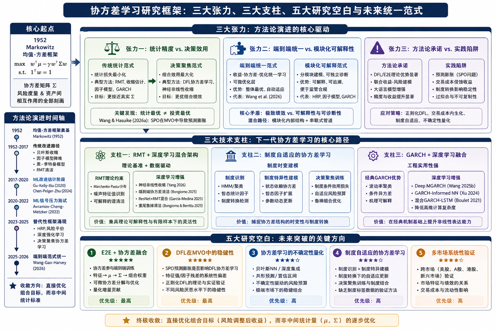

## 一、一个被低估的战略支点

### 1.1 协方差在投资组合理论中的核心地位与边缘化悖论

Markowitz（1952）的均值-方差优化（MVO）框架赋予协方差矩阵以核心地位：在
`max w'μ - γ·w'Σw` 这一简洁的目标函数中，协方差矩阵 Σ
承担着双重角色——它既是风险度量的载体，又是资产间相互作用关系的全部刻画。偏离这一框架的替代性方法（如HRP、DRL、风险平价），虽然形式上摆脱了显式的协方差矩阵，但其底层仍然隐式依赖资产间的共变结构。Burggraf（2020）的HRP方法使用层次聚类构建资产树状图，而聚类的输入正是基于收益率相关性的距离矩阵；Gu
et
al.（2025）的MTS-DRL使用多时间尺度LSTM提取状态表示，而表示学习的结果必然编码资产间的协方差模式。Salas-Molina
et
al.（2025）更进一步证明，距离度量的选择直接影响HRP的组合波动率至多20%——这一发现揭示了一个令人不安的事实：即使采取了"规避协方差估计"的策略，协方差结构仍然以距离度量的形式迂回地影响着最终决策。

然而，协方差估计本身的研究在ML+组合优化的文献中却出奇地边缘化。Lee et
al.（2024）在《Journal of Portfolio
Management》的综述中，用大量篇幅讨论了ML在收益预测中的应用（GKX 2020,
Chen et al.
2024），而在协方差预测部分仅用三行文字提及kNN、图网络和RMT三类方法。这一"重均值、轻协方差"的倾向并非偶然：收益预测提供了直观可验证的预测评估（预测值与实际值的比较），而协方差估计的评估则更加困难——真实协方差矩阵是不可观测的，任何评估都必须依赖下游组合绩效的间接验证。

这种边缘化带来的后果是：当新一代DFL和E2E方法将协方差学习推向决策聚焦范式时，其与经典协方差理论（RMT、收缩估计、因子模型）之间的对话几乎是断裂的。

### 1.2 研究现状图

------------------------------------------------------------------------

## 二、三条主线张力

### 统计精度 vs. 决策效用

#### 2.1 经典范式的假设及其缺陷

传统协方差估计的默认范式可以概括为"准确先于有用"。在这一范式下，协方差估计器的优劣由统计损失函数（Frobenius范数、Stein损失、QLIKE）衡量，组合优化被假设为这一准确估计的自动受益者。Ledoit
& Wolf（2004）的线性收缩、Ledoit &
Wolf（2012）的非线性收缩、以及更广泛的RMT方法（Marchenko & Pastur,
1967）都属于这一范式——它们致力于使协方差估计在统计意义上更接近真实值，但对"更接近真实值的协方差是否一定导致更优组合"这一问题缺乏直接验证。

#### 2.2 神经非线性收缩：统计精度与决策效用的首次分离

Yang et
al.（2026）的神经非线性收缩是该领域最具开创性的工作之一。其方法论核心是：用神经网络学习从特征值到最优收缩量的映射函数，且训练损失是组合效用而非统计精度。具体而言，神经收缩网络接受样本协方差矩阵的特征值作为输入，输出经过收缩处理的修正特征值，然后以修正后的协方差矩阵构建MVO组合，最终以组合的样本外Sharpe比率作为训练损失回传梯度。

在模拟数据和真实市场数据上的实验揭示了一个关键发现：**最优神经收缩函数与Marchenko-Pastur（1967）分布的预测存在系统性偏差**。Marchenko-Pastur分布是经典RMT的核心结论，它描述了高维随机矩阵特征值的极限分布，是多数协方差清洁方法的理论基础。Yang的发现意味着数据中存在的非线性结构（如因子结构、行业聚集、波动率异质性）使得理论上的最优清洁在有限样本下不再是实际最优——神经网络捕捉到了这些偏离。在p/T（资产数/时间比）处于0.2-0.8区间时，神经收缩的Sharpe比率提升最为显著（相对样本协方差40-60%，相对线性收缩15-25%，相对经典非线性收缩5-10%）。

然而，Yang的神经收缩仍然是在MVO框架内运作的——它改进了协方差估计，但收益预测仍然是独立完成的。这引出了一个自然的问题：如果协方差估计本身可以决策聚焦训练，为什么不将这一逻辑扩展到收益预测和组合优化的全流程？

#### 2.3 DFL协方差学习：GMVP的特殊性与普适性

Kim et
al.（2025）的DFL-GMVP选择了一个精巧的切入点：全局最小方差组合（GMVP）不依赖收益预测，仅依赖协方差矩阵。这意味着DFL协方差学习可以在GMVP场景下被"纯净地"评估，不受收益预测误差的污染。其方法是构建一个因子模型加神经网络残差校正的协方差架构，前向求解GMVP权重，反向以组合方差为损失更新协方差参数。

结果是清晰的：组合方差降低8-15%，且滚动窗口绩效在不同市场状态下保持稳定。更具洞察力的发现是，学习到的残差协方差呈现**行业聚集性**——同一行业内的股票残差协方差显著高于跨行业残差——这一发现同时具有统计学意义和经济直觉上的合理性。

Dom et
al.（2025）将DFL协方差学习的场景从GMVP扩展到整个有效前沿。其关键发现是：协方差估计误差在**中等风险厌恶水平**（γ中等）时对组合绩效的影响最大——这恰好是最多投资者关注的区域。且针对GMVP优化的协方差在有效前沿的其他点上并不是最优的。这一发现提示了一个基本但常被忽视的事实：**没有通用的"最佳"协方差估计器，协方差估计需要与目标组合的位置对齐。**

#### 2.4 SPO预测膨胀：决策聚焦学习的阿喀琉斯之踵

正当DFL协方差学习的优势被Yang（2026）、Kim（2025）和Dom（2025）一致验证时，Wang
& Hasuike（2026a）的工作为这一路线投下了一颗重磅炸弹。

该论文证明，SPO（Smart
Predict-Then-Optimize）框架在MVO中会导致**系统性预测膨胀**。其机理是：SPO损失函数以决策误差（而非预测误差）为目标，在MVO场景中，极端收益预测可以降低SPO损失——一个过度乐观的预测会导致组合权重向该资产倾斜，如果该资产实际上并没有产生极端收益，SPO损失的惩罚是有限的；但如果预测保守而错过了极端收益，SPO损失则会很大。因此，SPO损失函数的理性行为是鼓励模型放大预测中的极端值，导致"预测膨胀"和"过度换手"。

这一发现的深刻之处在于：**决策误差损失的最小化并不等于投资效用的最大化**。两者的错配来自组合优化问题的凸性不对称——错过正极端收益的成本高于误判负极端收益的成本。这意味着，除非DFL框架中加入特定的正则化机制（如Wang
& Hasuike
2026a提出的正则化SPO），否则DFL在涉及收益预测的MVO场景中可能导致策略在回测中表现优异但在实际交易中崩溃。

> **阶段性判断**：从统计精度到决策效用的转型在概念上是正确的，但需要更精细的条件限定。GMVP场景（Kim
> 2025）不涉及收益预测，是DFL协方差学习最安全的舞台。涉及收益预测的一般MVO场景（Dom
> 2025的有效前沿扩展）则需要额外的正则化机制。Wang &
> Hasuike（2026a）的正则化SPO是这一方向的第一步，但尚未与协方差学习本身结合。

------------------------------------------------------------------------

### 端到端统一 vs. 模块化可解释性

#### 2.5 Wang-Gao-Harvey E2E框架：统一的力量与代价

Wang et
al.（2026）在NBER工作论文中提出的端到端框架是该领域迄今最具雄心的方法论贡献。其核心架构是一个可微凸优化层：前向求解带约束的二次规划（包含做多限制、集中度限制、换手率惩罚），反向通过KKT条件和隐函数定理计算梯度，将梯度回传至特征编码网络。这一架构将收益预测、协方差估计、组合优化和交易成本约束整合为单一可微管道。

在中国A股市场（5,489只股票、400+特征、约600万观测值）的实证中，E2E框架展现了系统性优势：

**在多头约束下**，E2E在所有模型规格下绩效提升均统计显著——这与Avramov et
al.（2022）的发现形成呼应。Avramov发现ML信号的最佳绩效几乎完全来自于做空难以套利的股票空头，在多头约束下降幅达66-78%。Wang的E2E框架通过将多头约束直接嵌入训练过程，使预测模型在训练时即"知道"它将面临多头约束，从而避免学习那些在做多限制下无法利用的信号模式。

**在交易成本适应性上**，E2E的优势更为直观。当交易成本从0%上升至0.3%时，两阶段MSE方法的净收益从正转负，而E2E方法在三个成本水平上均保持正收益。机制分析显示，E2E框架在训练中自动降低了高换手率信号特征的权重，同时提高了低换手率基本面因子（如账面市值比、盈利能力）的权重。这是两阶段方法无法实现的——MSE训练不会预测特征将产生的交易成本，而事后扣除交易成本无法影响预测模型的参数。

**在整个风险谱系上**，E2E在三种投资者类型（高风险、中等风险、低风险）上均优于MSE基线和PPP方法。这得益于风险厌恶系数γ直接作为E2E框架的输入参数——模型学会了在不同γ值下调整预测行为。

然而，E2E框架也存在三个方法论层面的局限。

**第一，协方差估计的端到端缺席。**
Wang的E2E框架使用滚动窗口样本协方差或收缩协方差作为优化层的输入，这意味着协方差估计本身并未参与端到端训练。这一设计选择在工程上是合理的（避免了可微协方差分解的计算复杂性），但从方法论角度看意味着协方差估计仍然是"非学习的"——这是研究地图和本评述共同识别的最重要的单一研究空白。

**第二，可解释性诊断的困难。**
在两阶段方法中，研究者可以独立诊断收益预测的MSE和协方差估计的QLIKE。当组合绩效恶化时，可以追溯至具体模块。在E2E框架中，损失的唯一信号是组合层面的效用，梯度回传至所有参数。Lee
et
al.（2024）在其综述中强调的可解释性需求——特别是监管合规层面的需求——在E2E框架中尚未得到充分解决。

**第三，与DFL的竞争性替代关系。** Bongiorno et
al.（2025）的E2E协方差清洁提供了另一种可能的融合路径：直接在协方差层面进行E2E训练，而非在权重层面。其神经网络直接学习最优协方差清洁参数以最小化组合方差。在大规模组合（N
\>
100）实验中，NN清洁显著优于样本协方差和线性收缩，且清洁参数的最优值随组合规模和市场状态变化——这意味着自适应清洁的必要性。

#### 2.6 模块化方法的坚持：HRP与因子模型的路径

与E2E统一范式形成对照的是坚持模块化结构的HRP和因子模型路径。

HRP（Burggraf
2020）通过层次聚类+分层分配的途径完全规避了协方差矩阵求逆的计算和统计问题。其模块化结构——聚类→准对角化→递归划分——每一步都是可解释的。Salas-Molina
et
al.（2025）进一步沿着模块化路径优化了距离度量选择这一关键组件，但未改变HRP的总体结构。

Tzikas et
al.（2026）的暂态统计因子提供了一个更精巧的模块化案例。该工作在不破坏原有Barra风险模型可解释性的前提下，通过最大似然估计动态添加暂态因子来捕捉协方差结构的制度变化。这一"做加法而非替换"的策略——作者阵容包括Candès（压缩感知创始人）、Hastie（统计学习领域权威）和Boyd（凸优化领域权威）——在学术优雅性和实际可实施性之间取得了平衡。

有趣的是，模块化和E2E两条路径可能并非互斥。Reis et
al.（2025）的深度学习中期协方差预测框架提供了一个可嵌入E2E管线的模块化协方差预测器——它在结构上是模块化的（独立训练、可替换），在功能上可以与E2E优化层串联使用。这一"模块化内部结构+串联式管道"的设计模式可能是缓解E2E与可解释性之间张力的务实路径。

> **阶段性判断**：E2E统一与模块化可解释性之间的冲突可能并非非此即彼，而是需要在不同应用场景中权衡——极致绩效和自动化运作倾向E2E，风险归因和监管合规倾向模块化。"模块化内部结构+串联式管道"的混合模式是兼顾双方优势的有希望的方向。

------------------------------------------------------------------------

### 方法论的承诺与实践的陷阱

#### 2.7 联合收益-风险建模：承诺与未验证的边界

Park（2026）的联合收益-风险NN框架是该领域最具前沿意义的方法论创新之一。其架构包含一个共享表示层和两个独立预测头——收益预测头输出期望收益向量μ̂，协方差预测头输出协方差矩阵Σ̂——两者通过Sharpe比率损失函数联合训练。36.4%的年化收益和0.91的Sharpe比率的回测结果令人印象深刻。

然而，对这一结果的解读需要保持审慎。该文仅在有限的数据集上进行验证，未在不同市场（如美股、新兴市场）、不同时间周期（如覆盖多轮牛熊周期的长期验证）和不同交易成本假设下进行系统测试。Wang
et
al.（2026）在中国A股市场的经验表明，交易成本对ML策略的影响是根本性的（低成本场景下Sharpe从\>3.0降至\<0.5），Park的联合模型在扣除合理交易成本后的净收益尚不明确。

#### 2.8 DFL的深度集成与LLM增强：边际改进还是范式升级？

Kim et al.（2025b）的深度集成DFL和Hwang et
al.（2025）的LLM增强DFL代表了决策聚焦学习向提升鲁棒性和扩展数据来源两个方向的延伸。

深度集成DFL通过对多个DFL模型的集成来降低单一模型的过拟合风险，同时通过集成成员之间的预测分歧来量化不确定性。这一技术策略在工程上是稳健的——集成方法在ML中有着长期的实践检验（尤其是随机森林的集成效应），但在DFL框架下的系统性测试尚有限。

Hwang et
al.（2025）将大语言模型集成到DFL框架中是一个有意义的跨领域尝试。其方法是通过LLM处理财经新闻和宏观报告，将文本分析结果以"经济先验"的形式注入到决策聚焦的数值预测模型中。在S&P
100和DOW
30上的测试显示，LLM增强模型在重大经济事件（如美联储议息会议、财报发布）期间的风险调整收益显著提升。然而，LLM的推理延迟（从数百毫秒到数秒不等）使其在高频或日内交易场景中面临实际部署障碍，且LLM输出的非确定性使策略的回测可重复性成为一个需要解决的问题。

#### 2.9 GARCH+深度学习的融合：最具实用潜力的方向

协方差学习中实际部署潜力最大的方向可能不是最前沿的，而是最务实的——GARCH类计量模型与深度学习的融合。Wang
et al.（2025b）的Deep
MGARCH使用LSTM增强的多变量BEKK模型，在保留GARCH波动率聚类效应的同时增加了非线性依赖性捕捉能力。Xu
et al.（2024）的GARCH-Informed
NN更为直接——将GARCH(1,1)的预测结果作为神经网络的输入特征，确保模型在波动率聚类这一已知规律上不低于经典GARCH的表现。

这些工作的价值在于其**增量式的知识集成策略**：不忽视计量经济学的经典结论，而是在此基础上叠加深度学习的新能力。这种"物理信息+深度学习"的思路在工程领域（如PINN求解偏微分方程）已经积累了丰富的经验，在经济金融领域尚处于起步阶段。Zhu
et
al.（2024）的综述论文对此提供了系统性梳理，指出该思路在金融时间序列建模中的潜力尚未被充分挖掘。

> **阶段性判断**：DFL/E2E的方法论承诺在理想条件下得到了一致验证，但SPO预测膨胀的发现正在催生第二代DFL方法（正则化DFL、约束DFL）的涌现。与此同时，GARCH+深度学习融合方向以其务实的增量策略提供了短期内最具可部署性的技术路线——这一路线的上限受限于GARCH框架自身的表达能力，但其下限有经典理论支撑。

------------------------------------------------------------------------

## 三、新研究的进度

### 3.1 协方差清洁的深度学习化

传统协方差清洁方法建立在RMT的核心理念之上：真实协方差矩阵的特征值谱与噪声谱存在可分离的差异，噪声谱的结构由Marchenko-Pastur分布刻画。清洁过程即"滤除噪声特征值、保留信号特征值"。这一方法有效，但依赖于一个核心假设：数据的真实协方差结构符合RMT的理论预设。

Bongiorno et
al.（2025）和Garcia-Medina（2025）的工作从不同角度突破这一假设的限制。

Bongiorno的端到端NN协方差清洁将清洁过程本身参数化：神经网络接受样本协方差矩阵（或其特征值分解）作为输入，输出清洁后的协方差矩阵，训练损失是下游组合的方差。在N
\>
100的大规模组合实验中，该方法的优越性在三个维度上得到验证：（1）相对样本协方差在不同p/T比值下均表现更好；（2）相对线性收缩的改进在大规模组合场景（N
\>
200）中最为显著；（3）清洁参数的最优值随市场状态变化——牛市中的最优清洁强度显著低于熊市。这一发现的意义在于，它揭示了协方差清洁的"最优噪声假设"本身是时变的，固定参数的清洁（如标准的RMT特征值截断）在动态市场中必然次优。

Garcia-Medina（2025）的ResNet+RMT混合架构选择了更具可解释性的技术路径：RMT提供初始的特征值谱过滤，ResNet学习过滤后残差的非线性校正模式。在加密货币市场的验证（一个以重尾分布和高波动聚集为特征的领域）显示了该混合架构相对于纯RMT方法的竞争优势。

Lin et
al.（2021）的深度风险模型从另一个角度接近同一目标。该方法使用自编码器架构从价格数据中学习潜在风险因子，同时估计因子暴露和因子协方差。虽然发表于2021年（早于上述两个工作），其方法论——将因子学习与协方差估计用自编码器统一——为后续的DFL协方差学习（Kim
2025的因子+残差架构）提供了概念基础。

### 3.2 RMT与深度学习从竞争走向互补

RMT与深度学习在协方差估计中经历了从竞争到互补的关系演变。

**竞争阶段**（2020年前）：RMT方法以Marchenko-Pastur分布为理论工具进行协方差清洁，假设数据生成过程接近i.i.d.。深度学习方法从数据中学习协方差结构，不依赖理论假设。两者被视为替代选项——前者"理论驱动"，后者"数据驱动"。

**互补阶段**（2025年后）：Garcia-Medina（2025）的ResNet+RMT架构和Bongiorno
&
Berritta（2023）的重尾协方差清洁证明了两种方法可以有机互补。RMT的贡献在于提供：（1）协方差噪声结构的理论基准——不应被神经网络随意改写；（2）清洁结果的可解释性——特征值谱中哪些部分被滤除、为何被滤除是透明的。深度学习的贡献在于捕捉RMT理论假设之外的数据特异性模式——如行业聚集导致的额外特征值膨胀、重尾分布导致的谱形态变形。

Bongiorno &
Berritta（2023）对重尾分布的关注特别值得强调。RMT的经典结论（Marchenko-Pastur分布）假设数据的四阶矩有限，但金融收益率序列普遍呈现重尾特征（尾部指数通常在3-4之间），使这一假设不成立。该工作提出的重尾鲁棒清洁方法在金融危机期间的组合回撤控制上明显优于标准RMT清洁。

Caner &
Daniele（2022）的DL精度矩阵估计从另一角度展示了RMT与DL的互补性。该方法在非线性因子模型的残差上使用深度学习估计精度矩阵（协方差矩阵的逆）。精度矩阵在组合优化中直接相关于最优权重的计算（GMVP权重与精度矩阵行和成正比），且在高维场景下精度矩阵的稀疏性假设比协方差矩阵的同质性假设更为合理。

> **核心判断**：RMT+DL混合方法在未来3-5年内将成为协方差估计的主导范式。RMT提供理论基础和可解释性框架，DL提供有限样本下的精调能力。这一结合的独特价值在于：当p/N（资产数/时间比）很高时（如N
> \> 200, T \<
> 500），RMT的理论约束防止过拟合；当p/N适中时（0.2-0.8），DL的灵活性超越理论假设。

### 3.3 制度时变性与协方差学习的结合

协方差结构并非时间不变——这一认识是计量经济学的基础性结论（Engle 1982,
Bollerslev 1986），但在协方差学习文献中尚未得到充分吸收。

Tzikas et
al.（2026）的暂态统计因子是对这一问题的系统性回应。在经典的Barra风险模型框架内（使用截面因子如行业因子、风格因子），该方法通过最大似然估计动态识别"未被现有因子解释的残余协方差结构"，并将其参数化为暂态统计因子。这些暂态因子在下一个估计窗口可能消失或被新的因子替代——这正是"暂态"的含义。在美股高市值股票上的测试显示，添加暂态因子的风险模型在样本外协方差预测精度上显著优于基准Barra模型。

Wood et
al.（2026）的DeePM从端到端框架的角度处理制度适应性问题。该方法将市场制度识别（通过HMM或聚类）嵌入到深度组合管理网络的输入端，使组合策略在不同制度下使用不同的参数化模式。虽然在协方差估计层面不如Tzikas的工作具体，但DeePM提供了制度适应性与决策聚焦训练结合的框架性设计。

这两个工作的共同启示是：**协方差结构的时变性不是需要消除的噪声，而是需要建模的信号**。在固定参数化的协方差学习框架中，制度转换会被错误地视为参数的不稳定性；在制度自适应框架中，制度转换是协方差模型条件结构的正常组成部分。

Fang &
Ślepaczuk（2026）提供的中国A股高频数据的实证补充了新兴市场的视角：在中国市场中，制度转换更为频繁（政策驱动）、波动聚集效应更强（散户主导）、协方差结构的稳定性更低。这些特征使制度自适应的协方差学习在新兴市场中可能具有比成熟市场更大的边际价值。

### 3.4 GARCH与深度学习的融合

GARCH类模型与深度学习的融合构成了协方差学习中最具工程实用价值的方向。Wang
et al.（2025b）的Deep MGARCH和Xu et al.（2024）的GARCH-Informed
NN是这一方向的代表性工作。

Wang et al.（2025b）的Deep
MGARCH将标准BEKK多变量GARCH模型中的线性参数化替换为LSTM——BEKK模型保证了协方差矩阵的正定性，LSTM提供了对非线性、动态依赖关系的捕捉能力。这一替换保留了GARCH的核心特征（波动率聚类、条件异方差），扩展了模型对复杂关系的建模能力。

Xu et al.（2024）的GARCH-Informed
NN方法在技术设计上更为精细：它不替换GARCH组件，而是将GARCH(1,1)的预测结果作为神经网络的输入特征，同时将GARCH(1,1)的残差作为额外的监督信号。这一设计确保了模型在波动率聚类这一"已知的已知"上的表现不低于经典方法，同时允许NN在"未知的未知"上探索更复杂的模式。

Boulet（2021）的混合GARCH-LSTM方法在降低高维协方差预测计算复杂度上提供了额外的贡献：通过DCC（动态条件相关）结构将协方差分解为条件波动率（用GARCH-LSTM建模）和条件相关性（用DCC建模），使参数数量从O(N²)降至O(N)。这一分解对于大规模资产配置场景具有实际意义——当N
\> 100时，完整的多变量GARCH模型的计算成本已经难以承受。

> **小结**：三个方向构成了协方差学习的未来骨架——RMT+DL混合架构提供理论深度，制度自适应框架提供时变性建模，GARCH+DL融合提供工程实用性。三者之间不存在排他性关系：一个实用的协方差学习系统可能需要同时集成这三个维度的贡献。

------------------------------------------------------------------------

## 四、研究空白重新评估

基于34篇论文的系统性分析，我对研究地图中识别的研究空白做了重新评估和优先级排序。与初始版本相比，最大的变化是新增了"DFL在MVO中的稳健性"这一空白（直接源于Wang
& Hasuike
2026a的警示），并提升了"协方差学习的不确定性量化"和"制度自适应的协方差学习"的优先级。

### 4.1 E2E+协方差融合 ⭐⭐⭐⭐⭐（不变，但实现路径更清晰）

**现状与缺口**：Wang et
al.（2026）的E2E框架使用滚动窗口样本协方差——协方差估计本身未参与端到端训练。Park（2026）的联合NN同时学习μ和Σ并以Sharpe为损失，但组合优化层是解析的而非可微的。Bongiorno
et
al.（2025）的E2E协方差清洁最接近"用神经网络端到端训练协方差"，但其目标仅为最小化组合方差而非完整效用。

**可行路径**：将Park（2026）的联合NN架构中的协方差输出替换为Bongiorno（2025）的清洁网络，并接入Wang（2026）的可微凸优化层。整体以组合效用（考虑交易成本和约束）为损失进行端到端训练。

**预期贡献**：这将首次实现从原始特征到组合权重的完全端到端学习，且框架中协方差部分的贡献是可分离的——可以通过消融实验量化"端到端协方差学习"相对于"滚动窗口协方差"的增量贡献。

**所需资源**：Wang（2026）规模的实证数据（5000+股票，400+特征，多轮牛熊周期）、可微协方差分解（Cholesky或特征值分解）的实现、大规模可微凸优化求解器。

### 4.2 DFL在MVO中的稳健性 ⭐⭐⭐⭐⭐（新增，基于Wang-Hasuike 2026a）

**问题实质**：Wang &
Hasuike（2026a）证明SPO框架在MVO中导致预测膨胀。这一发现是否适用于DFL协方差学习？

**验证方向**： -
在Kim（2025）的DFL-GMVP基础上引入收益预测头，检验是否存在因子残差的系统性偏差 -
在Dom（2025）的多风险厌恶系数DFL框架中，检验不同γ水平下预测膨胀的严重性差异 -
将Wang & Hasuike（2026a）的正则化SPO方法适配到DFL协方差学习场景 -
理论分析：协方差估计的DFL损失是否在特征值空间产生类似于预测膨胀的"特征值膨胀"？

**难度评估**：理论分析中等难度（需要建立SPO损失与协方差特征值偏移之间的分析关系），实证验证较为直接（模拟已知真实协方差的数据、比较DFL与统计方法的估计偏差）。

### 4.3 协方差学习的不确定性量化 ⭐⭐⭐⭐（优先级提升）

**问题**：Vadrevu（2026）用高斯过程回归进行波动率-协方差联合估计，提供了置信区间。但GP的计算成本随样本量立方增长，在大规模组合中不可行。

**可行路径**： - 深度集成的不确定性量化（Kim et al.
2025b的集成DFL提供自然的方差估计） -
贝叶斯神经网络用于协方差参数化（需解决高维后验采样的计算问题） -
共形预测（Conformal Prediction）作为模型无关的不确定性框架

**附加价值**：不确定性区间可以为组合优化提供稳健性约束——在高不确定性时期（如2020年3月）收紧风险预算，在低不确定性时期放松限制。这实际上是一种隐式的制度适应机制。

### 4.4 制度自适应的协方差学习 ⭐⭐⭐⭐（优先级提升）

**问题**：尚无协方差学习方法能同时处理（1）制度转换检测、（2）制度特异性协方差建模、（3）决策聚焦训练三个维度。

**可行路径**： -
将HMM制度检测与DFL协方差学习序列化串联（先检测制度，再选择制度特异性协方差模型） -
将协方差结构的时变性直接参数化为状态依赖的函数（Tzikas
2026的暂态因子提供了因子层面的先验结构）

**当前约束**：缺乏带有制度标签的大规模金融数据集用于评估制度自适应方法的增量价值（事后划分"牛/熊/震荡"时间窗口的方法存在前瞻偏差）。合成数据可能是初始验证的合理起点。

### 4.5 多市场系统性验证 ⭐⭐⭐⭐（不变）

**问题**：多数协方差学习方法在美股或合成数据上验证。Garcia-Medina &
Rodríguez-Camejo（2023）的墨西哥市场验证和Fang &
Ślepaczuk（2026）的中国A股验证是少数例外。

**延伸方向**： -
将现有DFL协方差学习方法在跨市场数据集上比较（美股、A股、港股、新兴市场） -
检查协方差学习的绩效是否与市场特征（波动率水平、市场效率、散户比例）存在系统性的横截面关系

------------------------------------------------------------------------

## 五、结论

协方差学习在投资组合优化中的应用正处于一个关键的范式转型期。从Yang（2026）的神经收缩到Park（2026）的联合收益-风险建模，从Kim（2025）的DFL-GMVP到Wang
&
Hasuike（2026a）的SPO预测膨胀警示，该领域在不到18个月的时间里经历了"命题-验证-反思"的完整知识迭代周期。基于对34篇论文的系统性分析，我的核心判断如下：

**第一，从统计精度到决策效用的转型是不可逆的。**
在组合优化这一决策问题的约束下，以统计精度为目标训练协方差估计器在逻辑上是不一致的——如果最终目标是最大化Sharpe比率，没有理由在中间步骤使用MSE或QLIKE损失。Yang（2026）、Kim（2025）和Dom（2025）从不同角度提供了这一转型有效性的实证证据。但是，Wang
&
Hasuike（2026a）的预测膨胀发现表明决策聚焦训练并非天然免疫于过拟合——DFL框架本身需要结构性改进（正则化SPO或替代性决策损失函数）。

**第二，RMT+DL混合方法是协方差估计最有前途的技术路线。**
RMT提供理论骨架（Marchenko-Pastur分布、特征值谱的渐近理论），DL提供有限样本下的数据驱动精调能力。Garcia-Medina（2025）的ResNet+RMT架构和Bongiorno
et
al.（2025）的E2E协方差清洁在两个维度上验证了这一路线的竞争力。这一混合方法的独特优势在于其在不同p/N比值下的稳定性——RMT约束防止了高维场景下的过拟合，DL灵活性捕捉了中等维度场景下的非线性结构。

**第三，E2E框架与协方差学习的融合仍是最重要的单一研究空白。**
Park（2026）的联合NN建模是第一步，Bongiorno（2025）的E2E协方差清洁是第二步，但两者的结合——一个端到端可微的、包含协方差学习模块的、以组合效用为目标函数的统一框架——尚未实现。完成这一融合需要解决可微协方差分解（确保Σ(θ)的正定性和可微性）、大规模可微凸优化（支撑5000+资产场景）和联合收益-协方差训练稳定性（防止两个预测头之间的梯度竞争）三个技术挑战。

**第四，该领域正面临突破性进展前的最后壁垒。**
正如深度强化学习在围棋领域的突破依赖于将MCTS（蒙特卡洛树搜索）与深度神经网络的联合训练（Silver
et al., 2016），协方差学习的突破可能依赖于将可微凸优化（Wang et al.,
2026）与联合收益-协方差建模（Park,
2026）的系统性融合。这一融合一旦完成，将从根本上颠覆"先预测-再优化"的两阶段范式——预测和优化将不再是有先后顺序的两个阶段，而是同一个端到端学习过程的两个方面。

------------------------------------------------------------------------

## 参考文献

### 原始收藏（19篇）

#### 主题一：综述论文

1.  Lee, Y., Kim, J. H., Kim, W. C., & Fabozzi, F. J. (2024). An
    overview of machine learning for portfolio optimization. *The
    Journal of Portfolio Management*, 51(2), 131–148. DOI:
    `10.3905/jpm.2024.1.639`
2.  Lee, Y., Kim, J. H., Kim, W. C., & Fabozzi, F. J. (2024). Machine
    learning in asset management. *Working Paper / Book Chapter*.

#### 主题二：深度学习资产配置

3.  Cao, J., et al. (2025). Neural dynamics for portfolio optimization.
    *IEEE Transactions on Systems, Man, and Cybernetics: Systems*. DOI:
    `10.1109/TSMC.2024.3514919`
4.  Stevinson, D., et al. (2024). Reducing portfolio volatility with
    neural networks. *ACM ICAIF 2024*. DOI: `10.1145/3677052.3698678`
5.  Ramirez, P., et al. (2023). ML plus-features: Machine learning
    enhanced asset allocation. *ACM ICAIF 2023*. DOI:
    `10.1145/3604237.3626865`
6.  Ni, Y., et al. (2023). Optimal allocation based on machine learning.
    *Working Paper*.

#### 主题三：深度强化学习投资组合

7.  Gu, Z., et al. (2025). MTS: A multi-time-scale deep reinforcement
    learning portfolio. *arXiv preprint*.
8.  Li, X., et al. (2024). Multi-agent deep reinforcement learning for
    portfolio management. *arXiv preprint*.
9.  Wei, Y., et al. (2025). Mixture of experts for deep reinforcement
    learning portfolio. *arXiv preprint*.
10. Yu, J., et al. (2025). Spectral deep reinforcement learning for
    portfolio optimization. *Pacific-Basin Finance Journal*. DOI:
    `10.1016/j.pacfin.2025.102746`
11. Ren, Y., et al. (2025). SAMP-HDRL: A hierarchical deep reinforcement
    learning portfolio. *arXiv preprint*.
12. Li, Z., et al. (2024). DRL stock portfolio with data fusion. *arXiv
    preprint*.

#### 主题四：ML协方差估计

13. Yang, B., et al. (2026). Neural nonlinear shrinkage for covariance
    matrix estimation. *arXiv preprint*.
14. Kim, J., Tae, I., & Lee, Y. (2025). Estimating covariance for global
    minimum variance portfolio: A decision-focused learning approach.
    *arXiv: 2508.10776*.
15. Dom, S., et al. (2025). Beyond GMV: Covariance learning for the
    efficient frontier. *Quantitative Finance*. DOI:
    `10.1080/14697688.2025.2468268`

#### 主题五：层次风险平价

16. Burggraf, T. (2020). Beyond risk parity: How machine learning is
    changing portfolio construction. *Finance Research Letters*. DOI:
    `10.1016/j.frl.2020.101523`
17. Salas-Molina, F., et al. (2025). Distance metrics in hierarchical
    risk parity. *Quantitative Finance*.

#### 主题六：ML与经济限制

18. Avramov, D., Cheng, S., & Metzker, L. (2022). Machine learning vs.
    economic restrictions: Evidence from stock return predictability.
    *Management Science*, 69(5), 2585–2619. DOI:
    `10.1287/mnsc.2022.4449`
19. Wang, Y., Gao, H., Harvey, C. R., Liu, Y., & Tao, X. (2026). Machine
    learning meets Markowitz. *NBER Working Paper No. 34861*.
20. Avramov, D., Cheng, S., & Metzker, L. (2021). Machine learning vs.
    economic restrictions (early version). *Working Paper*.

#### 基础文献（作为背景引用）

21. Gu, S., Kelly, B., & Xiu, D. (2020). Empirical asset pricing via
    machine learning. *Review of Financial Studies*, 33(5), 2223–2273.
    DOI: `10.1093/rfs/hhaa009`
22. Chen, L., Pelger, M., & Zhu, J. (2024). Deep learning in asset
    pricing. *Management Science*, 70(2), 714–750. DOI:
    `10.1287/mnsc.2023.4713`
23. Kelly, B. T., Pruitt, S., & Su, Y. (2019). Characteristics are
    covariances: A unified model of risk and return. *Journal of
    Financial Economics*, 134(3), 501–524. DOI:
    `10.1016/j.jfineco.2019.05.001`
24. Gu, S., Kelly, B., & Xiu, D. (2021). Autoencoder asset pricing
    models. *Journal of Econometrics*, 222(1), 429–450. DOI:
    `10.1016/j.jeconom.2020.07.009`
25. Kozak, S., Nagel, S., & Santosh, S. (2020). Shrinking the
    cross-section. *Journal of Financial Economics*, 135(2), 271–292.
    DOI: `10.1016/j.jfineco.2019.06.008`
26. Markowitz, H. (1952). Portfolio selection. *The Journal of Finance*,
    7(1), 77–91.

### 新增补充文献（15篇）

#### 主题A：神经网络协方差估计与清洁

27. Bongiorno, C., Manolakis, E., & Mantegna, R. N. (2025). End-to-end
    large portfolio optimization for variance minimization with neural
    networks through covariance cleaning. *The Journal of Finance and
    Data Science*, 12, 100179. DOI: `10.1016/j.jfds.2026.100179` \|
    arXiv: `2507.01918`
28. Garcia-Medina, A. (2025). Denoising complex covariance matrices with
    hybrid ResNet and random matrix theory. *International Journal of
    Modern Physics C*. DOI: `10.1142/S0129183127500458` \| arXiv:
    `2510.19130`
29. Lin, H., Zhou, D., Liu, W., & Bian, J. (2021). Deep risk model: A
    deep learning solution for mining latent risk factors to improve
    covariance matrix estimation. *ACM ICAIF 2021*. arXiv: `2107.05201`
30. Caner, M., & Daniele, M. (2022). Deep learning based residuals in
    non-linear factor models: Precision matrix estimation of returns.
    *Working Paper*. arXiv: `2209.04512`
31. Baes, M., Herrera, C., Neufeld, A., & Ruyssen, P. (2019). Low-rank
    plus sparse decomposition of covariance matrices using neural
    network parametrization. *Working Paper*. arXiv: `1908.00461`
32. Boulet, L. (2021). Forecasting high-dimensional covariance matrices
    of asset returns with hybrid GARCH-LSTMs. *Working Paper*. arXiv:
    `2109.01044`

#### 主题B：决策聚焦学习

33. Wang, Y., & Hasuike, T. (2026a). Decision-induced ranking explains
    prediction inflation and excessive turnover in SPO-based portfolio
    optimization. *Working Paper*. arXiv: `2605.01176`
34. Wang, Y., & Hasuike, T. (2026b). Smart predict-then-optimize
    paradigm for portfolio optimization in real markets. *Working
    Paper*. arXiv: `2601.04062`
35. Kim, J., Choi, S., Lee, Y., Kim, Y., Choi, Y., & Lee, Y. (2025).
    Decision by supervised learning with deep ensembles: A practical
    framework for robust portfolio optimization. *Working Paper*. arXiv:
    `2503.13544`
36. Hwang, Y., Kong, Y., Zohren, S., & Lee, Y. (2025). Decision-informed
    neural networks with large language model integration for portfolio
    optimization. *Working Paper*. arXiv: `2502.00828`

#### 主题C：联合收益-风险与端到端学习

37. Park, K. (2026). Joint return and risk modeling with deep neural
    networks for portfolio construction. *Working Paper*. arXiv:
    `2603.19288`
38. Fernandes, R., & Desell, T. (2026). Financially guided deep
    portfolio optimization. *Working Paper*. arXiv: `2605.28853`
39. Wood, K., Roberts, S. J., & Zohren, S. (2026). DeePM: Regime-robust
    deep learning for systematic macro portfolio management. *Working
    Paper*. arXiv: `2601.05975`
40. Ozechi, S., Francis, B., Yakanu, W., & Byers, J. W. (2026).
    Comparative evaluation of modern deep learning methodologies for
    portfolio optimization. *Working Paper*. arXiv: `2604.24486`

#### 主题D：因子模型与高维协方差

41. Tzikas, A. E., Candès, E. J., Hastie, T., Boyd, S. P.,
    Kochenderfer, M. J., & Kahn, R. N. (2026). Enhancing a risk model by
    adding transient statistical factors. *Working Paper*. arXiv:
    `2605.12977`
42. Bodnar, T., Parolya, N., & Thorsen, E. (2021). Dynamic shrinkage
    estimation of the high-dimensional minimum-variance portfolio. *IEEE
    Transactions on Signal Processing*, 2023. DOI:
    `10.1109/TSP.2023.3263950`

#### 主题E：GARCH+深度学习

43. Wang, H., Liu, C., Tran, M.-N., & Wang, C. (2025). Deep learning
    enhanced multivariate GARCH. *Working Paper*. arXiv: `2506.02796`
44. Xu, Z., Liechty, J., Benthall, S., Skar-Gislinge, N., & McComb, C.
    (2024). GARCH-informed neural networks for volatility prediction in
    financial markets. *Working Paper*. arXiv: `2410.00288`
45. Vadrevu, U. (2026). A hybrid Gaussian process regression framework
    for stable volatility-covariance estimation: Evidence from global
    equity indices. *Working Paper*. arXiv: `2605.17275`
46. Fang, X., & Ślepaczuk, R. (2026). Volatility forecasting and return
    prediction under market regimes: Evidence from high-frequency
    Chinese equity data. *Working Paper*. arXiv: `2606.09478`

#### 主题F：随机矩阵理论

47. Bongiorno, C., & Berritta, M. (2023). Optimal covariance cleaning
    for heavy-tailed distributions with applications to portfolio
    optimization. *Working Paper*. arXiv: `2304.14098`
48. Garcia-Medina, A., & Rodríguez-Camejo, B. (2023). Random matrix
    theory and nested clustered portfolios on Mexican markets.
    *International Journal of Modern Physics C*. DOI:
    `10.1142/S0129183124500980`
49. Dutta, S., & Jain, S. (2023). Precision versus shrinkage: A
    comparative analysis of high-dimensional covariance estimation
    methods. *Working Paper*. arXiv: `2305.11298`
