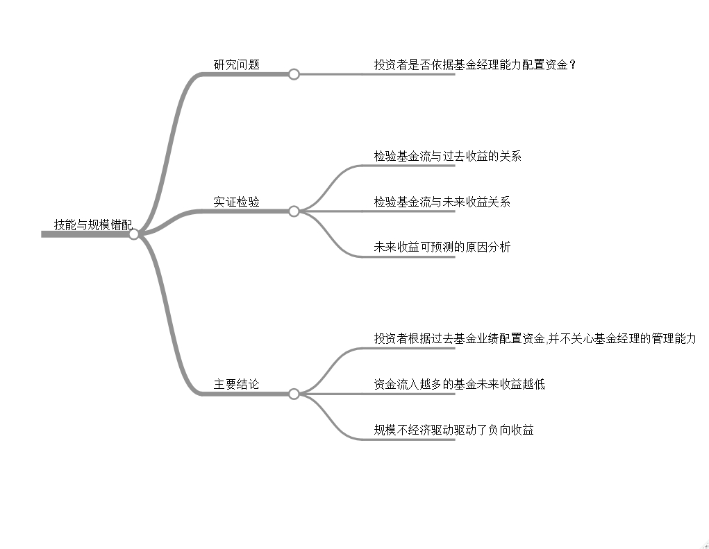
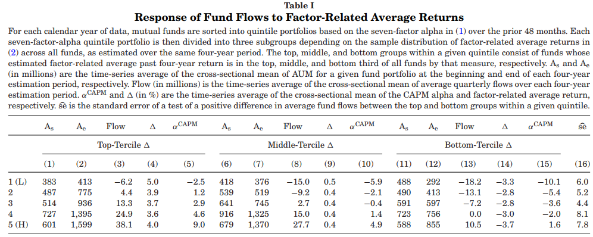
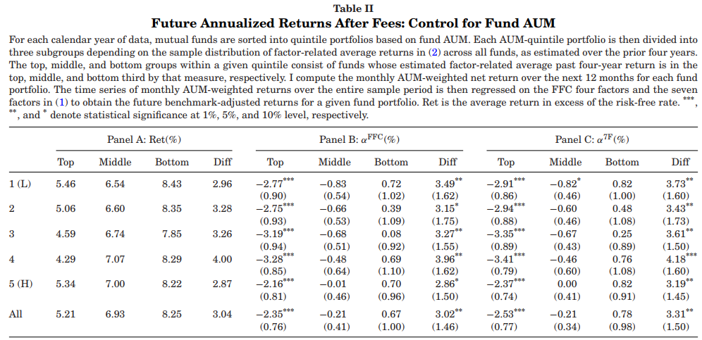
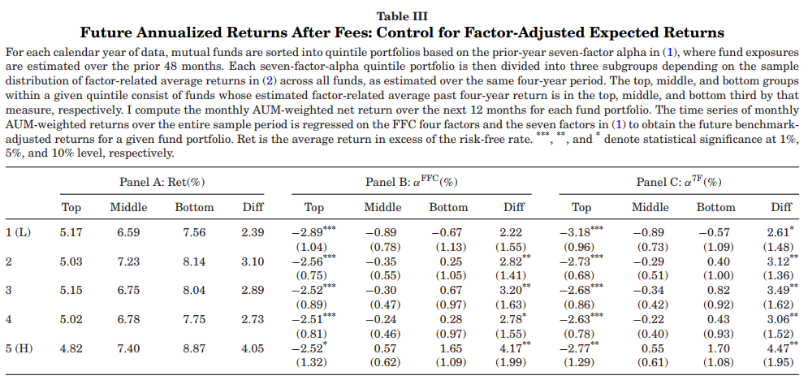
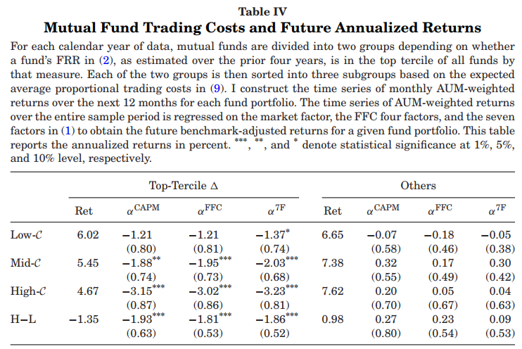

## [The Mismatch Between Mutual Fund Scale and Skill](https://doi.org/10.1111/jofi.12950)

### 摘要

> 我证明了在主动管理的股票型共同基金中，技能和基金规模存在在错配问题。许多共同基金投资者在投资基金时，对基金暴露的普通系统因子和管理能力效应非常困惑。过去收益很好的主动型共同基金将资产积累到其表现显着落后的程度。用基准模型调整后收益为负的基金主要由于基金规模过大导致。


### 研究问题

> 某种程度上，主动管理的基金价值增加不仅取决于基金经理发现优质投资机会的能力，还取决于基金的规模。过去数十年的学术研究发现，在费用扣除后，主动管理的股票型基金用基准模型调整后的收益显著为负，而且平均来看，基金业绩具有不可持续性。 @berk2004mutual 开创性的工作指出，主动管理型基金业缺乏绩持续性与理性投资者为稀缺的基金管理能力而竞争的模型一致，主动管理基金的收益随规模而下降。BG的理论也预测基金经历的管理能力与基金规模相匹配，从而在扣除费用后，共同基金获得的超额收益为零。

> BG的一个重要假设是共同基金投资者能理性评估基金经理的管理能力，并根据基金经历的能力分配资金。但这与基金投资者的特征和关于他们行为研究的证据相矛盾。如果共同基金投资者不像BG模型那样来评价基金经理的能力，某些基金将比证明有管理能力的基金获得更多的资产，这种基金规模和能力错配就会成为未来基金业绩的重要预测变量。

> 说白了意思就是 **如果投资者是理性的，能正确评价主动管理的基金经理能力，就会购买有管理能力的基金，从而使得基金规模扩大。当然，如果投资不理性，就会出现基金规模和基金经理管理能力错配的问题，从而导致对未来基金业绩有预测性。**

### 研究思路


```{r echo=FALSE}
# library(mindr)
# input_txt <- c("# 研究问题","## 投资者是否依据基金经理能力配置资金？","# 实证检验","## 检验基金流与过去收益的关系","## 检验基金流与未来收益关系","## 未来收益可预测的原因分析","# 主要结论","## 投资者根据过去基金业绩配置资金,并不关心基金经理的管理能力","## 资金流入越多的基金未来收益越低","## 规模不经济驱动驱动了负向收益")
# markmap(input_txt,root = "技能与规模错配", widget_options = markmapOption(nodeHeight = 30, nodeWidth = 80,renderer = "basic",
# spacingHorizontal = 60))
```


### 相关文献

> 1. @berk2004mutual 开创性的工作指出，主动管理型基金业缺乏绩持续性与理性投资者为稀缺的基金管理能力而竞争的模型一致，主动管理基金的收益随规模而下降。

> 2. 共同基金流对基金过去收益的正向反应是对普通因子的暴露和非市场因子[@barber2016factors ; @berk2016assessing]。

> 3.共同基金投资者应该能够区分基金业绩来自基金经理能力还是系统性风险因子[@pastor2002investing ；@grinblatt1989mutual]

> 4.以前许多研究[@pollet2008does ; @edelen2013shedding ； ]识别交易成本和执行成本作为主动管理股票型基金规模收益递减的重要因素，小盘基金和成长型基金往往交易成本较高。

### 实证结果

> **1.因子相关收益与基金申赎资金流动**

> 在每一年，按照过去48个月估计的7因子模型Alhpa将样本分为5组，在每一组内有根据因子相关收益将样本分成三组，共形成15个组合，分别统计每个组合形成期开始到结束的解决规模、申购赎回资金量、因子相关收益和Alpha。

> 

> 结果如表1所示，在控制基金经理管理能力后，基金的申购赎回资金流量仍与因子相关收益有线性关系，随着因子相关收益下降，申购赎回资金也会减少。

> **2.因子相关收益与未来Alpha**

> 在完全理性的世界中，主动基金投资者应该能把基金经理的管理能力和系统性因子的风险暴露区分开来，这样投资者应该给予有管理能力的基金更大规模，申购赎回的资金流应该与未来收益正相关。因此，本文通过控制基金规模和基金经理能力后讨论申购赎回资金流与未来收益的关系。

> (1)控制基金规模

> 

> (2)控制基金经理能力

> 

> 结果如表2和表3所示，直观地我们发现，基金未来收益与基金经理能力和基金规模没有关系，而是随着过去因子收益变化，过去因子高的基金反而未来获得更低的收益，这表明投资者并不能区分基金经理能力和系统因子。

> **3.正向因子相关收益的基金未来业绩不佳的原因**


> 

> 本文从基金投资者追求过去业绩导致的规模不经济的角度解释基金未来收益不佳的原因。将基金按照因子相关收益分为两组，在每一组内再按照交易成本分三组，我们发现基金收益驱动主要受交易成本驱动，未来收益随基金交易成本上升而下降。

### 研究结论

> 在这篇论文中，我们证明了基金经理管理能力与规模错配的现象，主动管理的共同基金申购赎回资金流受过去承担的风险因子驱动。过去风险溢价越高，资金流入越多。基金规模扩大会出现规模不经济问题导致未来收益降低，表现为过去风险溢价高的基金未来收益降低。


### 参考文献
