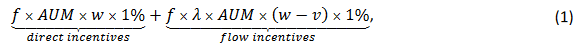

## [Corporate governance implications of the growth in indexing](https://www.nber.org/papers/w30718)

### 摘要

> 被动管理的基金已经发展成为上市公司的一些最大股东，但关于这种增长对公司治理的影响存在相当大的争论。本文的目的是回顾有关被动基金增长的治理影响的文献，并讨论未来研究的方向。特别是，我们提出了一个框架来理解被动和主动管理基金参与治理的动机，回顾该框架背景下的实证证据，并强调仍未得到解答的问题。

### 引言

> 过去二十年的特点是被动（指数）基金管理的资产显着增长。国内指数共同基金和ETF现在管理着所有国内股票共同基金和 ETF 管理资产的一半以上，三大指数基金管理公司（贝莱德、道富和先锋） ) 单独控制了标准普尔 500 强公司四分之一的股东投票[@bebchuk2019specter]，被动型基金投票权的增长引起了市场参与者、学术界和监管机构的关注。例如，对其超大影响力的担忧导致一群参议员提出了 INDEX 法案，该法案要求被动基金代理人根据基金投资者的指示进行投票。
>
> 被动的增加如何影响公司治理格局的问题非常悬而未决。虽然一些研究发现有证据表明被动基金赋予管理者的权力较小[@appel2016passive; @appel2019standing]，但其他研究则显示出相反效果的证据[@schmidt2017exogenous; @heath2022index]。法律学者之间还就被动基金是否首先具有经济动机进行了激烈辩论[@bebchuk2019index; @lund2017case; @fisch2019new; @kahan2020index; @sharfman2022opportunism]。
>
> 本调查的目标是提出一个经济学框架来思考机构投资者(特别是被动资金)参与治理的动机，并在这个框架下对现有的实证证据进行回顾。我们还强调了研究不足的问题，并讨论了未来研究的方向。鉴于我们对被动基金的关注，我们没有提供对股东积极主义的全面调查。[我们参考\@edmans2009blockholder](mailto:我们参考@edmans2009blockholder){.email} 、@dasgupta2015wall 和 @fos2017disciplinary 对大股东和机构投资者治理的更广泛的文献的优秀调查；参考 @brav2022shareholder 对对冲基金行动主义的调查。我们还从关于共同所有权的文献中抽象出来，这些文献通常将指数的增长与共同所有权[@vives2020common; @azar2018]的上升联系起来。

### 机构投资者参与的决定因素

> 在本部分中，我们提出了一个基于卢埃林和卢埃林( 2022a )以及Corum，马连科和马连科( 2022 )的框架，以了解哪些因素影响了机构投资者参与投资组合公司的动机，并在这个框架的背景下讨论了被动基金参与的动机。
>
> 我们首先概括了股东可以用来增加价值的不同技术。Mc Cahery、Sautner和Starks ( 2016 )对机构投资者的调查显示，机构投资者采取了多种不同的监督措施，大致可以分为三类：
>
> 1.  沟通(纯粹的接触/交流,没有任何干预策略)。这是最受欢迎的股东参与形式。63 %的机构投资者[@mccahery2016behind]使用了与高管的讨论。重要的是与管理层( 45 %的机构投资者)之外的董事会讨论，向管理层提出具体行动( 35 % )，在电话会议上积极质疑管理层( 30 % )。
>
> 2.  干预：投票、提交股东提案、维权运动、代理权争斗。机构投资者在股东大会上对各种议题进行投票，53 %的机构投资者将投票反对管理层作为股东参与的衡量指标。有时机构投资者会公布异议票( 18 %的机构投资者)，并提交股东提案进行表决( 16 % )。最后，投资者的子集(尤其是对冲基金活动家)使用了更多的对抗策略，例如运行公共维权活动和组织代理权争夺。
>
> 3.  退出(交易卖出公司,威胁对管理者施加纪律约束)。主动管理的基金如果对公司业绩或公司治理不满，可以而且经常出售股票。根据Mc Cahery、Sautner和Starks ( 2016 )的研究，几乎一半的受访机构投资者采用了这种策略。这种退出可以为管理层提供激励，因为伴随着股价[@admati2009wall; @edmans2009blockholder]的下跌。

> 文献往往将前两类组合在一起，并将它们的组合称为"通过声音治理" (即采取积极行动提高价值)，而不是"通过退出治理" (第三类)，这是一种更间接的影响形式。一些股东只使用一种技术，但大多数使用两种或两种以上的技术。例如，对冲基金活动家往往从私人沟通开始，但如果不成功，则使用更多的干涉主义策略[@gantchev2019governance]。
>
> 考虑到本研究讨论的是被动基金的治理作用，而被动基金无法主动退出，我们关注的是通过发声(我们将其广义地称为介入)进行治理，并没有广泛涉及退出治理，这在 [\@edmans2017blockholders](#0){.email} 和 @dasgupta2015wall 的研究中均有涉及。但需要注意的是，即使是指数基金，也可以通过股票拆借市场分享积极投资者利用负面信息抛售的盈余，这一主题在 @mitts2022passive 中得到了探索。我们从本次调查中的股份借贷问题中抽象出来。
>
> 考虑一个拥有公司股份的股东，他正在决定投入多少精力参与其中。这个决定取决于两个关键因素：
>
>  1. 参与的好处。通过与公司合作，股东可以增加其价值。如果股东能够获得部分价值增长，它就会有参与的私人动机。
>
> 2\. 参与成本。实现一定程度的价值增长，即使可行，对股东来说也是代价高昂的。这些成本可能因股东而异，对于特定股东而言，因不同的参与技术而异。我们首先在第 2.1 节中讨论参与的好处。
>
> 在第 2.2 节中，我们随后讨论了参与成本。在这两节中，我们都强调了被动基金与其他类型股东之间参与的成本和收益有何不同。

### 参与公司治理的收益

> 考虑一个机构投资者，例如，被动或主动共同基金，它拥有某家公司的 α 部分。假设基金经理找到了一种将公司价值提高 1% 的方法（例如，通过提供信息的投票和与管理层互动）。通常情况下，基金经理将获得少于此价值增长的全部价值。基金经理明年从这次合作中获得的收益是多少？基于 Lewellen 和 Lewellen (2022a)，我们可以将收益记为：
>
> 
>
> 其中 f 是基金经理的费用，AUM 是基金管理的资产，w 是基金投资组合中股票的权重，λ 是流量绩效敏感度（定义为基金 AUM 的增长百分比其回报率相对于基准投资组合的 1%），v 是股票在基准投资组合中的权重。
>
> 该收益包括两项。首先，投资组合公司价值的增加增加了基金总 AUM 的价值（在上例中增加了 AUM × w × 1%），因此基金经理从资产管理中赚取的费用（这部分 f增加）。这种效应体现在上述等式的第一部分，即 Lewellen 和 Lewellen (2022a) 所说的直接激励。
>
> 其次，投资组合价值的增加可能导致额外资金流入基金。这种效应体现在上述等式的第二部分，被 Lewellen 和 Lewellen (2022a) 称为流量激励。通过将公司价值增加 1%，该基金相对于基准产生 (w − v) × 1% 的额外回报。这种额外的回报导致 λ × AUM × (w − v) × 1% 的资本流入，这使得基金可以就这一数额（流入的 f 部分）收取额外的管理费。

### 参考文献
