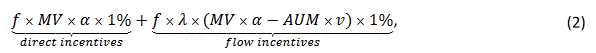

## [Corporate governance implications of the growth in indexing](https://www.nber.org/papers/w30718)

### 摘要

> 被动管理的基金已经发展成为上市公司的一些最大股东，但关于这种增长对公司治理的影响存在相当大的争论。本文的目的是回顾有关被动基金增长的治理影响的文献，并讨论未来研究的方向。特别是，我们提出了一个框架来理解被动和主动管理基金参与治理的动机，回顾该框架背景下的实证证据，并强调仍未得到解答的问题。

### 1 引言

> 过去二十年的特点是被动（指数）基金管理的资产显着增长。国内指数共同基金和ETF现在管理着所有国内股票共同基金和 ETF 管理资产的一半以上，三大指数基金管理公司（贝莱德、道富和先锋） ) 单独控制了标准普尔 500 强公司四分之一的股东投票[@bebchuk2019specter]，被动型基金投票权的增长引起了市场参与者、学术界和监管机构的关注。例如，对其超大影响力的担忧导致一群参议员提出了 INDEX 法案，该法案要求被动基金代理人根据基金投资者的指示进行投票。
>
> 被动的增加如何影响公司治理格局的问题非常悬而未决。虽然一些研究发现有证据表明被动基金赋予管理者的权力较小[@appel2016passive; @appel2019standing]，但其他研究则显示出相反效果的证据[@schmidt2017exogenous; @heath2022index]。法律学者之间还就被动基金是否首先具有经济动机进行了激烈辩论[@bebchuk2019index; @lund2017case; @fisch2019new; @kahan2020index; @sharfman2022opportunism]。
>
> 本调查的目标是提出一个经济学框架来思考机构投资者(特别是被动资金)参与治理的动机，并在这个框架下对现有的实证证据进行回顾。我们还强调了研究不足的问题，并讨论了未来研究的方向。鉴于我们对被动基金的关注，我们没有提供对股东积极主义的全面调查。[我们参考\@edmans2009blockholder](mailto:我们参考@edmans2009blockholder){.email} 、@dasgupta2015wall 和 @fos2017disciplinary 对大股东和机构投资者治理的更广泛的文献的优秀调查；参考 @brav2022shareholder 对对冲基金行动主义的调查。我们还从关于共同持股的文献中抽象出来，这些文献通常将指数的增长与共同持股[@vives2020common; @azar2018]的上升联系起来。

### 2 .1机构投资者参与的决定因素

> 在本部分中，我们提出了一个基于卢埃林和卢埃林( 2022a )以及Corum，马连科和马连科( 2022 )的框架，以了解哪些因素影响了机构投资者参与投资组合公司的动机，并在这个框架的背景下讨论了被动基金参与的动机。
>
> 我们首先概括了股东可以用来增加价值的不同技术。Mc Cahery、Sautner和Starks ( 2016 )对机构投资者的调查显示，机构投资者采取了多种不同的监督措施，大致可以分为三类：
>
> 1.  沟通(纯粹的接触/交流,没有任何干预策略)。这是最受欢迎的股东参与形式。63 %的机构投资者[@mccahery2016behind]使用了与高管的讨论。重要的是与管理层( 45 %的机构投资者)之外的董事会讨论，向管理层提出具体行动( 35 % )，在电话会议上积极质疑管理层( 30 % )。
>
> 2.  干预：投票、提交股东提案、维权运动、代理权争斗。机构投资者在股东大会上对各种议题进行投票，53 %的机构投资者将投票反对管理层作为股东参与的衡量指标。有时机构投资者会公布异议票( 18 %的机构投资者)，并提交股东提案进行表决( 16 % )。最后，投资者的子集(尤其是对冲基金活动家)使用了更多的对抗策略，例如运行公共维权活动和组织代理权争夺。
>
> 3.  退出(交易卖出公司,威胁对管理者施加纪律约束)。主动管理的基金如果对公司业绩或公司治理不满，可以而且经常出售股票。根据Mc Cahery、Sautner和Starks ( 2016 )的研究，几乎一半的受访机构投资者采用了这种策略。这种退出可以为管理层提供激励，因为伴随着股价[@admati2009wall; @edmans2009blockholder]的下跌。

> 文献往往将前两类组合在一起，并将它们的组合称为"通过声音治理" (即采取积极行动提高价值)，而不是"通过退出治理" (第三类)，这是一种更间接的影响形式。一些股东只使用一种技术，但大多数使用两种或两种以上的技术。例如，对冲基金活动家往往从私人沟通开始，但如果不成功，则使用更多的干涉主义策略[@gantchev2019governance]。
>
> 考虑到本研究讨论的是被动基金的治理作用，而被动基金无法主动退出，我们关注的是通过发声(我们将其广义地称为介入)进行治理，并没有广泛涉及退出治理，这在 [\@edmans2017blockholders](#0){.email} 和 @dasgupta2015wall 的研究中均有涉及。但需要注意的是，即使是指数基金，也可以通过股票拆借市场分享积极投资者利用负面信息抛售的盈余，这一主题在 @mitts2022passive 中得到了探索。我们从本次调查中的股份借贷问题中抽象出来。
>
> 考虑一个拥有公司股份的股东，他正在决定投入多少精力参与其中。这个决定取决于两个关键因素：
>
> 1.  参与的好处。通过与公司合作，股东可以增加其价值。如果股东能够获得部分价值增长，它就会有参与的私人动机。
>
> 2\. 参与成本。实现一定程度的价值增长，即使可行，对股东来说也是代价高昂的。这些成本可能因股东而异，对于特定股东而言，因不同的参与技术而异。我们首先在第 2.1 节中讨论参与的好处。
>
> 在第 2.2 节中，我们随后讨论了参与成本。在这两节中，我们都强调了被动基金与其他类型股东之间参与的成本和收益有何不同。

### 2.2 参与公司治理的收益

> 考虑一个机构投资者，例如，被动或主动共同基金，它拥有某家公司的 α 部分。假设基金经理找到了一种将公司价值提高 1% 的方法（例如，通过提供信息的投票和与管理层互动）。通常情况下，基金经理将获得少于此价值增长的全部价值。基金经理明年从这次合作中获得的收益是多少？基于 Lewellen 和 Lewellen (2022a)，我们可以将收益记为：
>
> 
>
> 其中 f 是基金经理的费用，AUM 是基金管理的资产，w 是基金投资组合中股票的权重，λ 是流量绩效敏感度（定义为基金 AUM 的增长百分比其回报率相对于基准投资组合的 1%），v 是股票在基准投资组合中的权重。
>
> 该收益包括两项。首先，投资组合公司价值的增加增加了基金总 AUM 的价值（在上例中增加了 AUM × w × 1%），因此基金经理从资产管理中赚取的费用（这部分 f增加）。这种效应体现在上述等式的第一部分，即 Lewellen 和 Lewellen (2022a) 所说的直接激励。
>
> 其次，投资组合价值的增加可能导致额外资金流入基金。这种效应体现在上述等式的第二部分，被 Lewellen 和 Lewellen (2022a) 称为流量激励。通过将公司价值增加 1%，该基金相对于基准产生 (w − v) × 1% 的额外回报。这种额外的回报导致 λ × AUM × (w − v) × 1% 的资本流入，这使得基金可以就这一数额（流入的 f 部分）收取额外的管理费。
>
> 如果我们将 α 表示为基金拥有的公司份额，将 MV 表示为公司的市值，则 AUM × w = MV × α，因此我们可以将基金经理明年的参与收益改写为：
>
> 
>
> 参与的总收益取决于基金经理年度收益的现值。
>
> 我们应该考虑方程 (1) 和 (2) 从参与部分均衡中获取基金收益，保持其他基金经理的努力相同。股东的参与决定可以是替代（如果一个基金的参与减少了对另一个基金参与的需求）或补充（如在投票的情况下，当接受有争议的提议需要多个股东的共同批准时）。因此，参与的均衡激励取决于多个股东之间的相互作用，我们将在第 3 节中讨论。
>
> 方程(1) 和 (2) 表明参与带来的收益受以下因素的影响：(i) 对公司的持股比例α ； (ii) 基金管理人的薪酬结构f； (iii) 流量激励。接下来，我们将讨论这些单独的因素以及它们的相互作用。

### 2.1.1公司持股股份

> 无论股东的性质如何（例如，无论是被动基金还是主动基金，或者直接持有股份的个人投资者），股东参与增加公司持股的动机：我们可以看到（2）股权 α 正在增加。这是众所周知的分散持股的搭便车问题：如果 α \< 1，股东在参与方面投资不足。这种投资不足与指数基金几乎没有动力去监督的普遍论点有关，因为"任何用于改善公司业绩的投资将使所有跟踪该指数的基金均受益"（隆德，2018 年）。虽然这种论点通常是针对针对同一指数的多个被动基金之间的竞争而提出的，但它也更普遍地适用于所有股东，包括主动和被动、直接和间接股东。
>
> 对于直接股东，即直接拥有股份而不是通过中介持有股份的股东，他们的持股股份是他们从参与中获益的唯一决定因素。实际上，直接股东完全获得了其持股股份的所有增值：方程式中的 f = 1。 (1) 和 (2)。此外，在这种情况下，流量激励部分为零，因为没有流量。
>
> 然而，对于间接股东，即代表其他投资者管理资金的共同基金和对冲基金等中介机构，基金经理的薪酬结构和流量考虑因素也会影响他们参与的动机。我们在第 2.1.2 - 2.1.3 节中讨论了薪酬结构的作用，在第 2.1.4 节中讨论了流程考虑因素。

### 2.1.2 基金经理的薪资结构

> 考虑一位基金经理决定参与，暂时将流量考虑放在一边。当量。 (1) 和 (2) 表明参与中存在第二层搭便车问题：即使基金拥有公司 100% 的股份，基金经理也只能从参与中获取价值增长的 f 部分（例如, Bebchuk 和 Hirst, 2019b).换句话说，基金投资者"搭便车"了基金管理人的参与努力：基金管理人支付成本，但基金投资者获得部分收益（基金管理人从其收取的费用收入中支付参与成本收集）。基金经理对资产管理收取的费用越低，搭便车问题的第二层就越重要。因此，基金经理的薪酬结构是参与激励的另一个决定因素。
>
> 公式(1) 和 (2)中的参数 f 衡量了基金经理应计的公司价值增加 1% 所占的比例。对于共同基金，管理费通常是基金 AUM 的固定比例，f 由该费用决定。对于对冲基金，如果薪酬合同包括年度管理费和超过基准的激励薪酬，f 将包含两者。为了准确理解参与的总（现值）收益如何受到基金经理薪酬合同的影响，我们提供了一个简单的定量示例。为简单起见，我们在此示例中关注直接激励部分。
>
> 考虑一家全股权融资公司，其当前资产账面价值为 100 亿美元2，账面股本回报率 (ROE) 为 10%，派息率为 0.5，股本成本为 10%。给定 0.5 的派息率和 10% 的股本回报率，该公司将以 0.5 × 10% = 5% 的恒定增长率增长其资产、收益和股息。使用股息贴现模型，其市值是0.5×10%×\$10B /(10%−5% )= \$100亿，这个市值将以每年5%的速度升值。
>
> 假设通过更好的治理，基金经理想办法将这家公司的净资产收益率提高 0.5 个百分点，从 10% 提高到 10.05%，同时保持投资政策（即资产增长率 5%）不变。鉴于新的 ROE 为 10.05% 并且公司的资产增长率为 5%，公司可以将下一期的股息增加到 (10.05% − 5%) × \$10B = \$5.05 亿美元，所有未来股息的支付比率为 5.05 %/10.05%。公司的最终市值将增加到 5.05 亿美元/( 10%−5%) = 101 亿美元，即增加 1%。由于 ROE 和新的派息率将随着时间的推移保持不变，并且公司资产以每年 5% 的速度增长，公司的市场价值也将以每年 5% 的速度增长。
>
> 这种治理改进对基金收取的费用收入的现值有何影响？
>
> **共同基金**
>
> 首先，假设资产管理人管理一只共同基金，年管理费为0.5%，基金计划永久持有这家公司4%的股权。3 那么，治理改善会增加基金的手续费收入今年增加 0.5% × 0.04 × (\$10.1 − \$10) 亿。此外，由于公司市值增长5%，今天1亿美元的市值增长也将增长5%（如上图），因此手续费收入也将增长5%。由于手续费收入与公司股权的市值成正比，因此手续费收入的适当折现率等于对股权现金流量进行估值的折现率，即股权成本10%。因此，此次治理变革带来的额外费用收入的现值为：
>
> 
>
> **对冲基金**
>
> 其次，考虑一家对冲基金，它拥有同样 4% 的公司股份，但收取 1.5% 的管理费和超过市场基准的回报率 20% 的绩效费。那么，今天公司价值增加 1 亿美元（因此持股股份增加 400 万美元）所产生的额外费用收入的现值为：
>
> 
>
> 第一项代表绩效费：对冲基金将通过绩效费从股权价值增加的 400 万美元中获取 20%。从本质上讲，治理干预将导致干预时公司价值从 100 亿美元增加到 101 亿美元，比市场基准高出 1% 的超额回报。鉴于 ROE 的改善在干预发生后立即被定价，预计公司在干预后不会产生高于市场基准（在本例中为 10% 的市场股权成本）的任何超额回报。因此，该干预仅会产生 80 万美元的一次性绩效费用。此外，干预将使对冲基金的 AUM 价值增加 400 万美元 × (1 − 20%)，这将导致每年更高的管理费。鉴于公司的市值预计将增长 5%，上述较高管理费收入的现值由上式中的第二项给出，等于 96 万美元。
>
> 请注意，由于绩效费只发生一次，而管理费的增加是永久发生的，因此管理费（第二次）期限大于第一次，即使 1.5% 的管理费小于 20% 的绩效费.虽然这种计算的细节取决于合同的形式以及如何随着时间的推移对费用收入进行贴现的假设，但总的来说，基金经理参与的动机是由合同决定的，如果收取较低的费用，则其参与的动机较低。
>
> 该示例还有一些其他含义。首先，上述计算假设基金经理打算无限期持有其在公司的股份。虽然这在指数基金的背景下是一个合理的假设，但主动型基金可能会在相对较快的某个时间点出售其股份。由于基金的参与努力允许它以更高的价格出售公司，今天的参与仍将增加基金的资产管理规模，从而增加其管理费，即使在出售之后也是如此，因此等式中的永续部分。 (3) 和 (4) 将保留。此外，该基金可以将这些较高的 AUM 再投资于其他公司并增加它们的价值，这将扩大其最初参与的回报。实际上，这意味着等式中的永续增长率。 (3) 和 (4) 将高于 5%。因此，对于主动基金，尤其是那些经常购买和参与新公司的基金，当前公司价值增加 1 美元所产生的额外费用收入的现值甚至高于 公式 (3) 和 (4)。
>
> 第二，方程 (3) 和 (4) 意味着在所有其他条件相同的情况下，公司较低的股权成本会增加基金经理参与的动机，因为这会导致参与收益的现值更高。这具有潜在的时间序列和横截面影响。首先，它表明如果市场风险溢价在过去二十年有所下降（这与观察到的高估值倍数一致；参见 Lettau、Ludvigson 和 Wachter，2008 年），那么基金经理参与的动机应该增加了。其次，在横截面上，投资于不同类型公司（例如，小盘股与大盘股）的基金可能有不同的参与动机，这不仅是因为它们收取不同的费用，或者因为它们的投资组合公司的改进潜力不同，还因为他们的投资组合公司的股权成本不同。

**2.1.3 持股与基金经理联合效应**

> 由于指数基金的管理费特别低，基金管理层和基金投资者之间的第二层搭便车问题对他们来说尤其严重，导致有人认为指数基金有强烈的动机在管理方面投资不足（例如， Bebchuk 和赫斯特，2019b)。然而，费用的讨论不能与持股的讨论分开，因为基金参与的综合激励是 f 和 α 的乘积（见方程（2））。虽然指数基金收费低，但它们通常是其投资组合中公司的最大股东，而且对于主要指数基金经理而言，f 和 α 的乘积可能大于持有少量股份的主动管理型基金。这也可以在方程 (1)中看到，这表明基金从参与中获得的收益取决于 f × AUM。一家大型指数基金经理的资产管理规模非常大，可以弥补其较低的管理费。
>
> 特别是，Kahan 和 Rock (2020) 以及 Lewellen 和 Lewellen (2022a) 估计了指数基金与其投资组合公司合作的财务激励，并将它们与其他机构投资者进行了比较。 Kahan 和 Rock (2020) 得出结论认为，三大指数基金经理（贝莱德、先锋和道富）"具有最强烈的直接财务激励"。 Lewellen 和 Lewellen (2022a) 发现五家主要指数基金经理（三巨头、Dimensional 和 Schwab）参与的美元激励高于普通机构的激励：典型持股价值增加 1%将他们的年度管理费增加 133,000 美元（相比之下，样本中的平均机构的直接奖励为 84,400 美元，总奖励为 129,000 美元）。此外，正如 Lewellen 和 Lewellen (2022a) 所示，这些大型指数基金增加价值的动机在规模上与主动基金相当（即 13D 申报者）相当。
>
> Corum、Malenko 和 Malenko（2022 年）从理论上检验了被动基金的增长是否有利于治理，重点关注基金参与的直接激励。在他们的模型中，投资者将财富分配给三种选择：主动基金投资、被动基金投资和私人储蓄。投资者要接触基金经理，需要付出搜索成本，即搜索基金相关信息并花时间了解的成本。在市场交易时，主动型基金利用股票因流动性（"噪音"）交易者的存在而被低估的机会。因此，主动基金比被动基金产生更高的回报，但它也收取更高的费用，因此在均衡状态下，投资者在投资主动基金和被动基金之间是无所谓的。
>
> Corum、Malenko 和 Malenko（2022 年）研究了更容易获得被动基金的影响（例如，源于它们更多地包含在 401(k) 计划中、投资者对指数基金的认识提高，或改进了基金费用的披露），他们通过减少相应的搜索成本来捕获。更容易获得被动基金，将投资者资金从主动基金和私人储蓄重新分配到被动基金，同时也降低了这两种基金的费用。作者得出结论，被动基金增长对治理的影响是非单调的：被动基金的初始增长改善了治理，但进一步增长最终会损害治理。直观上，这是因为最初流向被动基金的资金大部分来自投资者的私人储蓄，基金费用的减少幅度并不是很大。因此，基金取代了公司持股结构中的散户股东，他们的总持股股份增加了，而基金费用并没有下降太多，因此他们从参与中获得的整体收益（费用和持股股份的乘积）增加了。然而，随着对被动基金的进一步改善，流入被动基金的资金开始以投资者对主动基金。然后，被动基金主要取代公司持股结构中的主动基金，而不是散户投资者。此外，由于基金开始激烈争夺投资者资本，主动和被动基金费用开始大幅下降。结果，基金从参与中获得的总收益减少，这既是因为费用减少，也是因为主动基金（费用较高，因此参与收益更高）被费用较低的被动基金所取代。只要参与成本保持不变，股东参与的整体程度就会下降。
>
> 上述费用与规模之间的紧张关系也出现在 Corum、Malenko 和 Malenko (2022) 中。他们表明，费用的减少并不一定伴随着基金经理参与度的降低。这是因为费用不会孤立地发生变化：随着被动基金的使用变得更加容易，费用会下降，但这种费用的减少与被动基金的 AUM 和持股股权的增加同时发生。因此，正如作者所表明的那样，即使基金费用下降，被动基金参与度和公司治理的整体质量也可以得到改善。
>
> 为了结束这次讨论，我们提出四点：
>
> 1\. 首先，上面关于参与激励的讨论侧重于参与带来的好处，并没有考虑我们在第 2.2 节中介绍的相关成本。 Lewellen 和 Lewellen (2022a) 指出了这一点，并指出参与带来的美元收益（即等式 (3) 和 (4) 中的现值）可以解释为基金经理将承担的成本上限愿意为增加 1% 的公司价值而支付。当然，将价值增加 1% 的成本因公司而异。例如，对于治理良好且运营高效的公司而言，此类成本可能非常高；对于大公司来说，这些成本也可能更大。由于基金经理的均衡努力取决于参与的成本和收益，因此汇总参与基金投资组合中多家公司的激励可能很困难，因为它需要考虑相应成本的异质性。
>
> 2.  只关注参与的好处而不考虑成本也可能使不同规模和不同类型的股东之间的激励比较复杂化。首先，与大型机构大股东相比，小股东将公司价值提高 1% 的成本可能更高（或者，大股东的努力效率更高）。其次，指数基金不选择持有哪些股票，而积极管理的机构则这样做。例如，对冲基金积极分子专门持有表现不佳和治理不善的公司。这种内生投资组合选择意味着，在其他条件相同的情况下，对冲基金维权人士的投资组合中的平均公司价值增加 1% 的成本可能小于不专门持有表现不佳公司的基金的相应成本（例如，主要投资于被市场低估的优质公司的指数基金或主动管理型基金）。
>
> 3\. 对指数基金的一个流行批评是，它们缺乏参与的财务激励，因为它们只关心跟踪指数而不是击败指数。上述框架和估计表明这一论点并不准确：参与可以通过增加其 AUM 的价值来增加指数基金经理收取的费用，并且这些"直接激励"可以是对大型指数基金经理而言具有数量意义。此外，即使多个指数基金跟踪同一指数并搭便车，指数基金也可能有参与的动机。 在考虑指数基金的流量激励时，指数基金跟踪指数这一事实变得更加重要，我们在下一节中讨论。
>
> 4.将指数基金的激励与直接股东的激励进行比较是有益的。一方面，直接股东将其股份的价值增长完全内部化（即等式 (2) 第一项中的 f = 1），而指数基金由于收取少量费用而仅将这一价值增长的一小部分内部化。另一方面，指数基金从随后所有年度的 AUM 增加中收取更高的管理费（这些费用甚至可能随着时间的推移而增加；参见等式（3）和相关讨论），而直接股东的今天的收益仅限于公司价值的一次性增长。结合指数基金的持股股份要大得多，这第二种考虑意味着指数基金经理的激励可能比许多直接股东的激励更大。 Kahan 和 Rock (2020, p. 1786) 进行了这样的比较，但也考虑因素鉴于指数基金拥有更大的持股股份（我们在上文第 1 点中提到的考虑因素），它们影响结果的能力更强。假设股东影响投票结果的能力与其在公司的股份成正比，他们得出结论，Vanguard 进行信息投票的动机等同于拥有 Vanguard 所持股份数量的十二分之一的直接股东。

### 2.1.4 资金流激励

> 在公式 (1) 和 (2)中，基金经理参与 激励的第二个组成部分捕获基金流量的成分。直观上，通过与投资组合公司接洽并增加其价值，基金经理可以获得额外回报，这可能导致额外资金流入基金，增加基金经理未来的手续费收入。
>
> 一般来说，很难估计这个分量，因为与前两个相比，它更难观察。 Lewellen 和 Lewellen (2022a) 用以下方式衡量它。他们估计基金流量与基准调整后回报之间的流量与绩效关系，以及基金投资组合中股票相对于基准的超额权重。假设这种估计的流量与绩效关系也适用于参与产生的回报，他们估计流量的平均机构的激励在数量上与管理费的直接激励大致相同。
>
> 请注意，以这种方式衡量的指数基金的流量激励应该接近于零，因为指数基金的持股量大约等于基准（指数）。这正是 Lewellen 和 Lewellen (2022a) 得出的结论：在他们的数据中，指数基金的总激励中只有一小部分来自流量激励。因此，虽然指数基金不需要比主动管理基金更低的直接激励，但它们的流量激励通常会更低。正如 Bebchuk 和 Hirst (2019b) 所说，"与其他指数基金的竞争使指数基金经理在投资于其任何投资组合公司的管理工作时恰恰没有额外的零激励。"
>
> 我们想就流量激励发表一些进一步的评论。
>
> 1\. 流量激励的大小可能取决于流量对绩效敏感性的根本原因。这种敏感性的产生是因为投资者利用基金的当前表现来更新他们对基金未来产生回报能力的信念，这可能出于两个广泛的原因：(i) 基金在选股和/或市场时机方面的技巧（伯克和格林，2004）； (ii) 基金在监督和参与方面的技能。一般而言，流量对业绩的敏感性可能因业绩来源（选股与参与）而异，研究是否属于这种情况是未来研究的重要途径。 例如，理性资本市场，由于监控技能，基金产生卓越未来回报的能力可能有限：基金作为负责任的管理者的声誉的任何改善都会引发基金当前和预期未来股票持有量的市场价值立即升值（例如，Admati、Pfleiderer 和 Zechner，1994 年；Corum、Malenko 和 Malenko，2022 年）。因此，该基金只能通过其未来的意外交易通过治理创造回报。因此，如果基金交易相对较少或预期其未来交易（如指数基金），其未来产生卓越回报的能力可能会更加有限。
>
> 2\. 流量激励的估计由于依赖于研究人员可能不知道的投资者信息集而进一步复杂化。具体而言，当投资者看到相对于基准的超额表现时，他们可以将其归因于 (i) 基金的选股技巧或 (ii) 参与度。我们在数据中观察到的流量性能敏感性（在 Lewellen 和 Lewellen，2022a 中估计）反映了这两种影响。为了更准确地量化基金经理参与吸引流量的动机，重要的是要知道：1）投资者是否观察到超额表现是由于选股还是参与； 2) 投资者是否观察基金的投资组合权重； 3）假设投资者知道超额表现是由于参与，他们是否可以轻易地将其归因于特定基金经理的参与。进一步说明最后一点，股东与管理层的接触通常是私人的，每家公司都有多个股东，使投资者更难推断哪个股东对价值增长负责。
>
> 3\. 实证证据表明，共同基金流量对未经调整的原始回报表现做出反应，而不仅仅是对超过市场基准的超额表现做出反应（Del Guercio 和 Tkac，2002 年）。相关地，虽然有许多指数基金跟踪同一指数，但经验证据表明，由于大量的搜索和转换成本，市场远非完全竞争的情况（Hortacsu 和 Syverson，2004 年；Choi、Laibson 和 Madrian，2010 年） ，特别是关于 401(k) 计划中的退休储蓄。因此，将一美元投资于富达标准普尔 500 基金最相关的外部选择可能不是将一美元投资于先锋标准普尔 500 基金，而是为退休少存一美元。在这种情况下，改善指数的表现可能会产生流量激励，因为投资者会储蓄更多，即使追踪同一指数的所有基金都共享改善的表现。这表明指数基金也可能存在流量激励。
>
> 4\. 资金流动可能会对基金的参与努力做出反应，这不仅是因为投资者关心业绩，还因为他们有非货币激励（例如，Sharfman，2022）。这种考虑可以解释为什么某些资产管理公司（例如贝莱德）会定期宣传他们与公司的合作。8 正如 Fisch、Hamdani 和 Solomon（2019 年）所说，"积极的治理可以发挥品牌或营销功能。"
>
> 5\. 在讨论资金流动的影响时，重要的是要考虑资金流动的来源：如果一家机构通过参与吸引其他机构投资者的资金，那么其他投资者的资产管理规模，以及他们的直接激励，有可能减少。因此，重要的是要考虑流动的总体影响，考虑到哪些类型的机构投资者被挤出，以及这如何影响所有股东的综合参与动机。我们将在第 3.2 节中更详细地讨论这个方面。
>
> 6\. 我们的框架侧重于对流量的担忧如何影响投资者参与发言的动机。正如 Dasgupta 和 Piacentino（2015 年）以及 Cvijanovic、Dasgupta 和 Zachariadis（2022 年）所指出的，流动问题也会通过退出影响治理的有效性。

**2.1.5 获取私有信息**

> 在 公式(1) 和 (2)，另一个组成部分是参与带来的好处。监控和干预可以为股东产生私人信息，股东可以在以后的交易活动中利用这些信息。例如，Becht、Franks、Wagner (2021) 使用来自一家大型活跃资产管理公司的专有数据，表明其交易和参与活动紧密相关，得出的结论是参与产生了用于交易的信息优势。由于被动基金没有交易自由裁量权，因此该部分不存在，但它可能与主动基金以及至少拥有一些主动基金的基金家族相关。如果法律限制重要信息的选择性披露，例如美国的 FD 条例（公平披露），则该部分的量级是有限的。此外，正如 Fisch、Hamdani 和 Solomon（2020 年）指出的那样，对失去选股的宝贵信息甚至可能适得其反，导致基金家族不投票反对或批评管理层。因此，了解来自最后一个组成部分的激励与来自直接和流量激励的激励相比如何将很有趣。

**2.2 参与成本**

> 虽然与投资组合公司的合作带来好处，但并非没有代价。这些成本取决于股东使用的具体技术。在本小节中，我们将讨论这些成本如何因不同类型的股东而异。首先列出参与所涉及的成本是有用的。我们可以将这些成本大致分为以下几类：
>
> 1\. 获取信息的成本。为了就公司应该如何运营或以价值最大化的方式进行投票提出建议，股东需要了解正确的行动方针应该是什么。
>
> 2.这些成本包括与管理层接触或开展激进运动所涉及的各种显性成本：沟通和谈判所花费的时间和精力；法律费用；披露费用；申请费用；聘请代理律师，治理专家和公关公司。这些成本的大小和类型取决于所使用的具体激进主义策略以及它们的对抗程度（例如，私人参与与代理人斗争）。
>
> 3.参与的间接成本。示例包括疏远管理层和危及与公司的潜在业务关系或获取有价值信息的成本，或因对抗性方法而闻名的声誉成本。

这些成本在指数基金和其他类型的股东之间有何不同？

> 1\. 信息成本。 Kahan 和 Rock (2020) 以及 Fisch、Hamdani 和 Solomon (2019) 指出，指数基金与主动管理基金的不同之处在于它们具有收集和分析专业知识的信息类型，这反过来又会影响它们的参与策略。特别是，对冲基金和积极管理的共同基金在识别公司特定的运营或财务问题方面可能比指数基金更具优势，因为它们专门收集此类信息和/或生成此类信息作为其投资活动的副产品。相比之下，正如这些论文所论证的那样，指数基金由于其多样化的投资组合而能够很好地了解广泛的、市场范围的问题，例如公司治理标准：它们可以在收集此类信息方面享受规模经济，还可以使用一家公司过去的投票信息来更多地了解其他公司未来的投票情况。
>
> 2\. 参与的直接成本。指数基金在不同类型业务的直接成本方面也可能不同于主动管理型基金。一方面，对冲基金维权人士拥有专业知识、基础设施和人脉，可以有效开展维权活动和代理权竞争。此外，参与可归类为具有"改变或影响发行人控制权的目的或效果"的问题（例如提议出售公司或任命新董事）可能需要基金提交附表 13D 而不是附表13G（参见美国证券交易委员会条例 13D）。正如 Bebchuk 和 Hirst (2019b) 以及 Morley (2018) 强调的那样，13D 文件比 13G 文件要广泛得多，需要更频繁地提交，因此考虑到指数基金的交易频率，进行这些额外的广泛披露将令人望而却步9 总而言之，这些论点表明，指数基金可能要付出高昂的代价来处理对冲基金积极分子活动中共同关注的问题。
>
> 另一方面，鉴于大型被动资产管理公司持有大量多元化资产，它们可能会在制定全市场标准时享受规模经济（例如，Kahan 和 Rock，2020 年；Fisch、Hamdani 和 Solomon，2019 年）。这种规模经济可以通过被动基金经理自己的代理投票指南来实现（例如，Couvert，2021）；通过广泛的影响力运动（例如，Gormley 等人，2021 年）；通过基金与代理顾问的沟通并影响代理顾问的投票指南；或者通过溢出效应，其投资组合中的公司在看到其他公司对这些做法的立场后，先发制人地采用某些做法。
>
> 与主动管理基金相比，主要被动基金经理的另一个优势是他们在投资组合公司中持有大量股份。这种股权不仅增加了他们从参与中获得的收益（见第 2.1 节），而且还降低了他们的成本。例如，大型被动资产管理公司很可能成为代理权竞争中的关键选民（Brav 等人，2022 年）或对有争议的股东提案进行投票，从而使他们能够通过投票产生强大的影响力，而无需承担征集其他股东投票的成本.此外，如果管理层对他们的要求没有反应，他们可以使用大型被动资产管理人的大量投票权，这使他们在与管理层的沟通和谈判中具有更强的影响力，同时也降低了此类参与的成本。这一论点进一步强调了大型和小型指数基金家族之间的重要区别：不仅他们从参与中获得的收益，而且他们参与的成本也可能大不相同。
>
> 3\. 参与的间接成本。与其他股东相比，被动基金的间接参与成本是高还是低尚不清楚。一方面，Bebchuk 和 Hirst (2019b)、Fisch、Hamdani 和 Solomon (2020) 以及 Lund (2018) 认为，由于业务关系，三大指数基金经理有动机特别尊重管理层，特别是，他们从管理公司的 401(k) 计划或通过将他们的资金纳入公司员工可用的投资选项菜单中获益（例如，Davis 和 Kim，2007 年；Ashraf、Jayaraman 和 Ryan，2012 年；Cvijanovic、Dasgupta , 和 Zachariadis, 2016)。此外，Bebchuk 和 Hirst（2019b）强调了公众和政治反弹可能带来的间接成本，作为对三巨头日益增长的权力的反应，并认为他们可以通过对管理层的顺从来降低此类成本。另一方面，Kahan 和 Rock (2020) 假设了相反的效果：三巨头可能"在被投资者、监管机构和政治家视为负责任的行为者和向善的力量方面具有强烈的声誉利益"。

**2.2.1 关于参与成本的经验证据**

> 上面的讨论表明，被动基金和主动管理的机构投资者有不同类型的成本，因此可能专注于不同类型的参与：被动基金不太可能在个别公司开展主动活动，但更有可能通过设置产生影响广泛的市场治理标准。被动基金参与的证据与这个想法是一致的。例如，最近的三篇论文分析了指数基金在广泛的 ESG 问题上的市场参与情况。葛姆雷等。 (2021) 研究三巨头提高董事会性别多样性的影响力运动。通过探索这些活动的时机和三巨头的股权，他们得出结论，这些活动在促进多元化和任命女性董事担任关键董事会职位方面取得了成功。 Pawliczek、Skinner 和 Wellman (2021) 检查了拉里·芬克 (Larry Fink) 给首席执行官们的年度信件，并得出贝莱德的投资组合公司对其公众参与工作做出了回应的结论。阿扎尔等。 (2021) 从其投资管理报告中分析三巨头参与的数据，表明三巨头将他们的参与重点放在后续碳排放量高​​的公司上，并且他们的持股比例与后续碳排放减少之间存在负相关。同时，被动基金不使用对冲基金积极分子通常采用的更激进和对抗性的策略，例如提名董事或提交附表 13D 文件（见脚注 9）。鉴于这种专业化，主动和被动基金经理之间的互动和协作变得尤为重要，我们将在第 3 节中讨论此类互动。
>
> 关于参与成本大小的证据很少：估计这些成本很困难，因为它们通常不会被观察到，尤其是时间成本、精力成本或与声誉相关的成本。我们知道有两项研究试图衡量这些成本。 Gantchev（2013）通过将竞选过程建模为一个连续的过程来估计对冲基金维权人士竞选的成本，该过程从需求谈判阶段开始，然后（如果不成功）请求董事会代表，以及（如果再次不成功）代理权竞赛。在任何阶段，活动家都可以放弃竞选并退出。使用离散选择框架，该论文估计以代理竞争结束的平均竞选成本为 1070 万美元（包括可观察和不可观察的成本），并且代理竞争阶段是最昂贵的（平均近 600 万美元）活动）。
>
> Bebchuk 和 Hirst（2019b）使用晨星和三大基金家族的管理报告中的数据来衡量管理人员的数量。假设每位员工每年的成本为 300,000 美元，他们得出结论，每个家庭在管理方面的投资不到其收取费用的 0.2%。他们还估计，为了监督他们在美国的投资组合投资（假设在美国公司每 10 亿美元头寸按比例分配管理权），贝莱德每年花费不到 4 个人日和不到 5,000 美元，这些投资至少比道富银行少两倍和先锋队。作者得出结论，"人们非常担心三巨头在管理方面的投资严重不足。" Sharfman (2022, p. 13) 提供了相关的讨论。
>
> 重要的是要注意（正如 Bebchuk 和 Hirst (2019b) 也指出的那样）资源分配可能不成比例：例如，基金的治理团队可能会关注财务业绩不佳的公司或主动投资者瞄准的公司。如果是这样的话，三巨头在重要情况下的管理投资可能会更大。
>
> 总的来说，需要更多的研究来量化参与成本，并了解它们如何与不同类型投资者的参与收益进行比较。

### 3. 股东之间的互动

> 到目前为止，我们已经讨论了单个股东​​参与的决定。实际上，存在多个不同类型的股东，对于治理而言最终重要的是股东之间的互动，而不是第 2.1 节强调的一般搭便车问题。因此，要了解指数增长的治理效果，了解指数基金如何与其他股东互动非常重要。
>
> 我们可以将股东之间的互动分为直接互动和间接互动。前者是指明确的交互，例如通过投票、协调和共享信息提供支持。通过间接交互，我们指的是由于公司持股结构变化（例如指数基金取代公司持股结构中的其他股东或间接影响其他股东的参与动机）而产生的隐性影响。

**3.1 直接互动**

> 几篇论文模拟了股东之间的直接互动，以股东之间在参与努力中的合作形式。前面讨论过的 Brav、Dasgupta 和 Mathews（2021 年）关注狼群激进主义和激进基金经理对资金流动的担忧的有益激励作用。 Doidge、Dyck 和 Yang（2022 年）研究了投资者集体行动组织 (ICAO) 通过成本分担和信息共享进行的明确协调。在他们的模型中，国际民航组织的成立解决了其成员之间的搭便车问题，但独立的积极分子继续存在，搭上了国际民航组织的激进主义。 Pi (2021) 还研究了联盟内活动家之间的成本分摊，但侧重于联盟的规模如何通过传达有关活动家私人信息的信号来影响其他更被动的股东对竞选活动的支持。
>
> 理论工作尚未明确研究指数基金与其他股东之间的直接互动。然而，实证证据表明这种互动很重要。 Appel、Gormley 和 Keim（2019 年）研究了企业维权活动，发现较高的被动基金持股与对冲基金维权人士在获得董事会席位、促进目标公司销售和达成和解方面取得更大成功有关，同时可以增加代理人争斗的使用。作者得出被动投资者的增长促进了主动基金活动的结论。布拉夫等。 (2022) 关注代理权竞争，发现虽然与主动基金相比，被动基金更有可能投票反对持不同政见者，但它们是积极的监督者：被动基金支持表现不佳的公司的持不同政见者，他们使用更微妙的渠道表达异议，而不是直接面对管理。持不同政见者在考虑发起竞赛时，还需要确信他们能够赢得大量被动投资者的支持。事实上，该文件表明，如果被动资金为持不同政见者提供支持，持不同政见者更有可能通过与管理层达成和解来实现他们的目标（更多细节见下文第 4.2 节）。
>
> 被动基金，尤其是三巨头的增长，也可能通过导致更集中的股东基础影响维权活动：维权人士获得一个大投资者的支持可能比多个小投资者的支持更容易。与这个想法一致，Brav 等人。 (2022) 表明，与未成为维权人士目标的公司相比，代理权竞争进入投票阶段的目标公司需要较少数量的共同基金才能达到给定的投票支持百分比（参见其互联网附录表 IA7）。如果更集中的投资者基础确实有促进维权人士与公司股东之间的沟通，那么大型指数资产管理公司持股的增长可以让维权人士在不增加自己的持股股份的情况下瞄准越来越大的公司。
>
> 了解被动基金与对冲基金积极分子以外的其他类型股东之间的互动也很有趣。 Bena 和 Wang (2022) 假设被动基金和主动管理基金之间的冲突会对公司价值产生负面影响，并探索这两组投资者的投票以研究他们的分歧程度。一个重要且未被充分探索的问题是同一家族中被动基金和主动基金之间的相互作用。正如 Fisch、Hamdani 和 Solomon（2020 年）指出的那样，基金家族在主动和被动基金及费用的组合方面有所不同，一个家族的整体参与动机取决于其每只基金的资产管理规模和费用以及基金的相对作用它的被动和主动资金产生收入。此外，家族内的基金通常以协调的方式投票（例如，Morgan 等人，2011 年；Lakkis，2021 年），例如，因为一些家族在其管理团队而不是个人层面上协调他们的投票和参与活动基金经理。这种协调如何影响股东参与？一个影响是通过参与的好处：决定发挥多少（协调）努力的基金家族最大化其所有基金收取的综合费用。这缓解了第 2.1 节中强调的搭便车问题，并且与单独决定参与努力的个别基金经理的情况相比，增加了家庭参与的动机。至于参与成本，其影响事前尚不清楚。一方面，协调努力增加了家族的投票权和成为关键人物的可能性，这反过来又可以通过更高的投票反对管理层的威胁来提高其参与的有效性。另一方面，大型基金家族可能需要大量的协调成本。 Lakkis (2021) 探讨了其中一些问题，发现当一个家族的被动资产管理规模增加时，其主动型基金更频繁地投票反对管理层，得出结论认为更大的被动持股有利于基金家族的参与。

### 3.2 间接互动

> 虽然理论研究尚未考察指数基金与其他股东之间的直接互动，但它强调了间接互动的重要性。 Corum、Malenko 和 Malenko (2022) 以及 Baker、Chapman 和 Gallmeyer (2022) 研究的一个渠道是挤出效应：随着被动基金的增长，它们会排挤公司持股结构中的其他投资者，这会影响股东'参与的综合激励。 如第 2.1 节所述，在 Corum、Malenko 和 Malenko（2022 年）中，对散户投资者的排挤改善了公司治理，而主动基金的排挤通常是有害的，因为这些基金在收费较高的情况下有更强的参与动机。此外，被动基金增长降低了主动和被动基金费用，从而降低了基金参与的积极性。因此，在他们的论文中，指数化的增长最初是有利的，但一旦与主动基金的竞争变得激烈，就会变得有害。
>
> 在 Baker、Chapman 和 Gallmeyer (2022) 中，熟练的基金经理决定是成为选股者还是激进主义者：选股者确定更好的投资机会，而激进主义者则改善公司业绩。家庭决定如何在股票选择者、积极分子和指数基金之间分配他们的资本，其中指数基金的优点在于为他们的投资者提供多元化。该论文表明，指数基金费用的外生减少改变了管理货币部门的内生构成，并且可能对治理有利或有害（如激进主义者的内生数量及其 AUM 所示）。较低指数基金费用的负面影响是导致家庭投资从主动管理基金流向指数基金，而指数基金在其模型中不参与治理。较低指数基金费用的正面影响是其改变了主动管理基金行业的构成，朝着更多积极分子和更少选股者的方向发展。
>
> Levit、Malenko 和 Maug (2022) 以及 Kakhbod 等人 (2022) 强调影响指数基金与其他股东互动的另一个特征：指数基金的独特之处在于，与其他类型的投资者不同，他们在公司的持股股份不取决于他们对公司应该如何运作的偏好或信念.因此，他们的持股可以减少极端的投票结果（Levit、Malenko 和 Maug，2022 年）并确保广泛的股东基础，这对于在存在信仰差异的情况下有效参与非常重要（Kakhbod 等人，2022 年） ).
>
> 最后，被动基金增长的另一种更广泛的间接影响形式是通过金融市场交易。越来越多的证据表明，被动基金增长可能会改变信息生产和资产价格的信息内容（例如，Israeli、Lee 和 Sridharan，2017 年；Glosten、Nallardy 和 Zou，2021 年；Coles、Heath 和 Ringgenberg，2022 年）。反过来，这可能会对其他股东参与和影响公司政策的能力和意愿产生一阶影响。例如，当资产价格更有效率时，公司被低估的程度就会降低。这可能会减少股东（例如对冲基金积极分子）通过购买被低估的公司并通过干预增加其价值所获得的利润。市场效率还影响一旦维权人士在公司中的职位被披露后价格包含有关维权人士未来干预信息的速度，以及维权人士退出投资获利的能力。所有这些力量都可能影响股东激进主义的程度。一个相关的渠道是价格的信息效率通过退出威胁对股东的治理能力产生一阶影响。 16 深入讨论这种影响超出了本次调查的范围，但在考虑治理时它们很重要被动基金增长的影响。

### 4. 被动基金参与公司治理的实证证据

> 综上所述，前几节的讨论表明，要了解指数基金增长的治理效果，需要了解以下内容。首先，当指数基金增长时，哪些投资者从公司持股中被取代，这些投资者的参与成本和收益与指数基金相比如何？其次，指数基金的增加如何影响其他公司股东参与的能力和动机？在本节中，我们总结了实证文献中关于指数基金治理作用的证据，并尝试在前面描述的框架背景下对其进行解释。

### 4.1 高被动持股的影响

> 检验更大的被动持股对治理的影响的实证研究产生了相互矛盾的结果，并且文献尚未解决这一争论。几篇论文得出结论，更大的被动基金持股会降低管理权力。特别是，Appel、Gormley 和 Keim（2016 年）表明，更大的被动持股与更多的独立董事、更低的股东对管理提案的支持以及对股东提案的更大支持有关。如上所述，Appel、Gormley 和 Keim（2019 年）得出结论，更大的被动持股有利于对冲基金激进主义运动，而 Filali-Adib（2019 年）发现它与采用增值提案有关。另一方面，Schmidt 和 Fahlenbrach (2017) 以及 Heath 等人。 (2022) 得出结论，被动基金持股增加了 CEO 的权力：它与 CEO 主席职位被合并的可能性更大、独立董事更替率更低（Schmidt 和 Fahlenbrach，2017 年）、CEO 薪酬的绩效敏感性较低以及董事会职位较低有关独立性（Heath 等人，2022 年）。
>
> 实证文献试图通过论证某些论文中使用的方法没有对被动持股的因果效应提供无偏估计来调和这些相互矛盾的发现。具体而言，上述所有研究都将罗素 1000 与 2000 指数的股票分配作为被动持股外生变化的来源。这个想法是，这两组股票的指数基金持股可能存在很大差异，因为：(1) 指数是价值加权的，(2) 追踪 R2000 指数的被动资产在其整个市场中占据更大份额市值高于追踪 R1000 指数的被动资产（Appel、Gormley 和 Keim，2019 年）。然而，用于利用 Russell 设置的确切方法因论文而异。例如，早期的研究（例如，Appel、Gormley 和 Keim，2016 年）通过 Russell 2000 指数分配的指标变量来衡量被动基金持股，而随后的研究使用DID回归来比较指数调整公司和未调整的类似公司（例如，Heath 等人，2022）。关于正确的方法存在大量争论，我们在本次调查中对此进行了概括（请参阅 Appel、Gormley 和 Keim，2020 年；Wei 和 Young，2020 年；以及 Heath 等人，2022 年的深入讨论）。
>
> Corum、Malenko 和 Malenko (2022) 使用他们的框架提出了一种不同的方法来调和这些研究结果。它依赖于被动持股的增加（例如，由于指数重新分配）是否会改善治理取决于哪些股东被被动基金取代的想法：主动型基金或散户投资者。正如他们指出的那样，由于文献中的论文使用不同的方法并考虑略有不同的样本和时间段，因此它们以可以解释相反结论的方式被替换的股东类型不同。在 Appel、Gormley 和 Keim（2016 年、2019 年）和 Filali-Adib（2019 年）中，较高的被动基金持股并不伴随较低的主动基金持股。因此，被动基金可能会取代散户股东（散户规模太小且分散，无法参与），这与这些论文发现的它们对治理的总体积极影响是一致的。相比之下，希思等人。 (2022) 表明，随着指数重组，被动基金持股的增加伴随着主动基金持股的大幅减少，而 Schmidt 和 Fahlenbrach (2017) 没有发现总体机构持股有任何变化，这表明他们的样本中也正在替换主动基金.这些模式与这些论文中记录的被动基金的负面影响一致，只要主动基金参与的动机更强。与此相关的是，Bennett、Stulz 和 Wang（2020 年）分析了由于标准普尔 500 指数增加而导致的被动持股增加，发现主动基金持股同时大幅减少，并得出结论认为指数"包容性恶化......治理的某些方面"。
>
> 在未来的实证研究中，将被被动基金取代的股东类型与由此产生的公司治理变化更直接地联系起来可能会很有趣。此外，量化持股变化的幅度以及股东参与带来的利益相应变化的幅度将很有趣（例如，基于第 2.1 节中的框架）。量化这些幅度并将它们与观察到的治理变化联系起来，有助于更好地了解搭便车问题的严重程度、基金经理薪酬结构的作用以及参与成本。例如，计算指数重组后激励增加幅度的一种快速方法是使用公式 (3)。假设转换指数会使基金的持股增加 1.7%（根据 Heath 等人 (2022)，这是转换为 Russell 2000 增加综合指数持股的程度）。如果我们假设指数基金收取 0.15% 的管理费并且公司的市值为 50 亿美元，那么，公式 (3) 意味着指数调整使基金经理从参与中获得的额外费用收入的现值（价值增加 1%）增加了 25,500 美元。
>
> 我们想对罗素重构研究做两点进一步的评论。
>
>  1. Corum、Malenko 和 Malenko（2022 年）强调的第一点是，从指数重组研究中推断出的被动持股的治理效果可能与被动持股随时间增长的影响截然不同，这是出于两个原因。首先，被被动基金挤出的投资者类型（主动基金与散户投资者）在时间序列和指数重组时可能不同，谁被挤出对于股东参与的综合激励至关重要。其次，指数重组论文中的分析旨在增加其他一切（包括基金费用）不变的被动持股。相反，在时间序列上，费用随着持股的变化而变化，费用对基金参与的激励有重要影响。因此，在应用指数重组研究的结果来得出关于广泛的时间序列问题的结论时需要谨慎，例如指数基金随着时间的推移增长是否可能使治理变得更好或更糟。投资者改善治理的能力不会保持不变这一事实使情况变得更加复杂，因为公司可能会根据股东参与度的变化而先发制人地改变其治理实践。
>
> 2\. 第二点涉及结果的解释。假设通过正确的方法解决了选择和遗漏变量偏差问题（这是文献中方法论争论的焦点），并且这种方法在公司的持股结构中产生外生变化，而不是在任何其他公司特征中产生。即使那样，解释结果也可能不那么容易。这是因为除了被动基金、主动基金和散户投资者之外，还有许多其他股东类型，例如养老基金、保险公司、对冲基金、捐赠基金、公司和内部人士。 18 这些其他股东之间持股的确切分配研究人员仅部分观察到股东。即使指数重组只影响公司的持股结构而不影响任何其他公司特征，也不能保证它只影响共同基金和散户投资者的持股。事实上，Chinco 和 Sammon (2022) 的证据表明，在基于共同基金持有量的标准计算中，与指数相关的持股比例很大，即指数共同基金以外的投资者围绕指数重组大幅重新调整其投资组合。
>
> 虽然这种观察并没有使研究设计本身无效，但它可能会使对观察到的结果的准确解释复杂化。例如，可能不是被动基金持股的增加推动了观察到的公司政策在指数重组时发生变化，而是其他类型股东的持股发生了一些同步的、未被观察到的变化。 更一般地说，持股的任何变化在指数重组时发生的变化（例如，给定类型股东的数量和/或相对集中度的变化）可能是观察到的影响的部分原因。 20 总的来说，在未来的研究中，探索指数将很有趣重组引起的持股变化更深入，并利用它们来提高我们对推动结果的经济力量的理解。

### 4.2 关于主动和被动基金对投票和公司治理的证据

> 其他几篇论文通过关注被动基金的投票实践来研究被动基金的治理作用。文献研究了投票行为的三个方面：投票反对管理层的倾向、进行治理研究的程度以及遵循代理顾问建议的频率。我们总结了以下各个方面的证据。
>
> **投票反对管理层的倾向**。布拉夫等。 (2022) 和希思等人。 (2022) 比较被动基金和主动基金在同一股东大会上对同一提案的投票情况，得出被动基金比主动基金更频繁地投票给管理层的结论。例如，Heath 等人。 (2022) 表明，被动基金比主动基金对 ISS 和管理层不同意的薪酬提案（董事选举）进行投票的可能性高 11.3 (11) 个百分点。布拉夫等。 (2022) 发现代理竞争中的主动-被动投票差距为 9.5 个百分点，这主要是由三巨头驱动的：他们的排除将差距缩小到 4.4 个百分点。同样，Boone、Gillan 和 Towner（2020 年）表明，三巨头的投票比大型活跃基金家族和小型基金的投票更支持管理层。
>
> 对这一证据的一种解释是，被动基金，尤其是三巨头，对管理层过于恭顺。然而，其中一些和其他论文中的分析提出了一种更微妙的观点。
>
> 首先，Bubb 和 Catan（2022）强调，尽管三巨头在传统上被视为由董事会而非股东决定的问题（例如，高管薪酬）上对管理层表示尊重，但他们经常投票反对管理层关于与基本股东权利（例如，反收购防御）和代理权竞争相关的问题。其次，Brav 等人。 (2022) 发现，虽然被动基金平均更有可能对管理层进行投票，但它们对管理层的支持对公司业绩的敏感性与主动基金相似。他们还表明，被动基金更有可能拒绝向某些管理候选人投票，这是表达不满的一种对抗性方式，此类扣留降低了代理竞赛中最弱的管理候选人被选举产生的可能性。
>
> 此外，Brav 等人。 (2022) 指出，鉴于进行投票的代理竞争的内生选择，观察到的主动-被动投票差距可能夸大了主动基金和被动基金之间的差异。为了证明这一点，他们利用了投票披露方式的一个独特特征：他们的样本包括基金在有争议的选举发生之前解决或撤回的代理权竞争子集中的投票。此类结算或撤回通常发生在预定投票之前不久，因此许多基金已经在前几周投票，并期望投票将按计划进行。因此，观察到的选票显示了如果举行有争议的选举，基金将如何投票。该论文发现，包含此类选票会导致主动-被动差距大大缩小。虽然被动基金对持不同政见者的支持比基于投票竞赛的主动基金支持低 9.5%，但对于已解决（撤回）的竞赛，这一差异降至 2.4%（1.6%）。这一证据与这样一种观点是一致的，即当持不同政见者设法说服被动投资者支持他们的议程时，管理层被迫达成和解以避免可能的损失。
>
> Brav 等人的结论。 (2022) 也可能推广到其他投票。如果管理层期望其大股东支持股东提案，则更有可能私下执行提案发起人的要求，这将导致发起人撤回提案（例如 Chidambaran 和 Woidtke，1999）。同样，如果管理层预计其主要投资者的支持率较低，则管理层不太可能将自己的（管理层）提案付诸表决。这种对提案进行表决的选择意味着对三巨头机构相对较高的管理层支持的潜在不同解释：由于它们通常是大股东之一，因此它们本来不太支持管理层的提案可能根本不会被提出投票。
>
> Pinnington (2022) 和 Malenko、Malenko 和 Spatt (2022) 提供了另外两个原因，说明为什么大型资产管理公司相对频繁地支持管理本身不能被解释为他们支持管理偏见的证据。 Pinnington (2022) 表明，在不了解其他股东信息的情况下，最大化公司价值和战略性投票的公正大股东可能比小股东更频繁地投票给管理层。他估计了一种对薪酬话语权提案进行投票的结构模型，该模型解释了这种战略投票效应，并得出结论认为，尽管三巨头基金家族更有可能支持管理层，但并不偏向管理层。 Malenko、Malenko 和 Spatt (2022) 从理论上表明，相对于代理顾问的建议，公正的股东可能更频繁地投票给管理层。这是因为代理顾问可能有"制造争议"的动机，并使他们的建议对管理层产生偏见，以增加接近投票的可能性，从而实现利润最大化。因此，三巨头支持管理的频率高于遵循代理顾问建议的基金这一事实可能有第二种解释：不是三巨头偏向管理层，而是代理顾问的建议可能不是正确的基准。这两篇论文以及关于选择投票表决的提案的争论表明，在使用投票反对管理层的倾向作为强有力的监督措施时要谨慎。
>
> **独立治理研究。**除了研究实际投票外，文献还研究了基金在多大程度上了解所投票的问题。 Iliev、Kalodimos 和 Lowry（2021 年）通过分析投资者在投票前查看公司在 SEC 的电子数据收集、分析和检索（"EDGAR"）系统上的代理声明的频率来衡量独立治理研究的程度。作者表明，拥有较大股权的基金家族进行更多的治理研究，而拥有较大份额指数基金的家族进行较少的研究。他们还表明，指数编制者倾向于将研究重点放在更重要的股东大会上，例如当有 13D 或豁免征集文件时，或者当 ISS 建议反对更多问题时。
>
> 布拉夫等。 (2022) 遵循 Iliev、Kalodimos 和 Lowry (2021) 提出的方法，但重点关注代理人竞争。鉴于代理权竞争通常会产生势均力敌的投票结果和公司价值的巨大潜在变化，它们提供了一种环境，在这种环境中，资金最能被激励来收集有关持不同政见者和管理层提出的计划的信息。作者发现，在代理事件期间（从比赛年度开始两年到结束两年后），被动机构查看管理（异议）代理材料的概率为 19.6%（17.1%），高于主动型基金家族（分别为 7.5% 和 6.8%）。21 这些差异仍然存在于满足固定效应的规格中。活动期间的定期年会代理材料也表现出较高的搜索活动倾向；它也会在导致事件期间的期间增加。
>
> 值得注意的是，Brav 等人。 (2022) 发现三巨头的搜索活动与其他被动基金家族不同。特别是，代理材料的被动-主动差异收视率主要是由三巨头的较高搜索活动驱动的。然而，较小的被动基金家族在五年事件期之前的搜索活动少于主动基金家族，并且仅在五年事件期间，他们的搜索活动增加超过了主动基金家族。与小型被动基金家族相比，这些发现与三巨头拥有更高的所有权股份一致，因此从参与中获得更大的收益（第 2.1 节），以及实现其目标的潜在成本更低（第 2.2 节）。
>
> **代理顾问投票的倾向**。进行更多治理研究的投资者不太可能盲目依赖代理咨询公司的建议。因此，文献也研究了投资者跟随代理顾问的倾向。与 Brav 等人的结果一致。 (2022) 关于治理研究，Bubb 和 Catan (2022) 以及 Bolton 等人。 (2022) 指出三巨头不会被动地听从代理顾问的建议。 Bubb 和 Catan (2022) 对比了大型和小型被动基金家族并得出结论，虽然小型被动基金似乎采取合规方式进行投票并将投票外包给代理顾问，但三巨头的投票方式往往与代理顾问不同。同样，博尔顿等人。 (2020) 使用政治学的方法根据投资者的"理想点"沿着两个维度（金钱意识与亲社会和管理纪律与管理友好）对投资者的投票偏好进行分类，并表明理想点三巨头的代理顾问与代理顾问的代理顾问不同（例如，参见他们论文中的图 2D）。
>
> 请注意，偏离 ISS 建议的倾向可能与以更亲管理的方式投票的倾向正相关。例如，Heath 等人。 (2022) 表明，当 ISS 和管理层同意时，主动和被动基金彼此投票相似，并且大多同意 ISS 和管理层。被动基金在其样本中投票给管理层的倾向更高，这仅在 ISS 和管理层不同意的情况下才会明显。如果情况普遍如此，那么查看三巨头相对更支持管理层的证据的一种潜在方式是，它们往往更偏离 ISS 的建议，这可能预示着更积极的投票方式（例如，Iliev 和Lowry，2015 年；Pinnington，2022 年），与他们对重要选票进行研究的更大倾向保持一致（Brav 等人，2022 年），并代表一种纠正偏见和/或一刀切的方法在代理顾问的建议中（Malenko、Malenko 和 Spatt，2022）。
>
> 概括。总体而言，有证据表明，与主动基金相比，被动基金（包括三巨头）的投票通常更支持管理层。然而，几项研究得出结论认为，这不一定是消极投票方式或偏向管理层投票方式的证据。因此，需要更多的研究来为这些发现提供更明确和准确的解释。
>
> 此外，证据凸显了三巨头与其他被动基金家族之间的差异：三巨头似乎进行了更多的治理研究，并且更独立于代理顾问进行投票。大型和小型被动基金家族之间的这些差异表明，在解释在基金家族层面进行的分析时要谨慎。例如，假设研究人员在基金家族层面而非基金层面比较被动和主动资产管理人的投票。如果三巨头的投票方式与小型被动家庭不同，研究人员在使用估计系数得出被动所有权如何影响总体投票结果的结论时需要谨慎。这是因为三巨头只占用于估计系数的家庭样本的一小部分。然而，三巨头的实际投票权大大超过较小的被动基金家族的投票权，他们往往是重要投票中的关键选民。换句话说，虽然三巨头的行为对总体结果有很大影响，但估计的系数将更能说明较小的基金家族。更一般地说，这个讨论表明观察单位应该以研究人员提出的问题为指导。

### 5. 结论和未来研究

> 本次调查涵盖的研究得出以下主要结论。首先，即使被动基金跟踪指数并收取低廉费用，它们也可能有动机参与监管。具体而言，对于三巨头等主要被动资产管理公司而言，他们在多家公司的大量股权可以抵消低费用的影响，并意味着参与（通过直接激励）和潜在的低成本（作为关键选民，以及产生市场影响的能力）。然而，大型和小型被动基金家族之间存在差异：后者的激励可能要小得多。实证证据似乎与这一结论一致：与较小的被动基金相比，三巨头进行了更多的治理研究，并且投票更独立于代理顾问。从方向上看，被动基金，尤其是三巨头，往往比主动管理的基金更倾向于支持管理。然而，需要更多的研究来准确解释这一证据：现有研究得出的结论是，这可能表明他们的投票实践中存在亲管理偏见，或者表明他们采取了积极和独立的投票方式。被动基金也可能具有与传统维权投资者相辅相成的影响力：与其关注公司特定的运营改进，他们可能缺乏必要的公司特定信息，他们可能更有能力解决整个市场的问题问题，例如制定广泛的治理标准。与更主动管理的投资者相比，这种专业化与观察到的被动基金活动是一致的。
>
> 其次，要了解被动基金增长的整体治理效果，重要的是要考虑以下因素：(1) 在公司的所有权结构中哪些投资者被被动基金取代，以及与被动基金相比，他们参与的动机如何; (2) 被动基金增长如何更普遍地影响主动和被动基金费用以及基金经理的薪酬合同； (3)如何被动基金与其他股东互动，例如，通过支持维权运动或间接影响其他股东交易、投票和与管理层互动的方式。
>
> 本次调查中强调的力量也与考虑有关资产管理人治理作用的潜在政策建议有关。 搭便车问题的两个层面（与其他股东和基金投资者）意味着基金管理人有动机与社会规划者的最佳管理相比，管理投资不足（例如，Bebchuk 和 Hirst，2019b）。一个可能要考虑的基准是第二层搭便车问题被移除的场景，即基金经理努力工作，就好像基金完全是她的，f = 100%。虽然这将使参与的均衡水平更接近社会计划者的最佳水平，但它可能不是一个现实的基准，因为该基金管理其受益人的资本：消除搭便车问题的第二层需要转向大量受益人的情况。基金受益人各自拥有自己的小额股份，就昂贵的信息收集做出各自的决定，然后尝试与基金的其他受益人达成协议。因此，重要的是要仔细考虑鼓励基金经理更多参与的最有效方法。
>
> 我们的讨论还为未来的研究提出了几个方向。
>
> 首先，虽然 Lewellen 和 Lewellen (2022a) 在估计股东参与激励方面取得了重要进展，但还需要进行更多研究。正如第 2.2 节所强调的，参与成本是参与激励的关键决定因素，但尚未得到很好的理解和衡量。此外，改进流量激励的估计（见第 2.1.3 节），以及量化与参与相关的信息交易的收益（第 2.1.4 节），可以帮助更准确地衡量主动型基金从参与中获得的总收益。对基金的激励进行更精确的估计，可以了解股东参与的激励如何随着时间的推移而变化，例如，由于基金费用或总贴现率的变化。此外，通过将股东激励的估计与观察到的公司持股结构的变化联系起来（例如，被动基金取代其他类型的投资者），研究人员可以研究被动持股的增长如何影响股东参与的综合激励。
>
> 其次，文献尚未通过被动基金增长对持股结构的影响来探索被动基金增长对治理的影响，而不仅仅是简单的被动份额。也就是说，被动基金的增长可能会影响持股特征，例如不同类型股东的数量和相对规模，并且这些所有权特征可能会因公司而异。一个特定方面与专注有关。被动基金行业比主动基金行业更加集中，这可能是由于被动基金向投资者提供的产品同质化，以及它们可以利用的规模经济（相比之下，主动基金的规模收益可能递减） （Berk 和 Green，2004 年）。被动和主动基金行业的不同集中度意味着，随着被动所有权在经济中的份额增加，公司的所有权结构------每种类型的股东数量、他们的股份和总体所有权浓度 - 也可能会发生变化。这种变化可能对股东参与和治理有重要影响。
>
> 第三，要研究被动基金增长的治理影响，重要的是要对其治理活动的质量进行良好的衡量。这些措施通常很难提出。例如，关于被动基金与投资组合公司的私人参与（除了其管理报告中的摘要）以及这些参与的有效性的数据很少。然而，此类参与是被动基金治理活动的重要组成部分。也可能难以精确衡量基金投票决策的质量。例如，正如第 4.2 节中的讨论所表明的，投票反对管理层的倾向可能不是衡量基金投票是否知情和公正的精确指标（例如，Brav 等人，2022 年；Malenko、Malenko 和 Spatt，2022 年） ; Pinnington, 2022).23 文献中最近的一些方法包括估计基金投票对代理顾问建议的敏感性（Iliev 和 Lowry，2015 年）；衡量基金的治理研究（Iliev、Kalodimos 和 Lowry，2021）；将基金的投票决定与股价对投票结果的反应（Gao 和 Huang，2022）或公司随后的经营业绩相关联（Brav 等，2022）。完善现有措施并提出额外措施将是未来工作的一个有价值的方向。此外，重要的是要研究多种措施，而不是根据单一措施得出结论。这是因为资产管理者最佳地采用在他们运营的机构环境下提供最高预期收益的监控策略，因此不同类型的资产管理者通常会使用非常不同的策略。例如，正如我们在第 2.2 节中讨论的那样，被动基金从不根据其商业模式提名董事，而是通过广泛的公共和私人活动和投票参与。监控策略的这种异质性使不同类型资产管理者的监控工作的比较变得复杂，需要更仔细的分析。
>
> 第四，正如我们在第 2.1.4 节和第 3.2 节中更详细讨论的那样，被动基金增长可能会通过改变资产价格的信息量、普通股东的视野以及不同股东的交易活动和交易来影响股东参与和监督利润。被动基金对治理的影响这一方面尚未得到充分探索。
>
> 第五，本次调查的重点是基金参与以增加公司价值的动机。股东参与的另一个方面涉及环境和社会 (E&S) 问题。如果某些 E&S 活动与股东价值最大化不一致，则需要丰富第 2.1 节中概述的框架以考虑 E&S 参与。 此外，股东偏好的异质性成为 E&S 政策方面的首要问题。因此，股东之间在 E&S 约定背景下的互动可能不同于他们在治理约定中的互动，后者的股东利益相对更加一致。了解主动和被动基金从 E&S 参与中获益，探索他们的偏好，并研究被动基金增长对 E&S 政策以及股东和利益相关者福利的影响是未来研究的重要方向。
>
> 最后，另一个未充分探索的领域是指数基金增长的政治经济学方面。主要指数基金经理已成长为大多数美国大型上市公司的最大股东，并在许多重要投票中发挥关键作用，这一事实引发了监管机构对其超大权力的担忧。引言中提到的 INDEX 法案是为遏制这种权力而提出的建议的一个例子。 Bebchuk 和 Hirst（2019b）假设，对潜在监管反弹的担忧可能导致三巨头对公司经理的态度过于不同。了解此类政治经济学考虑因素如何影响资产管理者的管理行为，并研究拟议的监管变化对治理和投资者福利的影响，是未来研究的重要方向。

### 参考文献
