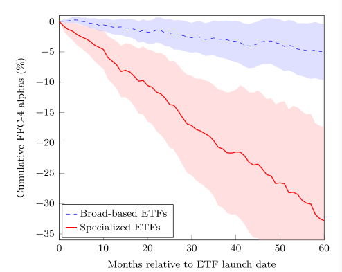

## Competition for attention in the ETF space

### 思维导图

### 摘要

> 投资者需求与供应商激励之间的相互作用塑造了交易所交易基金 (ETF)
> 的演变。虽然早期的
> ETF投资于基础广泛的指数，因此，以低成本提供多样化，但后来的产品追踪利基投资组合并收
> 取高额费用。引人注目的是，在头五年，专业 ETF
> 的风险调整后损失约为30%。这种表现不佳
> 不能用高额费用或对冲需求来解释。相反，它是由发行时标的股票的高估所驱动的。我们的
> 结果与供应商通过发行专门的 ETF
> 来追踪吸引注意力的主题来迎合投资者的推断信念是一致的。

### 研究问题

ETF常常作为投资民主化的工具被广泛使用。根据这个观点，无论资金多少，投资者不用通过昂贵的资产管理中介就可以使用ETF以最低的成本实现分散化，并获得多种投资风格的多空暴露。但这些叙述并不能准确完整地描述投资者对这些产品的感受。在实践中，当前市场上可利用的ETF
来自于投资者需求和供给者利润最大化的激励。一些投资者可能利用ETF作为廉价购买持有投资组合的替代，而其他投资者可能会根据他们的信念（理性与否）使用其进行投机。为了评价近十年最伟大的金融产品的优点，本文研究了如下问题：

> `1.供给者如何对投资者需求进行反应？`
>
> `2.ETF行业创新和产品业绩有什么意义？`

### **研究思路**

> 在实践中，ETF的存在是由投资者的需求和投资者利润最大化驱动，一些投资者使用ETF作为便宜的购买持有组合，而其他的投资者使用ETF按照其信念来投机。从ETF的发展主要沿着两条路径演进，一个是为投资者提供低成本高分散化的宽基ETF，另一个是满足投资者特殊需求的专业性ETF。所以，他们的业绩平均来说并不突出。本文的分析主要有两个部分，
>
> 1.  作者分析了ETF行业的竞争格局，认为ETF相比共同基金的竞争力主要体现在价格和质量两个维度。**具体来讲，宽基ETF以价格竞争为主，其他ETF以质量**[^1]竞争为主。这和市场分割的假设一致，两类产品在投资者需求对ETF费用和历史业绩敏感性上存在显著的差异。具体来说，**宽基ETF资金流对费用的敏感性更高，而专业化ETF对历史业绩高度敏感。**然而，ETF投资组合中股票的高媒体曝光度降低了流量对费用的敏感性，这表明投资者在关注其他产品属性时会忽略ETF收取的费用。
>
> 2.  什么使专业化ETF对投资者有吸引力？作者研究了专业ETF的质量层面，并检验了三种猜想：
>
>     （1）ETF提供者能够识别传递正向收益的部门和行业，并发行产品跟踪他们。
>
>     **结论：**情况并非如此，我们发现ETF的历史业绩是令人失望的，这样专业化ETF并不能解释他的高费用和交易摩擦。
>
>     （2）专业化ETF被投资者作为对冲他们暴露风险的工具。
>
>     **结论：**我们没有发现与对冲动机一致的证据，如果ETF对应的投资组合是投资者需要对冲的一个风险因子，专业化ETF应该与投资组合负相关，投资者对冲风险后，投资组合可以获得一个正的异常收益。但我们并没有发现类似证据。
>
>     （3）专业化ETF能满足投资者情绪。
>
>     **结论：**专业化ETF的发行者能识别市场追捧的趋势，通过发行产品来满足投资者的需求。当新的ETF进入市场时，他们投资的所有证券已经达到估值高峰，在ETF推出后，业绩表现不佳。所以，专业ETF被作为投机的工具，他们通过历史业绩推断未来。
>
> 

[^1]: **质量是指出价格以外的其他产品对投资者有吸引力的贡献。**

### **文献观点**

> 1.专业ETF作为投资者对冲风险的工具，解释了金融创新是实现市场竞争和风险分担手段的观点[@duffie1995financial;
> @allen1994financial]。
>
> 2.  近年来，Robinhood投资者因投资狂热而闻名，专业化ETF在Robinhood投资者中非常受欢迎[@barber2022attention]。
> 3.  证券发行和投资工具迎合投资者情绪。@lee1991investor
>     发现新的封闭式基金在投资者对有关类别资产的情绪高涨时推出。
> 4.  共同基金通过严重强调过去业绩[@chuprinin2018rent]和更改流行的名字来吸引资金[@chinco2022new]，进而迎合投资者情绪。
> 5.  新发行的共同基金在他们发行后表现较好，随后表现不佳，意味着他们关注趋势主题[@karoui2009performance;
>     @greene2016s]。
> 6.  覆盖范围窄的ETF被用于主动策略产生alpha的工具[@easley2021active]。
> 7.  如果ETF吸引了新一轮投资者对标的证券的需求，原则上可能会导致估值过高[@ben2018etfs]。
> 8.  @huang2020smart 关注新发的Smart-beta ETF，认为Smart-beta
>     ETF的投资组合是由过拟合数据设计以产生超越指数的表现，发行后产生的超额收益为0。
> 9.  专业ETF可能对不太成熟的投资者特别有吸引力，特别是散户投资者[@barber2022attention]。
> 10. 专业ETF中的股票具有吸引具有非理性信念和非标准偏好的投资者的特征。这些股票在上市前的市场调整回报率要高得多，这使得它们对具有推断或诊断信念的投资者具有吸引力[@greenwood2014expectations;
>     @barberis2018extrapolation; @bordalo2019diagnostic]。
> 11. 由专业ETF持有的股票显示出更大的正偏度，这对于那些喜欢彩票般回报的投资者来说是有吸引力的[@brunnermeier2005optimal;
>     @brunnermeier2007optimal; @mitton2007equilibrium;
>     @barberis2008stocks; @kumar2009gambles]。
> 12. 机构投资者平均比个人投资者更成熟，也就是说，他们的投资决策不太容易受到系统性偏差的影响[@french2008presidential;
>     @stambaugh2014presidential]，这往往会影响散户投资者的决策[@barber2013behavior]。

### 研究意义

> ETF带来的“投资民主化”的影响是混合的。一方面，以低成本进入金融市场可以改善投资者的福利，因为它允许更广泛的风险分担。另一方面，专门交易所交易基金的营销策略促进了对估值过高的证券的投机，而这些证券随后表现不佳。如果没有专门的ETF，这些投资者可能仍然会低效地投资。然而，由于其营销努力和竞争战略，专业ETF可能会鼓励更多的投资者参与。由于持有专门的ETF，大量保证金的投资者的情况可能会更糟。

### 结论

> 我们识别了ETF市场的两个细分市场，宽基ETF持有多样化的投资组合，收费较低。这些产品符合投资者实现多样化和以低成本进入市场的动机。相比之下，专门的ETF以高成本和低水平的多样化为投资者提供时尚主题。尽管这些基金的平均AUM较小，但总体而言，它们为美国股票型ETF行业带来了超过三分之一的收入。

> 我们研究了专业ETF是否在成功的投资理念方面提供价值，或者如果不是这样，则以保险的形式提供价值。我们的研究结果表明，平均而言，专门的ETF不会为投资者创造价值。这些ETF倾向于持有引人注目和估值过高的股票，因此表现明显落后：它们在成立后的5年内，平均每年的阿尔法值为负，约为-6%。我们没有发现任何证据表明，负面的表现对应于投资者愿意支付的价格，以确保对相关的风险因素，或他们愿意支付溢价，为一些非金钱利益。相反，专业化的ETF似乎迎合了过于乐观的投资者。专门的ETF是在围绕热门投资主题的兴奋高峰之后推出的。在推出后的几年里，基础资产摆脱了一些最初的高估，专业ETF的价格也是如此。

### 参考文献
