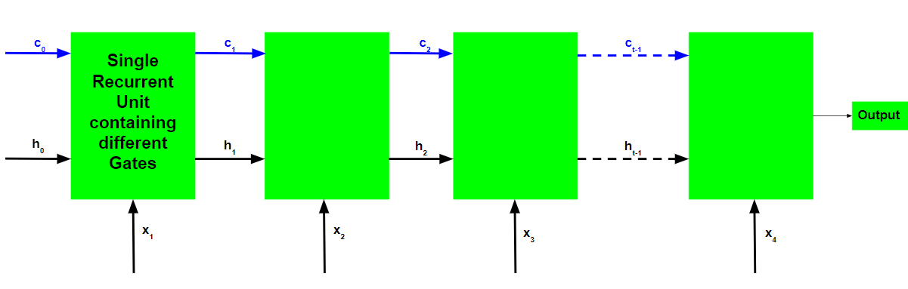
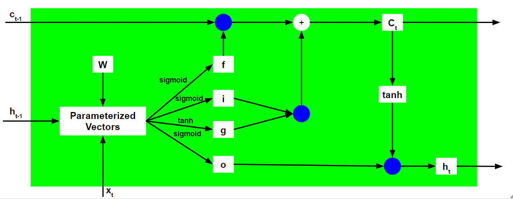
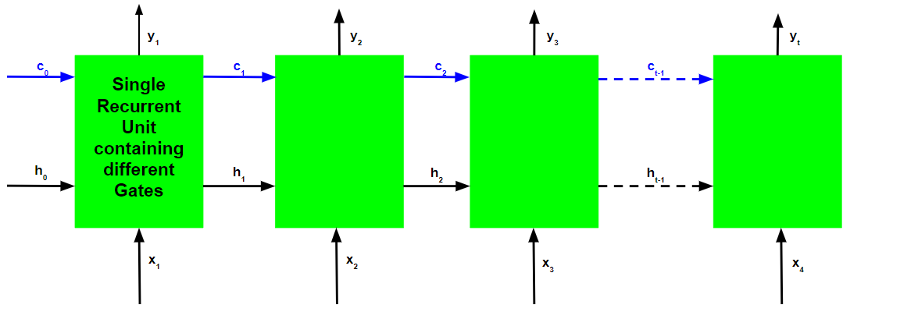

> 为了解决深度循环神经网络中的梯度消失和爆炸问题，人们开发了许多变体。其中最著名的一种是长短期记忆网络(LSTM)。从概念上讲，LSTM 循环单元试图"记住"网络迄今为止所见的所有过去知识，并"忘记"不相关的数据。这是通过为不同目的引入称为"门"的不同激活函数层来实现的。每个 LSTM 循环单元还维护一个称为内部单元状态的向量，该向量在概念上描述了前一个 LSTM 循环单元选择保留的信息。

> LSTM 网络是循环神经网络 (RNN) 最常用的变体。LSTM 的关键组件是记忆单元和门（包括遗忘门和输入门），记忆单元的内部内容由输入门和遗忘门调制。假设两个 segue 都已关闭，记忆单元的内容将在一个时间步和下一个时间步之间保持不变，梯度门控结构允许信息在许多时间步中保留，因此也允许组在许多时间步中流动。这使得 LSTM 模型能够克服大多数循环神经网络模型中发生的消失梯度。

> **长短期记忆网络由四个不同的门组成，用于不同的目的，如下所述**：

> 1.  遗忘门 (f)：在遗忘门处，输入与先前的输出相结合，生成一个介于 0 和 1 之间的分数，该分数决定了需要保留多少先前状态（或者换句话说，应该忘记多少状态）。然后将此输出与先前状态相乘。注意：激活输出 1.0 表示"记住一切"，激活输出 0.0 表示"忘记一切"。从另一个角度来看，遗忘门的更好名称可能是"记忆门"

> 1.  输入门 (i)：输入门与遗忘门对相同的信号进行操作，但这里的目标是决定哪些新信息将进入 LSTM 的状态。输入门的输出（同样是 0 和 1 之间的分数）与 tanh 块的输出相乘，产生必须添加到先前状态的新值。然后将此门控向量添加到先前状态以生成当前状态

> 1.  输入调制门 (g)：它通常被视为输入门的子部分，许多关于 LSTM 的文献甚至都没有提到它，而是假设它位于输入门内。它用于通过向信息添加非线性并使信息变为零均值来调制输入门将写入内部状态单元的信息。这样做是为了减少学习时间，因为零均值输入具有更快的收敛速度。尽管此门的操作不如其他门那么重要，并且通常被视为提供精细度的概念，但将此门纳入 LSTM 单元的结构中是一种很好的做法。

> 1.  输出门 (o)：在输出门处，输入和先前状态像之前一样被门控以生成另一个缩放分数，该缩放分数与 tanh 块的输出相结合，产生当前状态。然后给出此输出。输出和状态被反馈到 LSTM 块中。 长短期记忆网络的基本工作流程与循环神经网络的工作流程类似，唯一的区别是内部单元状态也与隐藏状态一起向前传递。

**LSTM 循环单元的工作原理**：

> 1.  输入当前输入、先前的隐藏状态和先前的内部单元状态。
> 2.  按照以下步骤计算四个不同门的值：

> -   对于每个门，通过与每个门的相应权重的相关向量进行元素乘积来计算当前输入和先前隐藏状态的参数化向量。

> -   在参数化向量上逐个元素地应用每个门的相应激活函数。下面给出了门的列表以及要应用于门的激活函数。
>
> 1.  首先计算输入门和输入调制门的逐元素乘法向量，计算当前内部细胞状态，然后计算遗忘门和前一个内部细胞状态的逐元素乘法向量，然后将两个向量相加。

$$
c_{t} = i\odot g + f\odot c_{t-1}
$$

> 1.  通过首先取当前内部细胞状态向量的逐元素双曲正切，然后与输出门进行逐元素乘法来计算当前隐藏状态。 上述工作原理如下图所示：

> 请注意，蓝色圆圈表示逐元素乘法。权重矩阵W包含当前输入向量和每个门的先前隐藏状态的不同权重。

> 与循环神经网络一样，LSTM网络也会在每个时间步骤生成一个输出，并使用该输出通过梯度下降来训练网络。

> 循环神经网络和长短期记忆网络的反向传播算法之间的唯一主要区别与算法的数学有关。

> 设$\overline{y}_{t}$是每个时间步的预测输出， $y_{t}$ 是每个时间步的实际输出。然后，每个时间步的误差由以下公式给出：

$$
E\_{t} = -y\_{t}log(\overline{y}\_{t})
$$

> 因此，总误差由所有时间步的误差总和给出。

$$
E = \sum_{t} E_{t}  
$$

$$
\Rightarrow E = \sum_{t} -y_{t}log(\overline{y}_{t})
$$

> 类似地，可以将值 $\frac{\partial E}{\partial W}$ 计算为每个时间步的梯度总和。

$$
\frac{\partial E}{\partial W} = \sum_{t} \frac{\partial E_{t}}{\partial W}
$$

> 使用链式法则并利用 $\overline{y}_{t}$ 是的函数$h_{t}$, 并且实际上是的函数 这一事实$t_{t}$ ，得出以下表达式：

$$
\frac{\partial E_{t}}{\partial W} = \frac{\partial E_{t}}{\partial \overline{y}_{t}} \frac{\partial \overline{y}_t }{\partial h_t}\frac{\partial h_t}{\partial c_t}\frac{\partial c_t}{\partial c_{t-1}} \dots\frac{\partial c_0}{\partial W}
$$

> 因此，总误差梯度由以下公式给出：

$$
\frac{\partial E}{\partial W} = \sum_{t} \frac{\partial E_{t}}{\partial \overline{y}_{t}}\frac{\partial \overline{y}_{t}}{\partial h_{t}}\frac{\partial h\_{t}}{\partial c_{t}}\frac{\partial c_{t}}{\partial c_{t-1}}\frac{\partial c_{t-1}}{\partial c_{t-2}}.......\frac{\partial c_{0}}{\partial W}
$$

> 请注意，对于 LSTM 反向传播，梯度方程涉及链$\partial c_{t}$， 而对于基本循环神经网络， 梯度方程涉及链$\partial h\_{t}$。LSTM如何解决梯度消失和爆炸的问题？回想一下的表达式$c_t$ 。

$$
c_{t} = i\odot g + f\odot c_{t-1}
$$

> 梯度的值由从开始的导数链$\frac{\partial c_{t}}{\partial c_{t-1}} t_{t}$控制 。使用以下表达式扩展此值$\partial c_{t}$ ：

$$
\frac{\partial c_{t}}{\partial c_{t-1}} = \frac{\partial c\_{t}}{\partial f}\frac{\partial f}{\partial h_{t-1}}\frac{\partial h_{t-1}}{\partial c_{t-1}} + \frac{\partial c_{t}}{\partial i}\frac{\partial i}{\partial h_{t-1}}\frac{\partial h_{t-1}}{\partial c_{t-1}} + \frac{\partial c_{t}}{\partial g}\frac{\partial g}{\partial h\_{t-1}}\frac{\partial h\_{t-1}}{\partial c_{t-1}} + \frac{\partial c_{t}}{\partial c_{t-1}}
$$

> 对于基本 RNN， 在一定时间之后，该项 $\frac{\partial h_{t}}{\partial h_{t-1}}$ 开始取大于 1 或小于 1 的值，但始终在同一范围内。这是梯度消失和爆炸问题的根本原因。在 LSTM 中，该项$\frac{\partial c_{t}}{\partial c_{t-1}}$没有固定的模式，可以在任何时间步骤中取任何正值。因此，不能保证在无限数量的时间步骤中，该项将收敛到 0 或完全发散。如果梯度开始向零收敛，则可以相应调整门的权重以使其更接近 1。由于在训练阶段，网络仅调整这些权重，因此它会学习何时让梯度收敛到零以及何时保留它。
